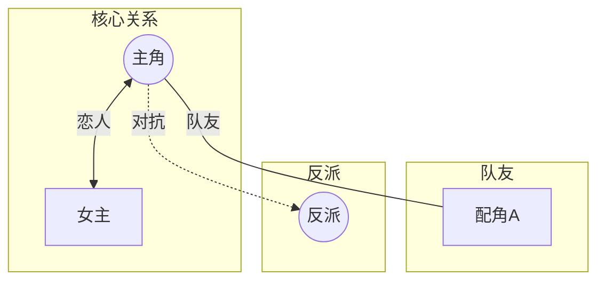

# 人物关系概要完整工作流

## 阶段1：初始化与角色假设

### 1.1 定位书籍目录

```
书籍目录 = C:\Users\Administrator\AppData\Roaming\AionUi\aionui\qwen-temp-1772299398561\Factory\拆书/{书名}/
```

### 1.2 检查前置依赖

确认以下文件存在：
- `{书名}/概括/` 目录
- `{书名}/全书概括.md`
- `{书名}/人物和设定/名词表.md`

### 1.3 检查增量更新

检查 `人物和设定/_progress.json` 是否存在：
- 存在 → 询问用户是否继续/增量更新
- 不存在 → 从头开始

### 1.4 读取基础资料

读取以下文件：
- `全书概括.md` - 了解主线框架
- `人物和设定/名词表.md` - 获取角色列表

### 1.5 生成初步假设

基于读取的资料，推测：
- 主角是谁
- 疑似女主/男主
- 疑似反派
- 重要配角

输出到 `_分析笔记.md` 的「初步假设」部分。

---

## 阶段2：顺序阅读与笔记维护

### 2.1 确定阅读策略

根据初步假设，确定需要关注的章节组：
- 优先阅读涉及主要角色互动的章节
- 每次阅读3组概括（约9章）

### 2.2 阅读循环

```
for 每次阅读:
    1. 读取3组章节概括
    2. 分析角色互动和关系线索
    3. 更新 _分析笔记.md（追加阅读记录）
    4. 阅读计数 +1

    if 阅读计数 % 10 == 0:
        询问用户是否继续
        if 用户选择停止:
            保存进度，退出
```

### 2.3 笔记更新格式

每次阅读后追加：

```markdown
### 第N次阅读：组X-Y（第A-B章）
**关注点**：xxx
**发现**：
- 发现1
- 发现2
**待确认**：xxx
```

---

## 阶段3：用户确认与归纳

### 3.1 用户确认

完成阅读后，展示分析笔记摘要，询问用户：
- 是否认可当前分析
- 是否需要补充阅读

### 3.2 归纳角色地位

根据笔记归纳，生成 `角色地位.yaml`：

```yaml
# 角色地位分析
protagonist:
  name: 主角名
  aliases: [别名1, 别名2]
  importance: 10

female_leads:
  - name: 女主名
    rank: 1
    importance: 9

male_leads: []

antagonists:
  - name: 反派名
    rank: 1
    importance: 8

supporting:
  - name: 配角名
    importance: 6
```

---

## 阶段4：深入关系挖掘

### 4.1 加载资料

读取：
- `全书概括.md`
- `角色地位.yaml`
- `_分析笔记.md`

### 4.2 关系挖掘

对于每对重要角色：
1. 确定关系类型（romantic/family/friend/enemy/subordinate）
2. 如有不明确，回到原文章节确认
3. 记录关键章节

### 4.3 生成人物关系

输出 `人物关系.yaml`：

```yaml
relationships:
  protagonist_relations:
    - from: 主角
      to: 女主
      type: romantic
      description: "关系描述"
      key_chapters: [31-33, 160-162]

  important_relations:
    - from: 角色A
      to: 角色B
      type: friend
      description: "关系描述"

  antagonist_relations:
    - from: 反派
      to: 主角
      type: enemy
      description: "关系描述"
```

---

## 阶段5：生成关系图谱

### 5.1 图谱生成规则

- 仅记录与主角相关的关系
- 重要配角（女主1、女主2、主要反派）
- 反派关系最多一层，不深入

### 5.2 Mermaid 格式

生成 `关系图谱.md`：

```markdown
# 人物关系图谱


```

---

## 阶段6：更新进度文件

完成后更新 `_progress.json`：

```json
{
  "book": "书名",
  "last_processed_chapter": 237,
  "last_processed_group": 79,
  "total_chapters_at_analysis": 237,
  "processed_groups": [1, 3, 7, 13, 15],
  "analysis_rounds": 15,
  "last_updated": "2026-01-28"
}
```

| 字段 | 类型 | 说明 |
|------|------|------|
| book | string | 书名 |
| last_processed_chapter | number | 最后处理的章节号 |
| last_processed_group | number | 最后处理的组号 |
| total_chapters_at_analysis | number | **分析时的总章节数（用于检测新章节）** |
| processed_groups | [number] | **已分析的组号列表** |
| analysis_rounds | number | 分析轮次 |
| last_updated | string | 最后更新日期 |

---

## 完成报告

```
📊 人物关系概要完成

书名：《xxx》
分析轮次：15 次
识别角色：12 个

输出：
├── 人物和设定/_分析笔记.md ✓
├── 人物和设定/角色地位.yaml ✓
├── 人物和设定/人物关系.yaml ✓
└── 人物和设定/关系图谱.md ✓
```

---

## 增量更新检测流程

当检测到 `_progress.json` 存在时，执行以下步骤：

### 步骤1：检测新章节

```
1. 读取 `概括/_progress.json` 获取 `total_chapters`
2. 读取 `人物和设定/_progress.json` 获取 `total_chapters_at_analysis`
3. 对比两者：
   - 相等 → 无新章节，询问是否重新分析
   - 不等 → 有新章节，计算新增范围
```

### 步骤2：确定新增章节

```
新增章节范围 = total_chapters_at_analysis + 1 ~ total_chapters
新增组号 = 计算对应的组号
```

### 步骤3：增量分析

```
1. 只读取新增组的概括文件
2. 加载已有的 角色地位.yaml 和 人物关系.yaml
3. 分析新章节中的角色和关系
4. 增量更新 YAML 文件
5. 更新 _progress.json
```

### 步骤4：更新进度

```json
{
  "total_chapters_at_analysis": 新的总章节数,
  "processed_groups": [...已有组号, ...新增组号],
  "last_updated": "当前日期"
}
```
