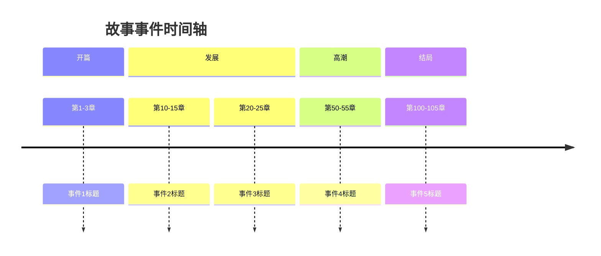

# 事件线追踪完整工作流

## 阶段1：初次事件线梳理

### 1.1 定位书籍目录

```
书籍目录 = C:\Users\Administrator\AppData\Roaming\AionUi\aionui\qwen-temp-1772299398561\Factory\拆书/{书名}/
事件线目录 = {书籍目录}/事件线/
```

### 1.2 检查前置依赖

确认以下文件存在：
- `{书名}/概括/` 目录
- `{书名}/全书概括.md`
- `{书名}/人物和设定/名词表.md`

### 1.3 检查增量更新

检查 `事件线/_progress.json` 是否存在：
- 存在 → 询问用户是否继续/增量更新
- 不存在 → 从头开始

### 1.4 创建事件线目录

```bash
mkdir -p {书名}/事件线/
```

### 1.5 读取基础资料

读取以下文件：
- `全书概括.md` - 了解主线框架
- `人物和设定/名词表.md` - 获取角色列表
- `概括/` 目录下的所有章节概括

### 1.6 初次梳理

基于读取的资料，直接梳理：
- **核心主线**：故事的主要冲突和发展
- **副主线1**：第一个重要支线
- **副主线2**：第二个重要支线（如有）
- **副主线3**：第三个重要支线（如有）

**注意**：感情线不在此处记录，已在全书概括中总结。

### 1.7 输出初次结果

生成 `初次事件线追踪.md`：

```markdown
# 初次事件线追踪

## 核心主线：[主线名称]

### 事件1：[事件名称]
- 章节范围：第X-Y章
- 类型：转折点/高潮/铺垫
- 概要：xxx

### 事件2：...

## 副主线1：[支线名称]
...

## 副主线2：[支线名称]
...

## 待确认事项
- [ ] 事件A的具体章节需要确认
- [ ] 事件B与事件C的因果关系
```

---

## 阶段2：审视与确认（拟人确认模式）

### 2.1 审视初次结果

主进程审视 `初次事件线追踪.md`，识别：
- 不确定的事件
- 需要确认的因果关系
- 章节范围模糊的事件

### 2.2 回到原文确认

对于每个疑问：
1. 定位相关章节
2. 读取原文章节（从 `拆分/` 目录）
3. 确认事件细节
4. 记录到 `_事件线笔记.md`

**限制**：最多10次回到原文阅读

### 2.3 笔记格式

```markdown
# 事件线笔记

## 确认记录

### 确认1：[事件名称]
**疑问**：xxx
**查阅章节**：第X章
**确认结果**：xxx

### 确认2：...

## 修正记录
- 事件A的章节范围从X-Y修正为A-B
- 事件B的类型从"铺垫"修正为"转折点"
```

---

## 阶段3：综合归档

### 3.1 整合信息

结合：
- `初次事件线追踪.md`
- `_事件线笔记.md`

### 3.2 生成事件线档案

输出 `事件线.yaml`：

```yaml
metadata:
  last_chapter: 237
  last_updated: "2026-01-28"

storylines:
  main:
    name: "核心主线名称"
    description: "主线描述"
    events:
      - chapter_range: "1-3"
        title: "事件标题"
        type: turning_point
        summary: "事件概要"

  sub_1:
    name: "副主线1名称"
    description: "支线描述"
    events:
      - ...

  sub_2:
    name: "副主线2名称"
    description: "支线描述"
    events:
      - ...
```

### 3.3 生成时间轴

输出 `时间轴.md`：

```markdown
# 事件时间轴


```

---

## 阶段4：更新进度文件

完成后更新 `_progress.json`：

```json
{
  "book": "书名",
  "last_processed_chapter": 237,
  "last_processed_group": 79,
  "total_chapters_at_analysis": 237,
  "processed_groups": [1, 2, 3, 4, 5],
  "storylines_identified": ["main", "sub_1", "sub_2"],
  "last_updated": "2026-01-28"
}
```

| 字段 | 类型 | 说明 |
|------|------|------|
| book | string | 书名 |
| last_processed_chapter | number | 最后处理的章节号 |
| last_processed_group | number | 最后处理的组号 |
| total_chapters_at_analysis | number | **分析时的总章节数（用于检测新章节）** |
| processed_groups | [number] | **已分析的组号列表** |
| storylines_identified | [string] | 已识别的事件线ID |
| last_updated | string | 最后更新日期 |

---

## 完成报告

```
📈 事件线追踪完成

书名：《xxx》
原文确认次数：5 次
识别主线：1 条
识别支线：2 条

输出：
├── 事件线/初次事件线追踪.md ✓
├── 事件线/_事件线笔记.md ✓
├── 事件线/事件线.yaml ✓
└── 事件线/时间轴.md ✓
```

---

## 增量更新流程

当检测到 `_progress.json` 存在时，执行以下步骤：

### 步骤1：检测新章节

```
1. 读取 `概括/_progress.json` 获取 `total_chapters`
2. 读取 `事件线/_progress.json` 获取 `total_chapters_at_analysis`
3. 对比两者：
   - 相等 → 无新章节，询问是否重新分析
   - 不等 → 有新章节，计算新增范围
```

### 步骤2：确定新增章节

```
新增章节范围 = total_chapters_at_analysis + 1 ~ total_chapters
新增组号 = 计算对应的组号
```

### 步骤3：增量分析

```
1. 读取已有的事件线.yaml
2. 只读取新增章节的概括
3. 识别新事件
4. 追加到现有事件线
5. 更新时间轴
6. 更新进度文件
```

### 步骤4：更新进度

```json
{
  "total_chapters_at_analysis": 新的总章节数,
  "processed_groups": [...已有组号, ...新增组号],
  "last_updated": "当前日期"
}
```
