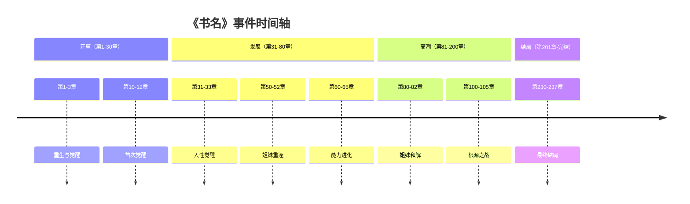

# YAML Schema 定义

## 事件线档案 (事件线.yaml)

```yaml
# 事件线档案
# 记录故事的主线和支线事件

metadata:
  book: string                      # 书名
  last_chapter: number              # 已处理到的章节
  total_chapters_at_analysis: number # 分析时的总章节数
  last_updated: string              # 最后更新日期

storylines:
  main:                     # 核心主线
    name: string            # 主线名称
    description: string     # 主线描述
    events:                 # 事件列表
      - chapter_range: string   # 章节范围 "X-Y"
        title: string           # 事件标题
        type: enum              # 事件类型
        summary: string         # 事件概要

  sub_1:                    # 副主线1
    name: string
    description: string
    events: [...]

  sub_2:                    # 副主线2（可选）
    name: string
    description: string
    events: [...]

  sub_3:                    # 副主线3（可选）
    name: string
    description: string
    events: [...]
```

### 事件类型 (type) 枚举

| 类型 | 说明 |
|------|------|
| turning_point | 转折点：改变剧情走向的关键事件 |
| climax | 高潮：情感或冲突的顶点 |
| setup | 铺垫：为后续事件做准备 |
| resolution | 解决：冲突的解决或结局 |
| revelation | 揭示：重要信息的揭露 |

### 示例

```yaml
metadata:
  book: "末世顶级杀手的我变成了萝莉"
  last_chapter: 237
  total_chapters_at_analysis: 237
  last_updated: "2026-01-28"

storylines:
  main:
    name: "通往根源的对抗"
    description: "宁雨作为根源钥匙与里昂势力的对抗"
    events:
      - chapter_range: "1-3"
        title: "重生与觉醒"
        type: turning_point
        summary: "宁雨遭组织背叛重生为萝莉"
      - chapter_range: "31-33"
        title: "人性觉醒"
        type: climax
        summary: "为保护沈怡月开启月之暗面"
      - chapter_range: "100-105"
        title: "根源之战"
        type: climax
        summary: "与里昂的最终对决"

  sub_1:
    name: "姐妹羁绊"
    description: "宁雨与宁萱的关系发展"
    events:
      - chapter_range: "50-52"
        title: "姐妹重逢"
        type: turning_point
        summary: "发现宁萱的真实身份"
      - chapter_range: "80-82"
        title: "姐妹和解"
        type: resolution
        summary: "宁萱背叛里昂，与宁雨并肩作战"

  sub_2:
    name: "觉醒者体系"
    description: "觉醒能力的获取与成长"
    events:
      - chapter_range: "10-12"
        title: "首次觉醒"
        type: setup
        summary: "宁雨发现自己的觉醒能力"
      - chapter_range: "60-65"
        title: "能力进化"
        type: turning_point
        summary: "月之暗面的完全觉醒"
```

---

## 进度文件 (_progress.json)

```json
{
  "book": "书名",
  "last_processed_chapter": 237,
  "last_processed_group": 79,
  "total_chapters_at_analysis": 237,
  "processed_groups": [1, 2, 3, 4, 5],
  "storylines_identified": ["main", "sub_1", "sub_2"],
  "last_updated": "2026-01-28"
}
```

| 字段 | 类型 | 说明 |
|------|------|------|
| book | string | 书名 |
| last_processed_chapter | number | 最后处理的章节号 |
| last_processed_group | number | 最后处理的组号 |
| total_chapters_at_analysis | number | **分析时的总章节数（用于检测新章节）** |
| processed_groups | [number] | **已分析的组号列表** |
| storylines_identified | [string] | 已识别的事件线ID |
| last_updated | string | 最后更新日期 |

---

## 时间轴 Mermaid 格式

```markdown
# 事件时间轴


```

### 时间轴分段规则

| 分段 | 章节范围 | 说明 |
|------|----------|------|
| 开篇 | 前15% | 故事开端、人物登场 |
| 发展 | 15%-50% | 冲突展开、关系建立 |
| 高潮 | 50%-85% | 主要冲突、转折点 |
| 结局 | 后15% | 冲突解决、故事收尾 |
