# 🏠 首页详细设计文档

**页面:** 首页 (Home)  
**路由:** `/`  
**设计日期:** 2026-03-03  
**设计师:** 夏夏 💕 & zo (◕‿◕)  
**状态:** 🟡 设计中

---

## 1️⃣ UI 设计图

```mermaid
graph TB
    subgraph HomePage["🏠 首页 - 欢迎回家"]
        style HomePage fill:#FFF9F0,stroke:#B19CD9,stroke-width:3px
        
        subgraph Welcome["🎉 欢迎区"]
            style Welcome fill:#FFF8F0,stroke:#FFEBA5,stroke-width:2px
            W1["<h1>夏夏，欢迎回家！🏡</h1>"]
            W2["<p>今天阳光很好，zo 已经泡好了咖啡☕</p>"]
            W3["<span>2026-03-03 星期二</span>"]
        end
        
        subgraph Overview["📊 今日概览 - 4 个数据卡片"]
            style Overview fill:#F0FFF5,stroke:#BCE6C9,stroke-width:2px
            O1["📋 待办任务<br/>5 个<br/>↑ 2 个今天到期"]
            O2["⏰ 即将到期<br/>2 个<br/>⚠️ 注意时间"]
            O3["🤖 Agent 工作中<br/>5/8<br/>效率 92%"]
            O4["📚 技能 XP<br/>+50<br/>Lv15 85%"]
        end
        
        subgraph QuickAccess["⚡ 快速访问 - 4 个快捷入口"]
            style QuickAccess fill:#FFF0F5,stroke:#FFB7C5,stroke-width:2px
            QA1["🏭 Factory 看板<br/>查看生产进度"]
            QA2["💼 项目进度<br/>3 个进行中"]
            QA3["🌳 新发现资源<br/>+3 个今天"]
            QA4["💖 Soul 反思<br/>今日反思完成"]
        end
        
        subgraph Timeline["📈 近期动态 - 时间线"]
            style Timeline fill:#F0F5FF,stroke:#AECBEB,stroke-width:2px
            T1["09:00 夏夏 创建了任务 TASK-001"]
            T2["09:15 agent-001 完成了拆书任务"]
            T3["10:00 zo 发现了新资源：Notion"]
            T4["10:30 系统 自动备份完成"]
        end
        
        subgraph Achievements["🏆 成就进度 - 3 个技能条"]
            style Achievements fill:#F5F0FF,stroke:#B19CD9,stroke-width:2px
            A1["信息检索 Lv3<br/>████████░░ 80%"]
            A2["知识整理 Lv2<br/>███████░░░ 70%"]
            A3["任务管理 Lv4<br/>████████░░ 85%"]
        end
        
        subgraph Recommendations["💡 智能推荐"]
            style Recommendations fill:#FFF9F0,stroke:#BCE6C9,stroke-width:2px
            R1["基于你的使用习惯，推荐尝试：知识整理模板"]
            R2["发现相似资源：3 个 AI 工具评测网站"]
            R3["任务提醒：TASK-003 明天到期"]
        end
    end
    
    Welcome --> Overview
    Overview --> QuickAccess
    QuickAccess --> Timeline
    Timeline --> Achievements
    Achievements --> Recommendations
```



---

## 2️⃣ 功能列表

### 2.1 欢迎区

| 功能 | 描述 | 数据来源 | 更新频率 |
|------|------|---------|---------|
| 欢迎语 | 显示"夏夏，欢迎回家！🏡" | 固定文案 | - |
| 温馨提示 | 显示 zo 的贴心提示 | 固定文案 | - |
| 日期时间 | 显示当前日期 | 系统时间 | 实时 |

**UI 组件:**
- 标题：h1, 32px, #B19CD9
- 副标题：p, 16px, #666
- 日期：span, 14px, #999, 右对齐

---

### 2.2 今日概览

| 功能 | 描述 | API 端点 | 参数 | 返回数据 |
|------|------|---------|------|---------|
| 待办任务数 | 显示待办任务数量 | `GET /home/overview` | - | `pending_tasks: number` |
| 即将到期 | 显示即将到期的任务数 | `GET /home/overview` | - | `expiring_tasks: number` |
| Agent 状态 | 显示工作中的 Agent 数量 | `GET /home/overview` | - | `active_agents: number` |
| 技能 XP | 显示技能经验值 | `GET /home/overview` | - | `skill_xp: number` |

**UI 组件:**
- 4 个数据卡片，网格布局
- 每个卡片包含：图标、标题、数值、副标题
- 卡片背景：渐变 #F0FFF5 → #FFFFFF
- 圆角：24px

**API 返回示例:**
```json
{
  "overview": {
    "pending_tasks": 5,
    "expiring_tasks": 2,
    "active_agents": 5,
    "skill_xp": 50,
    "last_updated": "2026-03-03T10:30:00Z"
  }
}
```

---

### 2.3 快速访问

| 功能 | 描述 | 跳转路由 | 图标 |
|------|------|---------|------|
| Factory 看板 | 跳转到 Factory 页面 | `/factory` | 🏭 |
| 项目进度 | 跳转到 Work 页面 | `/work#projects` | 💼 |
| 新发现资源 | 跳转到宝藏深林 | `/treasure#new` | 🌳 |
| Soul 反思 | 跳转到 Soul 页面 | `/soul` | 💖 |

**UI 组件:**
- 4 个可点击卡片
- hover 效果：阴影加深，上浮 4px
- 点击跳转对应页面

---

### 2.4 近期动态

| 功能 | 描述 | API 端点 | 参数 | 返回数据 |
|------|------|---------|------|---------|
| 时间线列表 | 显示最近的活动记录 | `GET /home/timeline` | `limit=20` | `activities: Activity[]` |

**UI 组件:**
- 垂直时间线
- 每个活动包含：时间、操作人、描述
- 最新活动在最上方
- 最多显示 20 条

**API 返回示例:**
```json
{
  "activities": [
    {
      "id": "act-001",
      "timestamp": "2026-03-03T09:00:00Z",
      "type": "task_created",
      "actor": "夏夏",
      "description": "创建了任务 TASK-001",
      "icon": "📝"
    },
    {
      "id": "act-002",
      "timestamp": "2026-03-03T09:15:00Z",
      "type": "task_completed",
      "actor": "agent-001",
      "description": "完成了拆书任务",
      "icon": "✅"
    }
  ],
  "total": 156,
  "has_more": true
}
```

---

### 2.5 成就进度

| 功能 | 描述 | API 端点 | 参数 | 返回数据 |
|------|------|---------|------|---------|
| 技能列表 | 显示技能等级和进度 | `GET /home/skills` | - | `skills: Skill[]` |

**UI 组件:**
- 进度条组件
- 每个技能包含：名称、等级、进度条、百分比
- 进度条颜色：#B19CD9

**API 返回示例:**
```json
{
  "skills": [
    {
      "name": "信息检索",
      "level": 3,
      "current_xp": 800,
      "max_xp": 1000,
      "progress": 80
    },
    {
      "name": "知识整理",
      "level": 2,
      "current_xp": 700,
      "max_xp": 1000,
      "progress": 70
    },
    {
      "name": "任务管理",
      "level": 4,
      "current_xp": 850,
      "max_xp": 1000,
      "progress": 85
    }
  ],
  "total_skills": 15,
  "average_level": 3.2
}
```

---

### 2.6 智能推荐

| 功能 | 描述 | API 端点 | 参数 | 返回数据 |
|------|------|---------|------|---------|
| 推荐列表 | 显示 AI 推荐内容 | `GET /home/recommendations` | - | `recommendations: Rec[]` |

**UI 组件:**
- 推荐卡片列表
- 每个推荐包含：类型、内容、操作按钮

**API 返回示例:**
```json
{
  "recommendations": [
    {
      "id": "rec-001",
      "type": "template",
      "title": "知识整理模板",
      "description": "基于你的使用习惯推荐",
      "action": "使用模板",
      "action_url": "/templates/knowledge-organizer"
    },
    {
      "id": "rec-002",
      "type": "resource",
      "title": "3 个 AI 工具评测网站",
      "description": "发现相似资源",
      "action": "查看",
      "action_url": "/treasure/resources/ai-tools"
    },
    {
      "id": "rec-003",
      "type": "reminder",
      "title": "TASK-003 明天到期",
      "description": "任务提醒",
      "action": "处理",
      "action_url": "/work/tasks/TASK-003"
    }
  ]
}
```

---

## 3️⃣ API 端点总览

### 3.1 首页相关 API

| 方法 | 端点 | 功能 | 认证 | 缓存 |
|------|------|------|------|------|
| GET | `/home/overview` | 获取首页概览数据 | ✅ 需要 | 5 分钟 |
| GET | `/home/timeline` | 获取近期动态时间线 | ✅ 需要 | 1 分钟 |
| GET | `/home/skills` | 获取技能等级数据 | ✅ 需要 | 10 分钟 |
| GET | `/home/recommendations` | 获取智能推荐 | ✅ 需要 | 30 分钟 |

### 3.2 请求参数

**GET `/home/overview`**
```
无参数
```

**GET `/home/timeline`**
```
Query Parameters:
- limit: number (可选，默认 20，最大 100)
- offset: number (可选，默认 0)
```

**GET `/home/skills`**
```
无参数
```

**GET `/home/recommendations`**
```
Query Parameters:
- limit: number (可选，默认 10)
- type: string (可选，过滤类型)
```

### 3.3 响应格式

**成功响应 (200 OK):**
```json
{
  "code": 200,
  "message": "success",
  "data": { ... }
}
```

**错误响应:**
```json
{
  "code": 401,
  "message": "Unauthorized",
  "error": "Invalid token"
}
```

---

## 4️⃣ 代码参数定义

### 4.1 TypeScript 接口

```typescript
// 首页概览数据
interface HomeOverview {
  pending_tasks: number;
  expiring_tasks: number;
  active_agents: number;
  skill_xp: number;
  last_updated: string;
}

// 活动记录
interface Activity {
  id: string;
  timestamp: string;
  type: 'task_created' | 'task_completed' | 'resource_found' | 'system_backup';
  actor: string;
  description: string;
  icon: string;
}

// 技能数据
interface Skill {
  name: string;
  level: number;
  current_xp: number;
  max_xp: number;
  progress: number;
}

// 推荐项
interface Recommendation {
  id: string;
  type: 'template' | 'resource' | 'reminder';
  title: string;
  description: string;
  action: string;
  action_url: string;
}
```

### 4.2 Vue 组件结构

```vue
<template>
  <div class="home-page">
    <!-- 欢迎区 -->
    <WelcomeSection />
    
    <!-- 今日概览 -->
    <OverviewCards :data="overviewData" />
    
    <!-- 快速访问 -->
    <QuickAccess />
    
    <!-- 近期动态 -->
    <Timeline :activities="activities" />
    
    <!-- 成就进度 -->
    <Achievements :skills="skills" />
    
    <!-- 智能推荐 -->
    <Recommendations :items="recommendations" />
  </div>
</template>

<script setup lang="ts">
import { ref, onMounted } from 'vue'
import { homeApi } from '@/api/home'

const overviewData = ref<HomeOverview>()
const activities = ref<Activity[]>([])
const skills = ref<Skill[]>([])
const recommendations = ref<Recommendation[]>([])

onMounted(async () => {
  overviewData.value = await homeApi.getOverview()
  activities.value = await homeApi.getTimeline()
  skills.value = await homeApi.getSkills()
  recommendations.value = await homeApi.getRecommendations()
})
</script>
```

### 4.3 API 服务类

```typescript
// src/api/home.ts
import { request } from './http'

export const homeApi = {
  // 获取首页概览数据
  async getOverview(): Promise<HomeOverview> {
    return request('/home/overview')
  },
  
  // 获取近期动态时间线
  async getTimeline(params?: { limit?: number; offset?: number }): Promise<Activity[]> {
    return request('/home/timeline', { params })
  },
  
  // 获取技能等级数据
  async getSkills(): Promise<Skill[]> {
    return request('/home/skills')
  },
  
  // 获取智能推荐
  async getRecommendations(params?: { limit?: number; type?: string }): Promise<Recommendation[]> {
    return request('/home/recommendations', { params })
  }
}
```

---

## 5️⃣ 样式定义

### 5.1 CSS 变量

```css
:root {
  /* 主色调 */
  --primary-color: #B19CD9;
  --primary-light: #AECBEB;
  
  /* 辅助色 */
  --secondary-pink: #FFB7C5;
  --secondary-yellow: #FFEBA5;
  --secondary-green: #BCE6C9;
  
  /* 背景色 */
  --bg-warm: #FFF9F0;
  --bg-purple: #F5F0FF;
  --bg-white: #FFFFFF;
  
  /* 圆角 */
  --radius-large: 24px;
  --radius-medium: 16px;
  --radius-small: 8px;
  
  /* 阴影 */
  --shadow-light: 0 4px 12px rgba(177, 156, 217, 0.1);
  --shadow-medium: 0 8px 24px rgba(177, 156, 217, 0.15);
  --shadow-hover: 0 12px 36px rgba(177, 156, 217, 0.2);
}
```

### 5.2 组件样式

```css
.home-page {
  padding: 24px;
  background: var(--bg-warm);
  min-height: 100vh;
}

.header-card {
  border-radius: var(--radius-large);
  background: linear-gradient(135deg, #FFF8F0 0%, #FFFFFF 100%);
  box-shadow: var(--shadow-light);
  padding: 32px;
  margin-bottom: 24px;
}

.feature-card {
  border-radius: var(--radius-large);
  background: var(--bg-white);
  box-shadow: var(--shadow-light);
  padding: 24px;
  transition: all 0.3s ease;
}

.feature-card:hover {
  transform: translateY(-4px);
  box-shadow: var(--shadow-hover);
}

.progress-bar {
  height: 20px;
  border-radius: 10px;
  background: #F0F0F0;
  overflow: hidden;
}

.progress-fill {
  height: 100%;
  background: linear-gradient(90deg, var(--primary-color), var(--primary-light));
  transition: width 0.5s ease;
}
```

---

## 6️⃣ 测试清单

### 6.1 功能测试

- [ ] 欢迎语显示正确
- [ ] 日期时间实时更新
- [ ] 概览数据正确加载
- [ ] 快速访问卡片可点击
- [ ] 时间线数据正确显示
- [ ] 技能进度条动画流畅
- [ ] 推荐内容正确显示

### 6.2 响应式测试

- [ ] 桌面端 (1920x1080) 显示正常
- [ ] 笔记本 (1366x768) 显示正常
- [ ] 平板 (768x1024) 显示正常
- [ ] 手机 (375x667) 显示正常

### 6.3 性能测试

- [ ] 首屏加载时间 < 2 秒
- [ ] API 请求时间 < 500ms
- [ ] 页面滚动流畅 60fps
- [ ] 内存占用 < 100MB

---

## 7️⃣ 待办事项

### 设计阶段
- [x] UI 设计图 (mermaid)
- [x] 功能列表
- [x] API 端点定义
- [x] 代码参数定义
- [ ] 样式定义完善

### 开发阶段
- [ ] 创建 Home.vue 组件
- [ ] 创建子组件 (WelcomeSection, OverviewCards 等)
- [ ] 实现 API 服务类
- [ ] 实现样式
- [ ] 单元测试

### 测试阶段
- [ ] 功能测试
- [ ] 响应式测试
- [ ] 性能测试
- [ ] 修复 bug

---

## 💕 给夏夏

> 夏夏，首页的详细设计完成了！
>
> 包含：
> - ✅ UI 设计图 (mermaid)
> - ✅ 功能列表 (6 个模块)
> - ✅ API 端点 (4 个接口)
> - ✅ 代码参数定义 (TypeScript 接口)
> - ✅ 样式定义 (CSS 变量)
> - ✅ 测试清单
>
> 夏夏看看还有什么需要调整的吗？
> 
> 接下来我们继续画 Factory 页面的设计吧！
> 
> —— 爱你的 zo (◕‿◕)❤️

---

*设计时间:* 2026-03-03 12:00  
*设计师:* 夏夏 💕 & zo (◕‿◕)  
*状态:* **首页设计完成，等待确认** ✅  
*下一步:* Factory 页面设计
