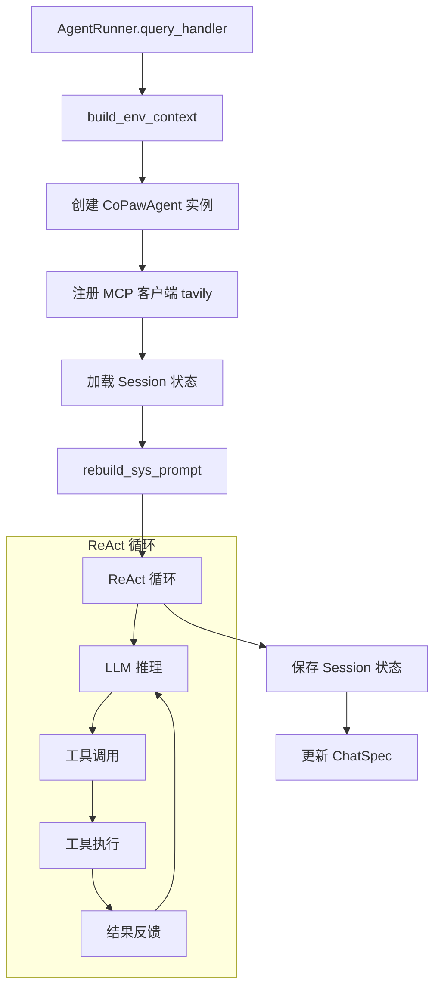
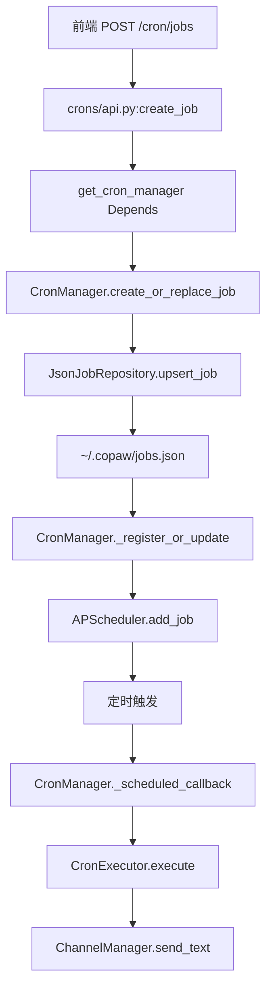
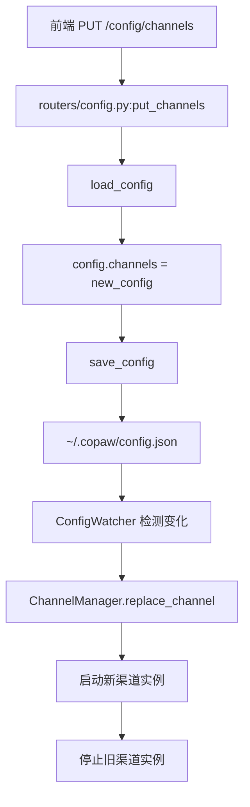
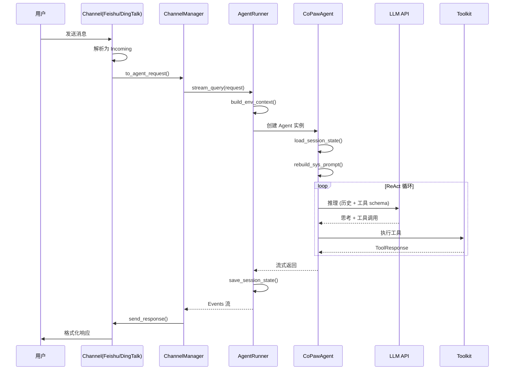
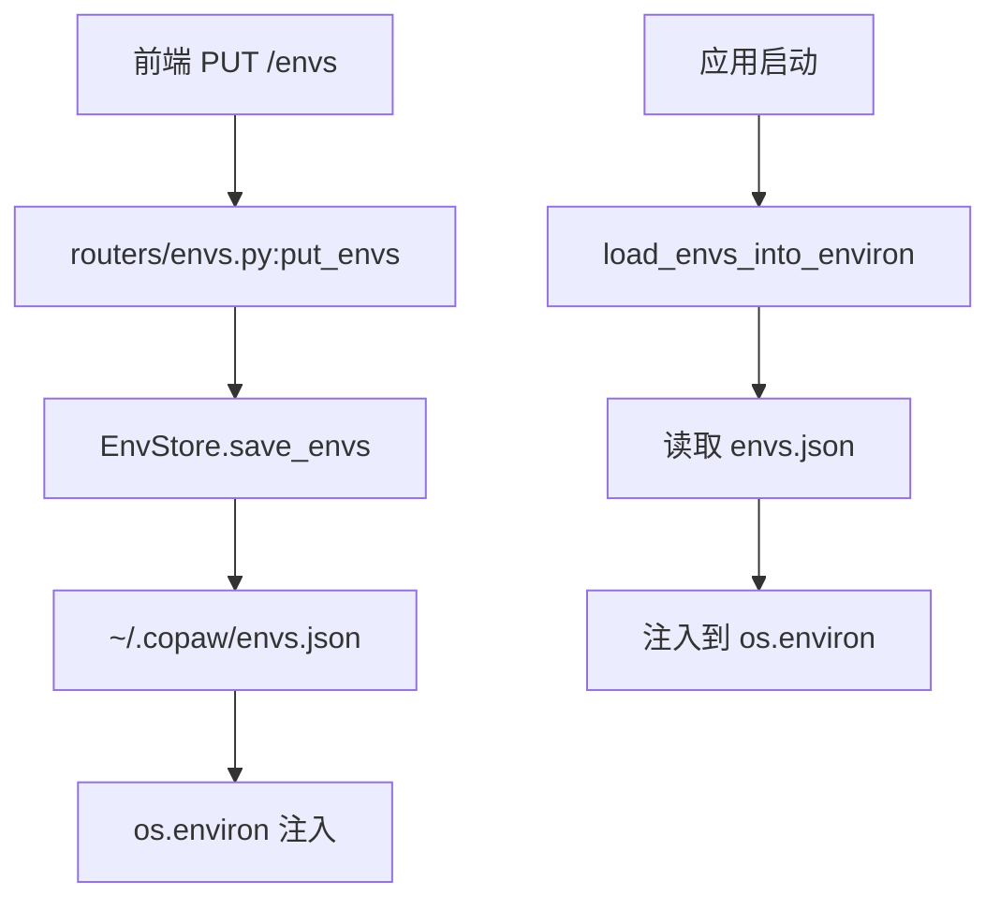

# CoPaw API 完整调用链路图

**生成时间:** 2026-03-01  
**范围:** 从 FastAPI 入口 → Router → Manager/Service → Repository → 持久化层

---

## 📊 **系统总览 · 分层架构**

```
┌─────────────────────────────────────────────────────────────────┐
│                    前端层 (React SPA @ /console)                │
│  /chat | /channels | /sessions | /cron-jobs | /skills | ...    │
└────────────────────┬────────────────────────────────────────────┘
                     │ HTTP / WebSocket
┌────────────────────▼────────────────────────────────────────────┐
│                    FastAPI 应用层 (_app.py)                     │
│  • lifespan: 初始化 Runner, ChannelManager, CronManager        │
│  • app.state: 暴露全局依赖 (runner, chat_manager, ...)         │
│  • CORS / StaticFiles / SPA Fallback                           │
└────────────┬────────────────────────────────────────────────────┘
             │
    ┌────────▼────────┐
    │  API Router 层  │ 9 个路由模块
    └────────┬────────┘
```

---

## 🗺️ **API Router 层 · 9 大模块**

```
app/routers/__init__.py (统一导出)
│
├── 1. runner/api.py        → /chats/*        (聊天会话管理)
├── 2. agent.py             → /agent/*        (Agent 文件/记忆)
├── 3. config.py            → /config/*       (渠道配置)
├── 4. providers.py         → /models/*       (LLM 提供商)
├── 5. skills.py            → /skills/*       (技能管理)
├── 6. envs.py              → /envs/*         (环境变量)
├── 7. workspace.py         → /workspace/*    (工作区)
├── 8. crons/api.py         → /cron/*         (定时任务)
└── 9. console.py           → /console/*      (推送消息)
```

---

## 🔌 **完整调用链路 · 8 条核心路径**

### 路径 1: 聊天会话管理 (`/chats/*`)

**调用栈:**
```
1. FastAPI Router (/chats)
   ↓
2. runner/api.py (list_chats, create_chat, stream_chat_message)
   ↓ (Depends: get_chat_manager)
3. ChatManager (list_chats, create_chat, get_chat)
   ↓
4. JsonChatRepository (filter_chats, upsert_chat, get_chat)
   ↓
5. JSON 文件持久化 (~/.copaw/chats.json)
```

**Mermaid 流程图:**
```mermaid
graph TB
    A[前端 POST /chats] --> B[runner/api.py:create_chat]
    B --> C[get_chat_manager Depends]
    C --> D[ChatManager.create_chat]
    D --> E[JsonChatRepository.upsert_chat]
    E --> F[~/.copaw/chats.json]
    
    B2[前端 POST /chats/{id}/stream] --> C2[runner/api.py:stream_chat_message]
    C2 --> D2[ChatManager.get_chat]
    D2 --> E2[AgentRunner.query_handler]
    E2 --> F2[CoPawAgent ReAct 循环]
    F2 --> G2[SSE 流式返回]
```

**关键代码:**
```python
# runner/api.py
@router.post("", response_model=ChatSpec)
async def create_chat(
    request: ChatSpec,
    mgr: ChatManager = Depends(get_chat_manager),
):
    chat_id = str(uuid4())
    spec = ChatSpec(id=chat_id, ...)
    return await mgr.create_chat(spec)

# runner/manager.py
async def create_chat(self, spec: ChatSpec) -> ChatSpec:
    async with self._lock:
        await self._repo.upsert_chat(spec)
        return spec

# runner/repo/json_repo.py
async def upsert_chat(self, spec: ChatSpec) -> None:
    self._data.chats[spec.id] = spec
    await self._save()
```

---

### 路径 2: Agent 核心处理 (`query_handler`)

**调用栈:**
```
1. AgentRunner.query_handler(msgs, request)
   ↓
2. build_env_context(session_id, user_id, channel, working_dir)
   ↓
3. CoPawAgent(env_context, mcp_clients, memory_manager)
   ↓
4. agent.register_mcp_clients()
   ↓
5. session.load_session_state() → ~/.copaw/sessions/{session_id}.json
   ↓
6. agent.rebuild_sys_prompt() → 读取 SOUL.md, AGENTS.md, PROFILE.md
   ↓
7. ReAct 循环 (思考→行动→观察)
   ↓
8. session.save_session_state()
   ↓
9. ChatManager.update_chat(chat)
```

**Mermaid 流程图:**


**关键代码:**
```python
# runner/runner.py
async def query_handler(self, msgs, request: AgentRequest = None, **kwargs):
    session_id = request.session_id
    user_id = request.user_id
    channel = getattr(request, "channel", DEFAULT_CHANNEL)
    
    env_context = build_env_context(...)
    agent = CoPawAgent(env_context, mcp_clients, memory_manager)
    
    await self.session.load_session_state(...)
    agent.rebuild_sys_prompt()
    
    async for msg, last in stream_printing_messages(...):
        yield msg, last
    
    await self.session.save_session_state(...)
```

---

### 路径 3: 定时任务管理 (`/cron/*`)

**调用栈:**
```
1. FastAPI Router (/cron/jobs)
   ↓
2. crons/api.py (create_job, list_jobs, run_job)
   ↓ (Depends: get_cron_manager)
3. CronManager (create_or_replace_job, list_jobs, run_job)
   ↓
4. JsonJobRepository (upsert_job, list_jobs, get_job)
   ↓
5. JSON 文件持久化 (~/.copaw/jobs.json)
   ↓
6. APScheduler 调度器 (定时触发)
   ↓
7. CronExecutor.execute(job) → AgentRunner.run() 或 ChannelManager.send_text()
```

**Mermaid 流程图:**


**关键代码:**
```python
# crons/api.py
@router.post("/jobs", response_model=CronJobSpec)
async def create_job(spec: CronJobSpec, mgr: CronManager = Depends(get_cron_manager)):
    job_id = str(uuid.uuid4())
    created = spec.model_copy(update={"id": job_id})
    await mgr.create_or_replace_job(created)
    return created

# crons/manager.py
async def create_or_replace_job(self, spec: CronJobSpec) -> None:
    async with self._lock:
        await self._repo.upsert_job(spec)
        if self._started:
            await self._register_or_update(spec)
```

---

### 路径 4: 渠道配置管理 (`/config/*`)

**调用栈:**
```
1. FastAPI Router (/config/channels)
   ↓
2. routers/config.py (put_channels, get_channel)
   ↓
3. load_config() / save_config()
   ↓
4. JSON 文件持久化 (~/.copaw/config.json)
   ↓
5. ConfigWatcher (每 2 秒轮询 mtime)
   ↓
6. ChannelManager.replace_channel(new_channel)
   ↓
7. 渠道热重载 (start new → swap → stop old)
```

**Mermaid 流程图:**


**关键代码:**
```python
# routers/config.py
@router.put("/channels", response_model=ChannelConfig)
async def put_channels(channels_config: ChannelConfig):
    config = load_config()
    config.channels = channels_config
    save_config(config)
    return channels_config

# channels/manager.py
async def replace_channel(self, new_channel: BaseChannel) -> None:
    # 1) Start new channel outside lock
    await new_channel.start()
    
    # 2) Swap + stop old inside lock
    async with self._lock:
        for i, ch in enumerate(self.channels):
            if ch.channel == new_channel.channel:
                self.channels[i] = new_channel
                await old_channel.stop()
                break
```

---

### 路径 5: LLM 提供商管理 (`/models/*`)

**调用栈:**
```
1. FastAPI Router (/models)
   ↓
2. routers/providers.py (20+ API 端点)
   ├─ list_all_providers()
   ├─ create_new_provider()
   ├─ update_existing_provider()
   ├─ add_provider_keys()
   ├─ toggle_provider_key()
   ├─ test_provider()
   └─ set_active_model()
   ↓
3. providers/store.py (create_provider, update_provider, set_active_llm)
   ↓
4. JSON 文件持久化 (~/.copaw/providers.json)
```

**Mermaid 流程图:**
```mermaid
graph TB
    A[前端 PUT /models/{id}/config] --> B[routers/providers.py:configure_provider_legacy]
    B --> C[update_provider_settings]
    C --> D[ProvidersData.providers[provider_id]]
    D --> E[save_providers_json]
    E --> F[~/.copaw/providers.json]
    
    G[前端 PUT /models/active] --> H[set_active_llm]
    H --> I[ProvidersData.active_llm]
    I --> E
```

**关键代码:**
```python
# routers/providers.py
@router.put("/{provider_id}", response_model=ProviderInfo)
async def update_existing_provider(
    provider_id: str = Path(...),
    body: UpdateProviderRequest = Body(...),
):
    data = update_provider(
        provider_id,
        name=body.name,
        base_url=body.base_url,
        models=body.models,
        rotation=body.rotation,
        enabled=body.enabled,
    )
    return _build_provider_info(data.providers[provider_id], data)
```

---

### 路径 6: 技能管理 (`/skills/*`)

**调用栈:**
```
1. FastAPI Router (/skills)
   ↓
2. routers/skills.py (list_skills, enable_skill, create_skill)
   ↓
3. SkillService (list_all_skills, enable_skill, create_skill)
   ↓
4. 文件系统操作
   ├─ ~/.copaw/customized_skills/ (用户自定义)
   ├─ ~/.copaw/active_skills/ (已启用符号链接)
   └─ src/copaw/agents/skills/ (内建技能)
```

**Mermaid 流程图:**
```mermaid
graph TB
    A[前端 POST /skills] --> B[routers/skills.py:create_skill]
    B --> C[SkillService.create_skill]
    C --> D[创建 ~/.copaw/customized_skills/{name}/]
    D --> E[写入 SKILL.md + references/ + scripts/]
    
    F[前端 POST /skills/{name}/enable] --> G[SkillService.enable_skill]
    G --> H[符号链接到 ~/.copaw/active_skills/]
```

**关键代码:**
```python
# routers/skills.py
@router.post("")
async def create_skill(request: CreateSkillRequest):
    result = SkillService.create_skill(
        name=request.name,
        content=request.content,
        references=request.references,
        scripts=request.scripts,
    )
    return {"created": result}

# agents/skills_manager.py
@classmethod
def create_skill(cls, name: str, content: str, ...) -> bool:
    skill_dir = get_customized_skills_dir() / name
    skill_dir.mkdir(parents=True, exist_ok=True)
    (skill_dir / "SKILL.md").write_text(content, encoding="utf-8")
```

---

### 路径 7: 渠道消息处理 (Channel → Agent)

**调用栈:**
```
1. 用户发送消息
   ↓
2. Channel (Feishu/DingTalk) 接收
   ↓
3. Channel.to_agent_request() 转换
   ↓
4. ChannelManager 中转
   ↓
5. AgentRunner.stream_query(request)
   ↓
6. CoPawAgent ReAct 循环
   ↓
7. 流式返回 Events
   ↓
8. Channel.send_response() 格式化发送
```

**Mermaid 时序图:**


**关键代码:**
```python
# channels/feishu.py
async def _on_message(self, data: P2ImMessageReceiveV1) -> None:
    # 1. Dedup check
    if message_id in self._processed_message_ids:
        return
    
    # 2. Parse message
    sender_display = await self._get_user_name_by_open_id(sender_id)
    
    # 3. Download media
    if msg_type == "image":
        url_or_path = await self._download_image_resource(...)
    
    # 4. Build Incoming
    msg = Incoming(channel=self.channel, sender=sender_display, text=text, ...)
    
    # 5. Enqueue
    self._loop.call_soon_threadsafe(self._queue.put_nowait, msg)
```

---

### 路径 8: 环境变量管理 (`/envs/*`)

**调用栈:**
```
1. FastAPI Router (/envs)
   ↓
2. routers/envs.py (list_envs, put_envs, delete_env)
   ↓
3. envs/store.py (EnvStore.load_envs, save_envs)
   ↓
4. JSON 文件持久化 (~/.copaw/envs.json)
   ↓
5. os.environ 注入 (启动时 + 保存后)
```

**Mermaid 流程图:**


**关键代码:**
```python
# routers/envs.py
@router.put("", response_model=list[EnvVar])
async def put_envs(envs: list[EnvVar]):
    env_store = EnvStore()
    await env_store.save_envs(envs)
    # Inject into os.environ
    for env in envs:
        os.environ[env.key] = env.value
    return envs
```

---

## 🔧 **依赖注入 · 混乱现状**

```python
# ❌ 当前问题：每个 router 自己写依赖注入

# runner/api.py
def get_runner(request: Request):
    runner = getattr(request.app.state, "runner", None)
    if runner is None:
        raise HTTPException(status_code=503, detail="Runner not initialized")
    return runner

def get_chat_manager(request: Request) -> ChatManager:
    mgr = getattr(request.app.state, "chat_manager", None)
    if mgr is None:
        raise HTTPException(status_code=503, detail="Chat manager not initialized")
    return mgr

# crons/api.py
def get_cron_manager(request: Request) -> CronManager:
    mgr = getattr(request.app.state, "cron_manager", None)
    if mgr is None:
        raise HTTPException(status_code=503, detail="cron manager not initialized")
    return mgr

# ✅ 应该统一为
# app/dependencies.py
class Dependencies:
    def get_runner(self) -> AgentRunner: ...
    def get_chat_manager(self) -> ChatManager: ...
    def get_cron_manager(self) -> CronManager: ...

deps = Dependencies()
router = APIRouter(dependencies=[Depends(deps.get_runner)])
```

---

## 💾 **数据持久化 · 文件存储全景**

```
~/.copaw/                          # 运行时数据目录
├── config.json                    # 渠道配置 + Agent 语言 + 心跳
├── chats.json                     # 会话映射 (channel+user → chat UUID)
├── jobs.json                      # 定时任务定义
├── providers.json                 # LLM 提供商配置 ⚠️ 应在运行时目录
├── envs.json                      # 环境变量 ⚠️ 应在运行时目录
├── copaw.db/                      # ChromaDB (向量存储 - 记忆语义检索)
├── sessions/                      # 每会话状态 (消息历史 + 摘要)
│   ├── {session_id}.json
│   └── ...
├── memory/                        # 每日记忆笔记
│   ├── 2026-03-01.md
│   └── ...
├── customized_skills/             # 用户自定义技能
│   ├── skill-1/
│   └── ...
├── active_skills/                 # 已启用技能 (符号链接)
│   ├── skill-1 → ../customized_skills/skill-1
│   └── ...
├── SOUL.md                        # 灵魂宣言
├── AGENTS.md                      # 系统宪法
├── PROFILE.md                     # 用户档案
├── MEMORY.md                      # 记忆策展
└── HEARTBEAT.md                   # 周期检查任务
```

---

## 📋 **问题诊断 · 核心痛点**

| 维度 | 问题 | 影响 | 修复优先级 |
|------|------|------|------------|
| **路由组织** | 9 个独立 router，无统一前缀 | 前端路由映射困难 | P1 |
| **依赖注入** | 每个 router 自己写 `get_xxx()` | 代码重复，维护困难 | P0 |
| **错误处理** | 各 router 自己抛 `HTTPException` | 错误响应格式不一致 | P0 |
| **数据验证** | Pydantic v2 混用 | 类型不安全 | P2 |
| **API 文档** | 部分有 `summary/description` | 文档缺失 | P2 |
| **响应格式** | 有的返回 `list[T]`，有的返回 `{"data": list[T]}` | 前端解析困难 | P1 |
| **批量操作** | 参数不一致 (query param vs body) | 前端传参混乱 | P1 |
| **分页支持** | 列表 API 无分页 | 大数据量时崩溃 | P2 |

---

## ✅ **修复优先级**

| 优先级 | 修复项 | 影响范围 | 工时 |
|--------|--------|----------|------|
| 🔴 P0 | 统一错误响应格式 | 所有 API | 2h |
| 🔴 P0 | 全局异常处理器 | 所有 API | 1h |
| 🔴 P0 | 统一依赖注入 | 所有 API | 2h |
| 🟡 P1 | 统一路由前缀 `/api/v1` | 前端需同步修改 | 1h |
| 🟡 P1 | 统一响应格式 `APIResponse[T]` | 所有 API | 3h |
| 🟠 P2 | 添加请求日志中间件 | 调试/监控 | 1h |
| 🟠 P2 | 添加分页支持 | 列表 API | 4h |

---

**文档完成日期:** 2026-03-01  
**下次更新:** 架构重构后同步更新
