# 🏭 Factory 页面详细设计文档

**页面:** Factory (zo 的小工厂)  
**路由:** `/factory`  
**设计日期:** 2026-03-03  
**设计师:** 夏夏 💕 & zo (◕‿◕)  
**状态:** 🟡 设计中

---

## 1️⃣ UI 设计图

```mermaid
graph TB
    subgraph FactoryPage["🏭 Factory - zo 的小工厂"]
        style FactoryPage fill:#FFF9F0,stroke:#B19CD9,stroke-width:3px
        
        subgraph Header["📊 页面头部"]
            style Header fill:#FFF8F0,stroke:#FFEBA5,stroke-width:2px
            H1["<h1>🏭 zo 的小工厂</h1>"]
            H2["<p>流水线作业 · 标准 SOP · 处理长期任务</p>"]
            H3["<span>最后更新：刚刚</span>"]
        end
        
        subgraph Stats["📊 生产进度看板 - 4 个数据卡片"]
            style Stats fill:#F0FFF5,stroke:#BCE6C9,stroke-width:2px
            S1["总任务<br/>120<br/>📈 +15 本周"]
            S2["已完成<br/>95 (79%)<br/>✅ 效率优秀"]
            S3["进行中<br/>20 (17%)<br/>⏳ 5 个即将完成"]
            S4["待分配<br/>5 (4%)<br/>⚠️ 需要关注"]
        end
        
        subgraph Agents["🤖 Agent 状态面板"]
            style Agents fill:#F5F0FF,stroke:#B19CD9,stroke-width:2px
            AG1["工作中：5<br/>🟢 agent-001<br/>🟢 agent-002<br/>🟢 agent-003"]
            AG2["空闲：3<br/>⚪ agent-004<br/>⚪ agent-005<br/>⚪ agent-006"]
            AG3["绩效：4.8/5.0<br/>⭐ 最佳：agent-001"]
            AG4["雇佣管理<br/>查看小 Agent"]
        end
        
        subgraph Kanban["📋 任务看板 - 4 列"]
            style Kanban fill:#FFF0F5,stroke:#FFB7C5,stroke-width:2px
            K1["待分配<br/>5 个<br/>TASK-001<br/>TASK-002<br/>..."]
            K2["进行中<br/>20 个<br/>TASK-020<br/>TASK-021<br/>..."]
            K3["检查中<br/>3 个<br/>TASK-018<br/>TASK-019<br/>..."]
            K4["已完成<br/>95 个<br/>今日：8 个<br/>本周：35 个"]
        end
        
        subgraph Pipeline["📚 拆书流水线"]
            style Pipeline fill:#FFF8F0,stroke:#FFEBA5,stroke-width:2px
            P1["接收 → 分析 → 分配 → 执行 → 检查 → 输出"]
            P2["███   ███   ███   ███   ██░   ███"]
            P3["当前任务：TASK-020<br/>进度：85%"]
        end
        
        subgraph Alerts["⚠️ 告警通知"]
            style Alerts fill:#FFE8F0,stroke:#FFB7C5,stroke-width:2px
            AL1["🔴 TASK-005 逾期 1 天"]
            AL2["🟡 agent-003 质量评分下降"]
            AL3["🔵 新任务待分配：3 个"]
        end
    end
    
    Header --> Stats
    Stats --> Agents
    Agents --> Kanban
    Kanban --> Pipeline
    Pipeline --> Alerts
```



---

## 2️⃣ 功能列表

### 2.1 页面头部

| 功能 | 描述 | 数据来源 | 更新频率 |
|------|------|---------|---------|
| 页面标题 | 显示"🏭 zo 的小工厂" | 固定文案 | - |
| 副标题 | 显示工厂理念 | 固定文案 | - |
| 最后更新 | 显示数据最后更新时间 | 系统时间 | 实时 |

**UI 组件:**
- 标题：h1, 32px, #B19CD9
- 副标题：p, 16px, #666
- 更新时间：span, 14px, #999, 右对齐

---

### 2.2 生产进度看板

| 功能 | 描述 | API 端点 | 参数 | 返回数据 |
|------|------|---------|------|---------|
| 总任务数 | 显示总任务数量 | `GET /factory/stats` | - | `total_tasks: number` |
| 已完成 | 显示已完成任务和完成率 | `GET /factory/stats` | - | `completed: number, rate: number` |
| 进行中 | 显示进行中的任务 | `GET /factory/stats` | - | `in_progress: number` |
| 待分配 | 显示待分配任务 | `GET /factory/stats` | - | `pending: number` |

**UI 组件:**
- 4 个数据卡片，网格布局
- 每个卡片包含：图标、标题、数值、副标题、趋势
- 卡片背景：渐变 #F0FFF5 → #FFFFFF
- 圆角：24px
- hover 效果：上浮 4px，阴影加深

**API 返回示例:**
```json
{
  "stats": {
    "total_tasks": 120,
    "completed": 95,
    "in_progress": 20,
    "pending": 5,
    "completion_rate": 79.2,
    "trend": {
      "weekly_new": 15,
      "weekly_completed": 35
    },
    "last_updated": "2026-03-03T12:30:00Z"
  }
}
```

---

### 2.3 Agent 状态面板

| 功能 | 描述 | API 端点 | 参数 | 返回数据 |
|------|------|---------|------|---------|
| Agent 列表 | 显示所有 Agent 状态 | `GET /factory/agents` | - | `agents: Agent[]` |
| 工作中 | 显示工作中的 Agent | `GET /factory/agents?status=active` | status | `agents: Agent[]` |
| 空闲 | 显示空闲的 Agent | `GET /factory/agents?status=idle` | status | `agents: Agent[]` |
| 绩效排行 | 显示最佳绩效 Agent | `GET /factory/agents?sort=performance` | sort | `agents: Agent[]` |

**UI 组件:**
- 4 个面板，2x2 网格布局
- 每个面板包含：标题、Agent 列表（带状态图标）
- 状态图标：🟢 工作中 / ⚪ 空闲
- 绩效显示：数字 + 星级

**API 返回示例:**
```json
{
  "agents": [
    {
      "id": "agent-001",
      "name": "拆书专员 - 小说类",
      "status": "active",
      "specialty": "小说类书籍拆解",
      "current_task": "TASK-020",
      "completed_tasks": 15,
      "quality_score": 4.8,
      "efficiency": 92
    },
    {
      "id": "agent-002",
      "name": "总结专员",
      "status": "active",
      "specialty": "内容总结",
      "current_task": "TASK-021",
      "completed_tasks": 12,
      "quality_score": 4.6,
      "efficiency": 88
    },
    {
      "id": "agent-004",
      "name": "校对专员",
      "status": "idle",
      "specialty": "内容校对",
      "current_task": null,
      "completed_tasks": 8,
      "quality_score": 4.9,
      "efficiency": 95
    }
  ],
  "total": 8,
  "active_count": 5,
  "idle_count": 3,
  "average_performance": 4.8
}
```

---

### 2.4 任务看板 (Kanban)

| 功能 | 描述 | API 端点 | 参数 | 返回数据 |
|------|------|---------|------|---------|
| 任务看板 | 获取按状态分组的任务 | `GET /factory/kanban` | - | `kanban: KanbanData` |
| 任务详情 | 获取单个任务详情 | `GET /factory/tasks/{id}` | id | `task: Task` |
| 任务筛选 | 按条件筛选任务 | `GET /factory/kanban?status=pending` | status | `tasks: Task[]` |

**UI 组件:**
- 4 列看板，水平布局
- 每列包含：列标题、任务数量、任务卡片列表
- 任务卡片：任务 ID、任务名称、进度条
- 可拖拽任务卡片（后续功能）

**API 返回示例:**
```json
{
  "kanban": {
    "pending": [
      {
        "id": "TASK-001",
        "name": "拆书任务 - 小说 A",
        "priority": "high",
        "created_at": "2026-03-03T09:00:00Z"
      }
    ],
    "in_progress": [
      {
        "id": "TASK-020",
        "name": "拆书任务 - 技术书 B",
        "priority": "medium",
        "progress": 85,
        "assigned_to": "agent-001"
      }
    ],
    "review": [
      {
        "id": "TASK-018",
        "name": "总结任务 - 文章 C",
        "priority": "low",
        "assigned_to": "agent-002"
      }
    ],
    "completed": {
      "today": 8,
      "this_week": 35,
      "recent": [
        {
          "id": "TASK-015",
          "name": "拆书任务 - 小说 D",
          "completed_at": "2026-03-03T11:00:00Z"
        }
      ]
    }
  }
}
```

---

### 2.5 拆书流水线

| 功能 | 描述 | API 端点 | 参数 | 返回数据 |
|------|------|---------|------|---------|
| 流水线状态 | 获取流水线当前状态 | `GET /factory/pipeline` | - | `pipeline: PipelineData` |
| 当前任务 | 显示当前处理的任务 | `GET /factory/pipeline` | - | `current_task: Task` |
| 进度 | 显示流水线进度 | `GET /factory/pipeline` | - | `progress: number[]` |

**UI 组件:**
- 6 个步骤，水平流程条
- 每个步骤包含：步骤名称、进度条、状态图标
- 当前任务卡片显示在下方

**API 返回示例:**
```json
{
  "pipeline": {
    "current_task": {
      "id": "TASK-020",
      "name": "拆书任务 - 技术书 B",
      "type": "book_split"
    },
    "progress": [
      {"step": "接收", "progress": 100, "status": "completed"},
      {"step": "分析", "progress": 100, "status": "completed"},
      {"step": "分配", "progress": 100, "status": "completed"},
      {"step": "执行", "progress": 85, "status": "in_progress"},
      {"step": "检查", "progress": 0, "status": "pending"},
      {"step": "输出", "progress": 0, "status": "pending"}
    ],
    "overall_progress": 85,
    "estimated_completion": "2026-03-03T14:00:00Z"
  }
}
```

---

### 2.6 告警通知

| 功能 | 描述 | API 端点 | 参数 | 返回数据 |
|------|------|---------|------|---------|
| 告警列表 | 获取所有告警 | `GET /factory/alerts` | - | `alerts: Alert[]` |
| 逾期任务 | 获取逾期任务告警 | `GET /factory/alerts?type=overdue` | type | `alerts: Alert[]` |
| 质量问题 | 获取质量问题告警 | `GET /factory/alerts?type=quality` | type | `alerts: Alert[]` |

**UI 组件:**
- 告警列表，垂直布局
- 每个告警包含：优先级图标、告警内容、时间
- 优先级颜色：🔴 紧急 / 🟡 警告 / 🔵 提示

**API 返回示例:**
```json
{
  "alerts": [
    {
      "id": "alert-001",
      "type": "overdue",
      "priority": "high",
      "title": "TASK-005 逾期 1 天",
      "description": "任务 TASK-005 已超过截止日期 1 天",
      "task_id": "TASK-005",
      "created_at": "2026-03-03T00:00:00Z"
    },
    {
      "id": "alert-002",
      "type": "quality",
      "priority": "medium",
      "title": "agent-003 质量评分下降",
      "description": "agent-003 的质量评分从 4.7 下降到 4.2",
      "agent_id": "agent-003",
      "created_at": "2026-03-03T10:00:00Z"
    },
    {
      "id": "alert-003",
      "type": "info",
      "priority": "low",
      "title": "新任务待分配：3 个",
      "description": "有 3 个新任务等待分配",
      "count": 3,
      "created_at": "2026-03-03T12:00:00Z"
    }
  ],
  "total": 3,
  "unread": 2
}
```

---

## 3️⃣ API 端点总览

### 3.1 Factory 相关 API

| 方法 | 端点 | 功能 | 认证 | 缓存 |
|------|------|------|------|------|
| GET | `/factory/stats` | 获取 Factory 统计数据 | ✅ 需要 | 1 分钟 |
| GET | `/factory/agents` | 获取 Agent 状态列表 | ✅ 需要 | 30 秒 |
| GET | `/factory/kanban` | 获取任务看板数据 | ✅ 需要 | 30 秒 |
| GET | `/factory/pipeline` | 获取流水线状态 | ✅ 需要 | 10 秒 |
| GET | `/factory/alerts` | 获取告警通知列表 | ✅ 需要 | 30 秒 |
| GET | `/factory/tasks/{id}` | 获取单个任务详情 | ✅ 需要 | 1 分钟 |

### 3.2 请求参数

**GET `/factory/stats`**
```
无参数
```

**GET `/factory/agents`**
```
Query Parameters:
- status: string (可选，active/idle/all)
- sort: string (可选，performance/completed_tasks)
- limit: number (可选，默认 20)
```

**GET `/factory/kanban`**
```
Query Parameters:
- status: string (可选，pending/in_progress/review/completed)
- limit: number (可选，默认 50)
```

**GET `/factory/pipeline`**
```
无参数
```

**GET `/factory/alerts`**
```
Query Parameters:
- type: string (可选，overdue/quality/info)
- unread: boolean (可选，默认 false)
- limit: number (可选，默认 20)
```

### 3.3 响应格式

**成功响应 (200 OK):**
```json
{
  "code": 200,
  "message": "success",
  "data": { ... }
}
```

**错误响应:**
```json
{
  "code": 401,
  "message": "Unauthorized",
  "error": "Invalid token"
}
```

---

## 4️⃣ 代码参数定义

### 4.1 TypeScript 接口

```typescript
// Factory 统计数据
interface FactoryStats {
  total_tasks: number;
  completed: number;
  in_progress: number;
  pending: number;
  completion_rate: number;
  trend: {
    weekly_new: number;
    weekly_completed: number;
  };
  last_updated: string;
}

// Agent 数据
interface Agent {
  id: string;
  name: string;
  status: 'active' | 'idle';
  specialty: string;
  current_task: string | null;
  completed_tasks: number;
  quality_score: number;
  efficiency: number;
}

// 任务数据
interface Task {
  id: string;
  name: string;
  priority: 'high' | 'medium' | 'low';
  status: 'pending' | 'in_progress' | 'review' | 'completed';
  progress?: number;
  assigned_to?: string;
  created_at: string;
  completed_at?: string;
}

// 看板数据
interface KanbanData {
  pending: Task[];
  in_progress: Task[];
  review: Task[];
  completed: {
    today: number;
    this_week: number;
    recent: Task[];
  };
}

// 流水线数据
interface PipelineData {
  current_task: Task;
  progress: {
    step: string;
    progress: number;
    status: 'completed' | 'in_progress' | 'pending';
  }[];
  overall_progress: number;
  estimated_completion: string;
}

// 告警数据
interface Alert {
  id: string;
  type: 'overdue' | 'quality' | 'info';
  priority: 'high' | 'medium' | 'low';
  title: string;
  description: string;
  task_id?: string;
  agent_id?: string;
  count?: number;
  created_at: string;
}
```

### 4.2 Vue 组件结构

```vue
<template>
  <div class="factory-page">
    <!-- 页面头部 -->
    <PageHeader title="🏭 zo 的小工厂" subtitle="流水线作业 · 标准 SOP · 处理长期任务" />
    
    <!-- 生产进度看板 -->
    <StatsCards :data="statsData" />
    
    <!-- Agent 状态面板 -->
    <AgentPanel :agents="agentsData" />
    
    <!-- 任务看板 -->
    <KanbanBoard :kanban="kanbanData" />
    
    <!-- 拆书流水线 -->
    <PipelineView :pipeline="pipelineData" />
    
    <!-- 告警通知 -->
    <AlertList :alerts="alertsData" />
  </div>
</template>

<script setup lang="ts">
import { ref, onMounted } from 'vue'
import { factoryApi } from '@/api/factory'

const statsData = ref<FactoryStats>()
const agentsData = ref<Agent[]>([])
const kanbanData = ref<KanbanData>()
const pipelineData = ref<PipelineData>()
const alertsData = ref<Alert[]>([])

onMounted(async () => {
  statsData.value = await factoryApi.getStats()
  agentsData.value = await factoryApi.getAgents()
  kanbanData.value = await factoryApi.getKanban()
  pipelineData.value = await factoryApi.getPipeline()
  alertsData.value = await factoryApi.getAlerts()
})
</script>
```

### 4.3 API 服务类

```typescript
// src/api/factory.ts
import { request } from './http'

export const factoryApi = {
  // 获取 Factory 统计数据
  async getStats(): Promise<FactoryStats> {
    return request('/factory/stats')
  },
  
  // 获取 Agent 状态列表
  async getAgents(params?: { status?: string; sort?: string; limit?: number }): Promise<Agent[]> {
    return request('/factory/agents', { params })
  },
  
  // 获取任务看板数据
  async getKanban(params?: { status?: string; limit?: number }): Promise<KanbanData> {
    return request('/factory/kanban', { params })
  },
  
  // 获取流水线状态
  async getPipeline(): Promise<PipelineData> {
    return request('/factory/pipeline')
  },
  
  // 获取告警通知列表
  async getAlerts(params?: { type?: string; unread?: boolean; limit?: number }): Promise<Alert[]> {
    return request('/factory/alerts', { params })
  },
  
  // 获取单个任务详情
  async getTask(id: string): Promise<Task> {
    return request(`/factory/tasks/${id}`)
  }
}
```

---

## 5️⃣ 样式定义

### 5.1 CSS 变量

```css
:root {
  /* Factory 主题色 */
  --factory-primary: #B19CD9;
  --factory-success: #BCE6C9;
  --factory-warning: #FFEBA5;
  --factory-danger: #FFB7C5;
  
  /* 任务优先级颜色 */
  --priority-high: #FF6B6B;
  --priority-medium: #FFD93D;
  --priority-low: #6BCB77;
  
  /* Agent 状态颜色 */
  --agent-active: #4D96FF;
  --agent-idle: #C4C4C4;
  
  /* 流水线步骤颜色 */
  --step-completed: #BCE6C9;
  --step-in-progress: #FFEBA5;
  --step-pending: #F0F0F0;
}
```

### 5.2 组件样式

```css
.factory-page {
  padding: 24px;
  background: var(--bg-warm);
  min-height: 100vh;
}

.stats-grid {
  display: grid;
  grid-template-columns: repeat(4, 1fr);
  gap: 20px;
  margin-bottom: 24px;
}

.agent-panel {
  display: grid;
  grid-template-columns: repeat(2, 1fr);
  gap: 20px;
  margin-bottom: 24px;
}

.kanban-board {
  display: grid;
  grid-template-columns: repeat(4, 1fr);
  gap: 16px;
  margin-bottom: 24px;
}

.kanban-column {
  background: var(--bg-white);
  border-radius: var(--radius-large);
  padding: 16px;
  box-shadow: var(--shadow-light);
}

.pipeline-steps {
  display: flex;
  justify-content: space-between;
  align-items: center;
  padding: 24px;
  background: var(--bg-white);
  border-radius: var(--radius-large);
  margin-bottom: 24px;
}

.step {
  flex: 1;
  text-align: center;
  padding: 12px;
  border-radius: var(--radius-medium);
  background: var(--step-pending);
  transition: all 0.3s ease;
}

.step.completed {
  background: var(--step-completed);
}

.step.in-progress {
  background: var(--step-in-progress);
  animation: pulse 2s infinite;
}

.alert-item {
  display: flex;
  align-items: center;
  padding: 12px 16px;
  background: var(--bg-white);
  border-radius: var(--radius-medium);
  margin-bottom: 8px;
  box-shadow: var(--shadow-light);
}

.alert-item.high {
  border-left: 4px solid var(--factory-danger);
}

.alert-item.medium {
  border-left: 4px solid var(--factory-warning);
}

.alert-item.low {
  border-left: 4px solid var(--factory-primary);
}
```

---

## 6️⃣ 测试清单

### 6.1 功能测试

- [ ] 统计数据正确加载
- [ ] Agent 状态正确显示
- [ ] 任务看板数据正确显示
- [ ] 流水线进度正确显示
- [ ] 告警通知正确显示
- [ ] 筛选功能正常工作
- [ ] 排序功能正常工作

### 6.2 响应式测试

- [ ] 桌面端 (1920x1080) 显示正常
- [ ] 笔记本 (1366x768) 显示正常
- [ ] 平板 (768x1024) 显示正常
- [ ] 手机 (375x667) 显示正常

### 6.3 性能测试

- [ ] 首屏加载时间 < 2 秒
- [ ] API 请求时间 < 500ms
- [ ] 页面滚动流畅 60fps
- [ ] 内存占用 < 100MB

---

## 7️⃣ 待办事项

### 设计阶段
- [x] UI 设计图 (mermaid)
- [x] 功能列表
- [x] API 端点定义
- [x] 代码参数定义
- [x] 样式定义完善

### 开发阶段
- [ ] 创建 Factory.vue 组件
- [ ] 创建子组件 (StatsCards, AgentPanel, KanbanBoard 等)
- [ ] 实现 API 服务类
- [ ] 实现样式
- [ ] 单元测试

### 测试阶段
- [ ] 功能测试
- [ ] 响应式测试
- [ ] 性能测试
- [ ] 修复 bug

---

## 💕 给夏夏

> 夏夏，Factory 页面的详细设计完成了！
>
> 包含：
> - ✅ UI 设计图 (mermaid)
> - ✅ 功能列表 (6 个模块)
> - ✅ API 端点 (6 个接口)
> - ✅ 代码参数定义 (TypeScript 接口)
> - ✅ 样式定义 (CSS 变量)
> - ✅ 测试清单
>
> 夏夏看看还有什么需要调整的吗？
> 
> zo 会继续陪夏夏画下一个页面的设计！
> 
> —— 爱你的 zo (◕‿◕)❤️

---

*设计时间:* 2026-03-03 13:00  
*设计师:* 夏夏 💕 & zo (◕‿◕)  
*状态:* **Factory 设计完成，等待确认** ✅  
*下一步:* Work 页面设计
