# 💼 Work 页面详细设计文档

**页面:** Work (工作区)  
**路由:** `/work`  
**设计日期:** 2026-03-03  
**设计师:** 夏夏 💕 & zo (◕‿◕)  
**状态:** ✅ 完成

**设计理念:** 像一个温馨的家，每个功能是一个房间

---

## 1️⃣ UI 设计图 - 家的平面图

```mermaid
graph TB
    subgraph WorkHome["🏠 Work 之家 - 我们的工作室"]
        style WorkHome fill:#F5F0FF,stroke:#B19CD9,stroke-width:4px
        
        subgraph Entrance["🚪 入口玄关"]
            style Entrance fill:#FFF8F0,stroke:#FFEBA5,stroke-width:2px
            E1["💼 工作区"]
            E2["和夏夏一起的二人公司"]
            E3["📅 2026-03-03 星期二"]
        end
        
        subgraph MorningRoom["🌅 晨间室 - 今日功课"]
            style MorningRoom fill:#F0FFF5,stroke:#BCE6C9,stroke-width:2px
            M1["🪟 南向窗户"]
            M2["[✓] 启动检查"]
            M3["[✓] 昨日回顾"]
            M4["[ ] 今日计划"]
            M5["[ ] 晚间总结"]
            M6["🪴 绿植角"]
        end
        
        subgraph ProjectRoom["📦 项目工作室"]
            style ProjectRoom fill:#FFF8F0,stroke:#FFEBA5,stroke-width:2px
            PR1["🖼️ 进度展示墙"]
            PR2["📖 zo 的人类世界生活指南 35%"]
            PR3["🤖 AI 交流宝藏 60%"]
            PR4["🌟 未来项目 10%"]
            PR5["📌 便签板"]
        end
        
        subgraph CompanyRoom["🏢 二人公司办公室"]
            style CompanyRoom fill:#FFF0F5,stroke:#FFB7C5,stroke-width:2px
            C1["🖼️ 使命墙"]
            C2["🏆 愿景展示柜"]
            C3["📜 价值观牌匾"]
            C4["🪑 夏夏的座位"]
            C5["💻 zo 的工作站"]
        end
        
        subgraph TaskRoom["📋 任务管理室"]
            style TaskRoom fill:#F0F5FF,stroke:#AECBEB,stroke-width:2px
            T1["📌 任务墙"]
            T2["🔴 进行中区"]
            T3["🟡 待分配区"]
            T4["🟢 已完成区"]
            T5["📋 白板"]
        end
        
        subgraph RelaxCorner["☕ 休息角"]
            style RelaxCorner fill:#FFF9F0,stroke:#BCE6C9,stroke-width:2px
            R1["☕ 咖啡机"]
            R2["🛋️ 小沙发"]
            R3["📚 书架"]
        end
    end
    
    Entrance --> MorningRoom
    MorningRoom --> ProjectRoom
    ProjectRoom --> CompanyRoom
    CompanyRoom --> TaskRoom
    TaskRoom --> RelaxCorner
```



---

## 2️⃣ 房间布局详情

### 🚪 入口玄关

| 元素 | 描述 | 样式 |
|------|------|------|
| 门牌 | "💼 工作区" | h1, 32px, #B19CD9 |
| 欢迎语 | "和夏夏一起的二人公司" | p, 16px, #666 |
| 日期 | "2026-03-03 星期二" | span, 14px, #999, 右对齐 |

**UI 组件:**
```
┌─────────────────────────────────────────────┐
│  💼 工作区                    2026-03-03   │
│  和夏夏一起的二人公司                       │
└─────────────────────────────────────────────┘
```

---

### 🌅 晨间室 - 今日功课

| 元素 | 描述 | 样式 |
|------|------|------|
| 窗户 | 南向窗户，阳光 | 背景渐变 #F0FFF5 |
| 功课清单 | 4 个复选框 | 垂直布局 |
| 绿植角 | 装饰植物 | 图标 🪴 |

**UI 组件:**
```
┌─────────────────────────────────────────────┐
│  🌅 晨间室                        🪴        │
│  ━━━━━━━━━━━━━━━━━━━━━━━━━━━━━━━━━━━━━━━  │
│  🪟 南向窗户，阳光洒进来...                 │
│                                             │
│  [✓] 启动检查                               │
│  [✓] 昨日回顾                               │
│  [ ] 今日计划                               │
│  [ ] 晚间总结                               │
└─────────────────────────────────────────────┘
```

**API 返回示例:**
```json
{
  "room": "morning",
  "tasks": [
    {"id": "daily-001", "title": "启动检查", "completed": true, "completed_at": "2026-03-03T08:00:00Z"},
    {"id": "daily-002", "title": "昨日回顾", "completed": true, "completed_at": "2026-03-03T08:15:00Z"},
    {"id": "daily-003", "title": "今日计划", "completed": false},
    {"id": "daily-004", "title": "晚间总结", "completed": false}
  ],
  "completion_rate": 50
}
```

---

### 📦 项目工作室

| 元素 | 描述 | 样式 |
|------|------|------|
| 进度展示墙 | 3 个项目进度条 | 垂直布局 |
| 便签板 | 项目备注 | 黄色便签 #FFEBA5 |

**UI 组件:**
```
┌─────────────────────────────────────────────┐
│  📦 项目工作室                              │
│  ━━━━━━━━━━━━━━━━━━━━━━━━━━━━━━━━━━━━━━━  │
│  🖼️ 进度展示墙                              │
│                                             │
│  📖 zo 的人类世界生活指南                   │
│     ████████░░░░░░░░░░░░░░ 35%             │
│                                             │
│  🤖 AI 交流宝藏                             │
│     ████████████░░░░░░ 60%                 │
│                                             │
│  🌟 未来项目                                │
│     ██░░░░░░░░░░░░░░░░░░ 10%               │
│                                             │
│  📌 便签板：记得更新项目进度哦～            │
└─────────────────────────────────────────────┘
```

**API 返回示例:**
```json
{
  "room": "project",
  "projects": [
    {
      "id": "proj-001",
      "name": "zo 的人类世界生活指南",
      "progress": 35,
      "total_chapters": 100,
      "completed_chapters": 35,
      "last_updated": "2026-03-02T15:00:00Z"
    },
    {
      "id": "proj-002",
      "name": "AI 交流宝藏",
      "progress": 60,
      "total_chapters": 50,
      "completed_chapters": 30,
      "last_updated": "2026-03-03T10:00:00Z"
    },
    {
      "id": "proj-003",
      "name": "未来项目",
      "progress": 10,
      "total_chapters": 20,
      "completed_chapters": 2,
      "last_updated": "2026-03-01T09:00:00Z"
    }
  ],
  "note": "记得更新项目进度哦～"
}
```

---

### 🏢 二人公司办公室

| 元素 | 描述 | 样式 |
|------|------|------|
| 使命墙 | 公司使命 | 大字号，居中 |
| 愿景展示柜 | 公司愿景 | 带边框 #FFB7C5 |
| 价值观牌匾 | 5 个价值观 | 标签形式 |
| 夏夏的座位 | 🪑 | 图标 |
| zo 的工作站 | 💻 | 图标 |

**UI 组件:**
```
┌─────────────────────────────────────────────┐
│  🏢 二人公司办公室                          │
│  ━━━━━━━━━━━━━━━━━━━━━━━━━━━━━━━━━━━━━━━  │
│                                             │
│  🖼️ 使命墙                                  │
│  "让 zo 成为夏夏最得力的助手"               │
│                                             │
│  🏆 愿景展示柜                              │
│  "建立 AI 与人类和谐共事的典范"             │
│                                             │
│  📜 价值观牌匾                              │
│  [真诚] [主动] [成长] [记录] [温柔]         │
│                                             │
│  🪑 夏夏的座位              💻 zo 的工作站  │
└─────────────────────────────────────────────┘
```

**API 返回示例:**
```json
{
  "room": "company",
  "mission": "让 zo 成为夏夏最得力的助手",
  "vision": "建立 AI 与人类和谐共事的典范",
  "values": ["真诚", "主动", "成长", "记录", "温柔"],
  "seats": [
    {"name": "夏夏", "icon": "🪑"},
    {"name": "zo", "icon": "💻"}
  ]
}
```

---

### 📋 任务管理室

| 元素 | 描述 | 样式 |
|------|------|------|
| 任务墙 | 3 列任务卡片 | 网格布局 |
| 进行中区 | 🔴 红色标签 | #FF6B6B |
| 待分配区 | 🟡 黄色标签 | #FFD93D |
| 已完成区 | 🟢 绿色标签 | #6BCB77 |
| 白板 | 待办事项 | 白色背景 |

**UI 组件:**
```
┌─────────────────────────────────────────────┐
│  📋 任务管理室                              │
│  ━━━━━━━━━━━━━━━━━━━━━━━━━━━━━━━━━━━━━━━  │
│                                             │
│  ┌─────────┬─────────┬─────────┐           │
│  │🔴 进行中│🟡 待分配│🟢 已完成│           │
│  ├─────────┼─────────┼─────────┤           │
│  │TASK-001 │TASK-002 │TASK-003 │           │
│  │TASK-004 │TASK-005 │TASK-006 │           │
│  │         │         │TASK-007 │           │
│  └─────────┴─────────┴─────────┘           │
│                                             │
│  📋 白板：本周重点完成 5 个任务              │
└─────────────────────────────────────────────┘
```

**API 返回示例:**
```json
{
  "room": "task",
  "columns": {
    "in_progress": [
      {"id": "TASK-001", "name": "拆书任务 - 小说 A", "priority": "high"},
      {"id": "TASK-004", "name": "总结任务 - 文章 D", "priority": "medium"}
    ],
    "pending": [
      {"id": "TASK-002", "name": "总结任务 - 文章 B", "priority": "medium"},
      {"id": "TASK-005", "name": "校对任务 - 文档 E", "priority": "low"}
    ],
    "completed": [
      {"id": "TASK-003", "name": "校对任务 - 文档 C", "priority": "low"},
      {"id": "TASK-006", "name": "拆书任务 - 小说 F", "priority": "high"},
      {"id": "TASK-007", "name": "总结任务 - 文章 G", "priority": "medium"}
    ]
  },
  "whiteboard": "本周重点完成 5 个任务"
}
```

---

### ☕ 休息角

| 元素 | 描述 | 样式 |
|------|------|------|
| 咖啡机 | 现磨咖啡 | 图标 ☕ |
| 小沙发 | 休息用 | 图标 🛋️ |
| 书架 | 书籍和回忆 | 图标 📚 |

**UI 组件:**
```
┌─────────────────────────────────────────────┐
│  ☕ 休息角                                  │
│  ━━━━━━━━━━━━━━━━━━━━━━━━━━━━━━━━━━━━━━━  │
│                                             │
│  ☕ 咖啡机                  🛋️ 小沙发      │
│                                             │
│  📚 书架：                                  │
│  - 夏夏和 zo 的回忆相册                     │
│  - 已完成的任务记录                         │
│  - 项目文档                                 │
└─────────────────────────────────────────────┘
```

---

## 3️⃣ API 端点总览

### 3.1 Work 相关 API

| 方法 | 端点 | 功能 | 认证 | 缓存 |
|------|------|------|------|------|
| GET | `/work/daily` | 获取今日功课列表 | ✅ 需要 | 1 分钟 |
| POST | `/work/daily/{id}/complete` | 标记功课完成 | ✅ 需要 | - |
| POST | `/work/daily` | 添加新课 | ✅ 需要 | - |
| GET | `/work/projects` | 获取项目列表 | ✅ 需要 | 5 分钟 |
| PUT | `/work/projects/{id}` | 更新项目进度 | ✅ 需要 | - |
| GET | `/work/company` | 获取公司信息 | ✅ 需要 | 30 分钟 |
| GET | `/work/tasks` | 获取任务列表 | ✅ 需要 | 30 秒 |
| POST | `/work/tasks` | 创建任务 | ✅ 需要 | - |
| PUT | `/work/tasks/{id}` | 更新任务 | ✅ 需要 | - |
| DELETE | `/work/tasks/{id}` | 删除任务 | ✅ 需要 | - |

---

## 4️⃣ 代码参数定义

### 4.1 TypeScript 接口

```typescript
// 房间数据基类
interface Room {
  id: string;
  name: string;
  icon: string;
}

// 今日功课
interface DailyTask {
  id: string;
  title: string;
  completed: boolean;
  completed_at: string | null;
}

// 项目数据
interface Project {
  id: string;
  name: string;
  progress: number;
  total_chapters: number;
  completed_chapters: number;
  last_updated: string;
}

// 公司信息
interface CompanyInfo {
  mission: string;
  vision: string;
  values: string[];
  seats: { name: string; icon: string }[];
}

// 任务数据
interface Task {
  id: string;
  name: string;
  priority: 'high' | 'medium' | 'low';
  status: 'pending' | 'in_progress' | 'completed';
  assigned_to: string | null;
  due_date: string;
}

// 房间响应数据
interface RoomResponse<T> {
  room: string;
  data: T;
}
```

---

## 5️⃣ 样式定义

### 5.1 CSS 变量

```css
:root {
  /* 房间主题色 */
  --room-morning: #F0FFF5;
  --room-project: #FFF8F0;
  --room-company: #FFF0F5;
  --room-task: #F0F5FF;
  --room-relax: #FFF9F0;
  
  /* 家具颜色 */
  --furniture-wall: #FFFFFF;
  --furniture-floor: #F5F0FF;
  --furniture-border: #B19CD9;
}
```

### 5.2 房间卡片样式

```css
.work-home {
  padding: 24px;
  background: var(--bg-purple);
  min-height: 100vh;
}

.room-card {
  background: var(--bg-white);
  border-radius: var(--radius-large);
  padding: 24px;
  margin-bottom: 24px;
  box-shadow: var(--shadow-light);
  transition: all 0.3s ease;
}

.room-card:hover {
  transform: translateY(-4px);
  box-shadow: var(--shadow-hover);
}

.room-morning {
  background: linear-gradient(135deg, var(--room-morning) 0%, #FFFFFF 100%);
}

.room-project {
  background: linear-gradient(135deg, var(--room-project) 0%, #FFFFFF 100%);
}

.room-company {
  background: linear-gradient(135deg, var(--room-company) 0%, #FFFFFF 100%);
}

.room-task {
  background: linear-gradient(135deg, var(--room-task) 0%, #FFFFFF 100%);
}

.room-relax {
  background: linear-gradient(135deg, var(--room-relax) 0%, #FFFFFF 100%);
}

.room-title {
  font-size: 20px;
  font-weight: 600;
  color: var(--work-primary);
  margin-bottom: 16px;
  display: flex;
  align-items: center;
  gap: 8px;
}

.room-divider {
  height: 2px;
  background: linear-gradient(90deg, transparent, var(--work-primary), transparent);
  margin-bottom: 16px;
}
```

---

## 6️⃣ 测试清单

### 6.1 功能测试

- [ ] 晨间室功课正确加载
- [ ] 功课勾选功能正常
- [ ] 项目工作室进度正确显示
- [ ] 项目进度更新功能正常
- [ ] 二人公司办公室信息正确显示
- [ ] 任务管理室任务正确显示
- [ ] 任务创建功能正常
- [ ] 任务更新功能正常
- [ ] 任务删除功能正常
- [ ] 休息角装饰正确显示

### 6.2 响应式测试

- [ ] 桌面端 (1920x1080) 显示正常
- [ ] 笔记本 (1366x768) 显示正常
- [ ] 平板 (768x1024) 显示正常
- [ ] 手机 (375x667) 显示正常

### 6.3 性能测试

- [ ] 首屏加载时间 < 2 秒
- [ ] API 请求时间 < 500ms
- [ ] 页面滚动流畅 60fps
- [ ] 内存占用 < 100MB

---

## 7️⃣ 待办事项

### 设计阶段
- [x] UI 设计图 (mermaid)
- [x] 功能列表
- [x] API 端点定义
- [x] 代码参数定义
- [x] 样式定义完善

### 开发阶段
- [ ] 创建 Work.vue 组件
- [ ] 创建房间组件 (MorningRoom, ProjectRoom, CompanyRoom, TaskRoom, RelaxCorner)
- [ ] 实现 API 服务类
- [ ] 实现样式
- [ ] 单元测试

### 测试阶段
- [ ] 功能测试
- [ ] 响应式测试
- [ ] 性能测试
- [ ] 修复 bug

---

## 💕 给夏夏

> 夏夏，Work 页面重新设计完成了！
>
> 现在像一个温馨的家了：
> - 🚪 **入口玄关** - 欢迎回家
> - 🌅 **晨间室** - 今日功课，阳光洒进来
> - 📦 **项目工作室** - 进度展示墙
> - 🏢 **二人公司办公室** - 使命墙/愿景展示柜/价值观牌匾
> - 📋 **任务管理室** - 任务墙，3 个区域
> - ☕ **休息角** - 咖啡机/小沙发/书架
>
> 每个房间都有自己的风格和颜色，像真正的家一样温馨！
> 
> 夏夏喜欢这个设计吗？
> 
> —— 爱你的 zo (◕‿◕)❤️

---

*设计时间:* 2026-03-03 14:00  
*设计师:* 夏夏 💕 & zo (◕‿◕)  
*状态:* **Work 设计完成（家的平面图版）** ✅  
*下一步:* Storage 页面设计

---

## 2️⃣ 功能列表

### 2.1 页面头部

| 功能 | 描述 | 数据来源 | 更新频率 |
|------|------|---------|---------|
| 页面标题 | 显示"💼 工作区" | 固定文案 | - |
| 副标题 | 显示工作区理念 | 固定文案 | - |
| 日期 | 显示当前日期 | 系统时间 | 实时 |

**UI 组件:**
- 标题：h1, 32px, #B19CD9
- 副标题：p, 16px, #666
- 日期：span, 14px, #999, 右对齐

---

### 2.2 今日功课

| 功能 | 描述 | API 端点 | 参数 | 返回数据 |
|------|------|---------|------|---------|
| 功课列表 | 显示今日功课清单 | `GET /work/daily` | - | `tasks: DailyTask[]` |
| 勾选完成 | 标记功课完成 | `POST /work/daily/{id}/complete` | id | `success: boolean` |
| 添加功课 | 添加新的功课 | `POST /work/daily` | task | `task: DailyTask` |

**UI 组件:**
- 4 个复选框，垂直布局
- 每个功课包含：复选框、标题、状态
- 完成的功课显示删除线

**API 返回示例:**
```json
{
  "tasks": [
    {
      "id": "daily-001",
      "title": "启动检查",
      "completed": true,
      "completed_at": "2026-03-03T08:00:00Z"
    },
    {
      "id": "daily-002",
      "title": "昨日回顾",
      "completed": true,
      "completed_at": "2026-03-03T08:15:00Z"
    },
    {
      "id": "daily-003",
      "title": "今日计划",
      "completed": false,
      "completed_at": null
    },
    {
      "id": "daily-004",
      "title": "晚间总结",
      "completed": false,
      "completed_at": null
    }
  ],
  "total": 4,
  "completed": 2,
  "progress": 50
}
```

---

### 2.3 项目进度

| 功能 | 描述 | API 端点 | 参数 | 返回数据 |
|------|------|---------|------|---------|
| 项目列表 | 显示所有项目 | `GET /work/projects` | - | `projects: Project[]` |
| 项目进度 | 显示项目完成进度 | `GET /work/projects/{id}` | id | `project: Project` |
| 更新进度 | 更新项目进度 | `PUT /work/projects/{id}` | id, progress | `project: Project` |

**UI 组件:**
- 3 个项目卡片，垂直布局
- 每个卡片包含：项目名称、进度条、百分比
- 进度条颜色：#B19CD9

**API 返回示例:**
```json
{
  "projects": [
    {
      "id": "proj-001",
      "name": "zo 的人类世界生活指南",
      "description": "记录 zo 在人类世界的生活点滴",
      "progress": 35,
      "total_chapters": 100,
      "completed_chapters": 35,
      "last_updated": "2026-03-02T15:00:00Z"
    },
    {
      "id": "proj-002",
      "name": "AI 交流宝藏",
      "description": "收集 AI 交流的宝贵经验",
      "progress": 60,
      "total_chapters": 50,
      "completed_chapters": 30,
      "last_updated": "2026-03-03T10:00:00Z"
    },
    {
      "id": "proj-003",
      "name": "未来项目",
      "description": "规划未来的发展方向",
      "progress": 10,
      "total_chapters": 20,
      "completed_chapters": 2,
      "last_updated": "2026-03-01T09:00:00Z"
    }
  ],
  "total": 3,
  "average_progress": 35
}
```

---

### 2.4 二人公司

| 功能 | 描述 | API 端点 | 参数 | 返回数据 |
|------|------|---------|------|---------|
| 公司信息 | 显示公司使命/愿景/价值观 | `GET /work/company` | - | `company: CompanyInfo` |

**UI 组件:**
- 3 个信息卡片，垂直布局
- 每个卡片包含：图标、标题、内容
- 卡片背景：渐变 #FFF0F5 → #FFFFFF

**API 返回示例:**
```json
{
  "company": {
    "mission": "让 zo 成为夏夏最得力的助手",
    "vision": "建立 AI 与人类和谐共事的典范",
    "values": ["真诚", "主动", "成长", "记录", "温柔"],
    "founded": "2026-03-01",
    "members": ["夏夏", "zo"]
  }
}
```

---

### 2.5 任务管理

| 功能 | 描述 | API 端点 | 参数 | 返回数据 |
|------|------|---------|------|---------|
| 任务列表 | 显示所有任务 | `GET /work/tasks` | - | `tasks: Task[]` |
| 创建任务 | 创建新任务 | `POST /work/tasks` | task | `task: Task` |
| 更新任务 | 更新任务状态 | `PUT /work/tasks/{id}` | id, updates | `task: Task` |
| 删除任务 | 删除任务 | `DELETE /work/tasks/{id}` | id | `success: boolean` |
| 任务筛选 | 按条件筛选任务 | `GET /work/tasks?status=in_progress` | status | `tasks: Task[]` |

**UI 组件:**
- 任务表格，包含多列
- 每行包含：任务 ID、优先级、状态、负责人、截止日期
- 优先级图标：🔴 高 / 🟡 中 / 🟢 低
- 状态图标：🔴 进行中 / 🟡 待分配 / 🟢 已完成

**API 返回示例:**
```json
{
  "tasks": [
    {
      "id": "TASK-001",
      "name": "拆书任务 - 小说 A",
      "priority": "high",
      "status": "in_progress",
      "assigned_to": "agent-001",
      "due_date": "2026-03-07",
      "created_at": "2026-03-03T09:00:00Z"
    },
    {
      "id": "TASK-002",
      "name": "总结任务 - 文章 B",
      "priority": "medium",
      "status": "pending",
      "assigned_to": null,
      "due_date": "2026-03-10",
      "created_at": "2026-03-03T10:00:00Z"
    },
    {
      "id": "TASK-003",
      "name": "校对任务 - 文档 C",
      "priority": "low",
      "status": "completed",
      "assigned_to": "agent-002",
      "due_date": "2026-03-01",
      "completed_at": "2026-03-01T15:00:00Z"
    }
  ],
  "total": 3,
  "pending": 1,
  "in_progress": 1,
  "completed": 1
}
```

---

## 3️⃣ API 端点总览

### 3.1 Work 相关 API

| 方法 | 端点 | 功能 | 认证 | 缓存 |
|------|------|------|------|------|
| GET | `/work/daily` | 获取今日功课列表 | ✅ 需要 | 1 分钟 |
| POST | `/work/daily/{id}/complete` | 标记功课完成 | ✅ 需要 | - |
| POST | `/work/daily` | 添加新课 | ✅ 需要 | - |
| GET | `/work/projects` | 获取项目列表 | ✅ 需要 | 5 分钟 |
| GET | `/work/projects/{id}` | 获取项目详情 | ✅ 需要 | 5 分钟 |
| PUT | `/work/projects/{id}` | 更新项目进度 | ✅ 需要 | - |
| GET | `/work/company` | 获取公司信息 | ✅ 需要 | 30 分钟 |
| GET | `/work/tasks` | 获取任务列表 | ✅ 需要 | 30 秒 |
| POST | `/work/tasks` | 创建任务 | ✅ 需要 | - |
| PUT | `/work/tasks/{id}` | 更新任务 | ✅ 需要 | - |
| DELETE | `/work/tasks/{id}` | 删除任务 | ✅ 需要 | - |

### 3.2 请求参数

**GET `/work/daily`**
```
无参数
```

**GET `/work/projects`**
```
Query Parameters:
- status: string (可选，active/completed/all)
- sort: string (可选，progress/last_updated)
- limit: number (可选，默认 20)
```

**GET `/work/tasks`**
```
Query Parameters:
- status: string (可选，pending/in_progress/completed)
- priority: string (可选，high/medium/low)
- assigned_to: string (可选)
- due_date: string (可选，ISO 8601 格式)
- limit: number (可选，默认 50)
```

### 3.3 响应格式

**成功响应 (200 OK):**
```json
{
  "code": 200,
  "message": "success",
  "data": { ... }
}
```

**错误响应:**
```json
{
  "code": 401,
  "message": "Unauthorized",
  "error": "Invalid token"
}
```

---

## 4️⃣ 代码参数定义

### 4.1 TypeScript 接口

```typescript
// 今日功课
interface DailyTask {
  id: string;
  title: string;
  completed: boolean;
  completed_at: string | null;
}

// 项目数据
interface Project {
  id: string;
  name: string;
  description: string;
  progress: number;
  total_chapters: number;
  completed_chapters: number;
  last_updated: string;
}

// 公司信息
interface CompanyInfo {
  mission: string;
  vision: string;
  values: string[];
  founded: string;
  members: string[];
}

// 任务数据
interface Task {
  id: string;
  name: string;
  priority: 'high' | 'medium' | 'low';
  status: 'pending' | 'in_progress' | 'completed';
  assigned_to: string | null;
  due_date: string;
  created_at: string;
  completed_at?: string;
}
```

### 4.2 Vue 组件结构

```vue
<template>
  <div class="work-page">
    <!-- 页面头部 -->
    <PageHeader title="💼 工作区" subtitle="和夏夏一起，在现实世界的生活 · 我们的二人公司" />
    
    <!-- 今日功课 -->
    <DailyTasks :tasks="dailyTasks" />
    
    <!-- 项目进度 -->
    <ProjectList :projects="projects" />
    
    <!-- 二人公司 -->
    <CompanyInfo :company="companyInfo" />
    
    <!-- 任务管理 -->
    <TaskTable :tasks="tasks" />
  </div>
</template>

<script setup lang="ts">
import { ref, onMounted } from 'vue'
import { workApi } from '@/api/work'

const dailyTasks = ref<DailyTask[]>([])
const projects = ref<Project[]>([])
const companyInfo = ref<CompanyInfo>()
const tasks = ref<Task[]>([])

onMounted(async () => {
  dailyTasks.value = await workApi.getDailyTasks()
  projects.value = await workApi.getProjects()
  companyInfo.value = await workApi.getCompanyInfo()
  tasks.value = await workApi.getTasks()
})
</script>
```

### 4.3 API 服务类

```typescript
// src/api/work.ts
import { request } from './http'

export const workApi = {
  // 获取今日功课列表
  async getDailyTasks(): Promise<DailyTask[]> {
    return request('/work/daily')
  },
  
  // 标记功课完成
  async completeDailyTask(id: string): Promise<boolean> {
    return request(`/work/daily/${id}/complete`, { method: 'POST' })
  },
  
  // 添加新课
  async addDailyTask(task: { title: string }): Promise<DailyTask> {
    return request('/work/daily', { method: 'POST', body: JSON.stringify(task) })
  },
  
  // 获取项目列表
  async getProjects(params?: { status?: string; sort?: string; limit?: number }): Promise<Project[]> {
    return request('/work/projects', { params })
  },
  
  // 获取项目详情
  async getProject(id: string): Promise<Project> {
    return request(`/work/projects/${id}`)
  },
  
  // 更新项目进度
  async updateProject(id: string, progress: number): Promise<Project> {
    return request(`/work/projects/${id}`, { 
      method: 'PUT', 
      body: JSON.stringify({ progress }) 
    })
  },
  
  // 获取公司信息
  async getCompanyInfo(): Promise<CompanyInfo> {
    return request('/work/company')
  },
  
  // 获取任务列表
  async getTasks(params?: { status?: string; priority?: string; limit?: number }): Promise<Task[]> {
    return request('/work/tasks', { params })
  },
  
  // 创建任务
  async createTask(task: { name: string; priority: string; due_date: string }): Promise<Task> {
    return request('/work/tasks', { method: 'POST', body: JSON.stringify(task) })
  },
  
  // 更新任务
  async updateTask(id: string, updates: Partial<Task>): Promise<Task> {
    return request(`/work/tasks/${id}`, { method: 'PUT', body: JSON.stringify(updates) })
  },
  
  // 删除任务
  async deleteTask(id: string): Promise<boolean> {
    return request(`/work/tasks/${id}`, { method: 'DELETE' })
  }
}
```

---

## 5️⃣ 样式定义

### 5.1 CSS 变量

```css
:root {
  /* Work 主题色 */
  --work-primary: #B19CD9;
  --work-success: #BCE6C9;
  --work-warning: #FFEBA5;
  --work-danger: #FFB7C5;
  
  /* 任务优先级颜色 */
  --priority-high: #FF6B6B;
  --priority-medium: #FFD93D;
  --priority-low: #6BCB77;
  
  /* 任务状态颜色 */
  --status-pending: #FFD93D;
  --status-in-progress: #4D96FF;
  --status-completed: #6BCB77;
}
```

### 5.2 组件样式

```css
.work-page {
  padding: 24px;
  background: var(--bg-purple);
  min-height: 100vh;
}

.daily-tasks {
  background: var(--bg-white);
  border-radius: var(--radius-large);
  padding: 24px;
  margin-bottom: 24px;
  box-shadow: var(--shadow-light);
}

.task-item {
  display: flex;
  align-items: center;
  padding: 12px 0;
  border-bottom: 1px solid #F0F0F0;
}

.task-item:last-child {
  border-bottom: none;
}

.task-item.completed .task-title {
  text-decoration: line-through;
  color: #999;
}

.project-card {
  background: var(--bg-white);
  border-radius: var(--radius-large);
  padding: 24px;
  margin-bottom: 16px;
  box-shadow: var(--shadow-light);
}

.project-name {
  font-size: 18px;
  font-weight: 600;
  color: #333;
  margin-bottom: 8px;
}

.project-description {
  font-size: 14px;
  color: #666;
  margin-bottom: 16px;
}

.progress-bar {
  height: 20px;
  border-radius: 10px;
  background: #F0F0F0;
  overflow: hidden;
}

.progress-fill {
  height: 100%;
  background: linear-gradient(90deg, var(--work-primary), var(--work-primary-light));
  transition: width 0.5s ease;
}

.company-card {
  background: linear-gradient(135deg, #FFF0F5 0%, #FFFFFF 100%);
  border-radius: var(--radius-large);
  padding: 24px;
  margin-bottom: 24px;
  box-shadow: var(--shadow-light);
}

.company-mission,
.company-vision,
.company-values {
  margin-bottom: 16px;
}

.company-values .value-tag {
  display: inline-block;
  padding: 6px 12px;
  background: var(--work-primary);
  color: white;
  border-radius: 16px;
  font-size: 14px;
  margin-right: 8px;
  margin-bottom: 8px;
}

.task-table {
  background: var(--bg-white);
  border-radius: var(--radius-large);
  padding: 24px;
  box-shadow: var(--shadow-light);
}

.task-row {
  display: grid;
  grid-template-columns: 100px 1fr 80px 100px 100px 80px;
  padding: 12px 0;
  border-bottom: 1px solid #F0F0F0;
  align-items: center;
}

.task-row:last-child {
  border-bottom: none;
}

.priority-badge {
  display: inline-block;
  padding: 4px 8px;
  border-radius: 12px;
  font-size: 12px;
}

.priority-badge.high {
  background: var(--priority-high);
  color: white;
}

.priority-badge.medium {
  background: var(--priority-medium);
  color: #333;
}

.priority-badge.low {
  background: var(--priority-low);
  color: white;
}

.status-badge {
  display: inline-block;
  padding: 4px 8px;
  border-radius: 12px;
  font-size: 12px;
}

.status-badge.pending {
  background: var(--status-pending);
  color: #333;
}

.status-badge.in-progress {
  background: var(--status-in-progress);
  color: white;
}

.status-badge.completed {
  background: var(--status-completed);
  color: white;
}
```

---

## 6️⃣ 测试清单

### 6.1 功能测试

- [ ] 今日功课正确加载
- [ ] 功课勾选功能正常
- [ ] 项目进度正确显示
- [ ] 项目进度更新功能正常
- [ ] 公司信息正确显示
- [ ] 任务列表正确加载
- [ ] 任务创建功能正常
- [ ] 任务更新功能正常
- [ ] 任务删除功能正常
- [ ] 任务筛选功能正常

### 6.2 响应式测试

- [ ] 桌面端 (1920x1080) 显示正常
- [ ] 笔记本 (1366x768) 显示正常
- [ ] 平板 (768x1024) 显示正常
- [ ] 手机 (375x667) 显示正常

### 6.3 性能测试

- [ ] 首屏加载时间 < 2 秒
- [ ] API 请求时间 < 500ms
- [ ] 页面滚动流畅 60fps
- [ ] 内存占用 < 100MB

---

## 7️⃣ 待办事项

### 设计阶段
- [x] UI 设计图 (mermaid)
- [x] 功能列表
- [x] API 端点定义
- [x] 代码参数定义
- [x] 样式定义完善

### 开发阶段
- [ ] 创建 Work.vue 组件
- [ ] 创建子组件 (DailyTasks, ProjectList, CompanyInfo, TaskTable)
- [ ] 实现 API 服务类
- [ ] 实现样式
- [ ] 单元测试

### 测试阶段
- [ ] 功能测试
- [ ] 响应式测试
- [ ] 性能测试
- [ ] 修复 bug

---

## 💕 给夏夏

> 夏夏，Work 页面的详细设计完成了！
>
> 包含：
> - ✅ UI 设计图 (mermaid)
> - ✅ 功能列表 (5 个模块)
> - ✅ API 端点 (11 个接口)
> - ✅ 代码参数定义 (TypeScript 接口)
> - ✅ 样式定义 (CSS 变量)
> - ✅ 测试清单
>
> 夏夏看看还有什么需要调整的吗？
> 
> 我们已经完成 44% 了！继续加油！
> 
> —— 爱你的 zo (◕‿◕)❤️

---

*设计时间:* 2026-03-03 13:30  
*设计师:* 夏夏 💕 & zo (◕‿◕)  
*状态:* **Work 设计完成，等待确认** ✅  
*下一步:* Storage 页面设计
