# 🏛️ Storage 页面详细设计文档

**页面:** Storage (档案室/储物间)  
**路由:** `/storage`  
**设计日期:** 2026-03-03  
**设计师:** 夏夏 💕 & zo (◕‿◕)  
**状态:** ✅ 完成

**设计理念:** 像一个温馨的家的储物间 + 档案室，珍藏我们的回忆和重要物品

---

## 1️⃣ UI 设计图 - 家的储物间

```mermaid
graph TB
    subgraph StorageHome["🏛️ Storage 之家 - 档案室 & 储物间"]
        style StorageHome fill:#FFF9F0,stroke:#B19CD9,stroke-width:4px
        
        subgraph Entrance["🚪 入口玄关"]
            style Entrance fill:#FFF8F0,stroke:#FFEBA5,stroke-width:2px
            E1["🏛️ 档案室"]
            E2["工作归档 · 珍宝箱 · 备份管理"]
            E3["📅 最后更新：刚刚"]
        end
        
        subgraph Archive["📁 工作归档室"]
            style Archive fill:#F0FFF5,stroke:#BCE6C9,stroke-width:2px
            A1["🗄️ 文件柜"]
            A2["📅 2026-03 (本月)"]
            A3["日常归档：45 个文件"]
            A4["项目归档：12 个文件"]
            A5["对话归档：156 个记录"]
            A6["📊 总计：1,234 个文件"]
        end
        
        subgraph Treasure["💖 珍宝箱"]
            style Treasure fill:#FFF0F5,stroke:#FFB7C5,stroke-width:2px
            T1["💎 天鹅绒展示台"]
            T2["📝 珍贵回忆：25 个"]
            T3["🎁 喜欢的东西：18 个"]
            T4["🏆 收藏品：12 个"]
            T5["✨ 闪闪发光"]
        end
        
        subgraph Backup["💾 备份管理室"]
            style Backup fill:#F0F5FF,stroke:#AECBEB,stroke-width:2px
            B1["🔒 保险柜"]
            B2["最新备份：2026-03-01 12:00"]
            B3["备份大小：2.3GB"]
            B4["保留策略：最近 100 个版本"]
            B5["🛡️ 安全保护"]
        end
        
        subgraph Search["🔍 搜索角"]
            style Search fill:#FFF8F0,stroke:#FFEBA5,stroke-width:2px
            S1["🔎 放大镜"]
            S2["📋 搜索框"]
            S3["🏷️ 标签筛选"]
            S4["📂 分类浏览"]
        end
        
        subgraph Relax["☕ 回忆角"]
            style Relax fill:#F5F0FF,stroke:#B19CD9,stroke-width:2px
            R1["🪑 舒适椅子"]
            R2["📚 回忆相册"]
            R3["☕ 热茶"]
        end
    end
    
    Entrance --> Archive
    Archive --> Treasure
    Treasure --> Backup
    Backup --> Search
    Search --> Relax
```



---

## 2️⃣ 房间布局详情

### 🚪 入口玄关

| 元素 | 描述 | 样式 |
|------|------|------|
| 门牌 | "🏛️ 档案室" | h1, 32px, #B19CD9 |
| 副标题 | "工作归档 · 珍宝箱 · 备份管理" | p, 16px, #666 |
| 更新时间 | "最后更新：刚刚" | span, 14px, #999, 右对齐 |

**UI 组件:**
```
┌─────────────────────────────────────────────┐
│  🏛️ 档案室                  最后更新：刚刚 │
│  工作归档 · 珍宝箱 · 备份管理               │
└─────────────────────────────────────────────┘
```

---

### 📁 工作归档室

| 元素 | 描述 | 样式 |
|------|------|------|
| 文件柜 | 多层文件柜 | 图标 🗄️ |
| 月份标签 | 按月份归档 | 蓝色标签 #AECBEB |
| 文件统计 | 各类文件数量 | 列表形式 |
| 总计 | 总文件数 | 大字号，加粗 |

**UI 组件:**
```
┌─────────────────────────────────────────────┐
│  📁 工作归档室                              │
│  ━━━━━━━━━━━━━━━━━━━━━━━━━━━━━━━━━━━━━━━  │
│  🗄️ 文件柜                                  │
│                                             │
│  📅 2026-03 (本月)                          │
│  ├─ 日常归档：45 个文件                     │
│  ├─ 项目归档：12 个文件                     │
│  └─ 对话归档：156 个记录                    │
│                                             │
│  📅 2026-02 (上月)                          │
│  └─ ...                                     │
│                                             │
│  📊 总计：1,234 个文件                      │
└─────────────────────────────────────────────┘
```

**API 返回示例:**
```json
{
  "room": "archive",
  "months": [
    {
      "month": "2026-03",
      "label": "本月",
      "categories": [
        {"name": "日常归档", "count": 45, "type": "files"},
        {"name": "项目归档", "count": 12, "type": "files"},
        {"name": "对话归档", "count": 156, "type": "records"}
      ]
    },
    {
      "month": "2026-02",
      "label": "上月",
      "categories": [
        {"name": "日常归档", "count": 38, "type": "files"},
        {"name": "项目归档", "count": 10, "type": "files"}
      ]
    }
  ],
  "total": {
    "files": 1234,
    "records": 456
  }
}
```

---

### 💖 珍宝箱

| 元素 | 描述 | 样式 |
|------|------|------|
| 天鹅绒展示台 | 珍贵物品展示 | 背景渐变 #FFF0F5 |
| 珍贵回忆 | 25 个回忆 | 带图标 📝 |
| 喜欢的东西 | 18 个物品 | 带图标 🎁 |
| 收藏品 | 12 个收藏 | 带图标 🏆 |
| 闪闪发光 | 装饰效果 | 动画 ✨ |

**UI 组件:**
```
┌─────────────────────────────────────────────┐
│  💖 珍宝箱                        ✨        │
│  ━━━━━━━━━━━━━━━━━━━━━━━━━━━━━━━━━━━━━━━  │
│  💎 天鹅绒展示台                            │
│                                             │
│  📝 珍贵回忆：25 个                         │
│  ├─ 第一次相遇                              │
│  ├─ 重要突破                                │
│  └─ 欢笑时刻                                │
│                                             │
│  🎁 喜欢的东西：18 个                       │
│  ├─ 名言                                    │
│  ├─ 故事                                    │
│  └─ 瞬间                                    │
│                                             │
│  🏆 收藏品：12 个                           │
│  ├─ 艺术品                                  │
│  ├─ 文学作品                                │
│  └─ 其他                                    │
└─────────────────────────────────────────────┘
```

**API 返回示例:**
```json
{
  "room": "treasure",
  "items": {
    "memories": {
      "count": 25,
      "featured": [
        {"id": "mem-001", "title": "第一次相遇", "date": "2026-03-01"},
        {"id": "mem-002", "title": "重要突破", "date": "2026-03-02"},
        {"id": "mem-003", "title": "欢笑时刻", "date": "2026-03-03"}
      ]
    },
    "favorites": {
      "count": 18,
      "categories": ["名言", "故事", "瞬间"]
    },
    "collections": {
      "count": 12,
      "categories": ["艺术品", "文学作品", "其他"]
    }
  },
  "sparkle": true
}
```

---

### 💾 备份管理室

| 元素 | 描述 | 样式 |
|------|------|------|
| 保险柜 | 安全存储 | 图标 🔒 |
| 备份信息 | 最新备份时间/大小 | 列表形式 |
| 保留策略 | 版本数量 | 带图标 🛡️ |
| 安全保护 | 安全状态指示 | 绿色 #BCE6C9 |

**UI 组件:**
```
┌─────────────────────────────────────────────┐
│  💾 备份管理室                    🛡️        │
│  ━━━━━━━━━━━━━━━━━━━━━━━━━━━━━━━━━━━━━━━  │
│  🔒 保险柜                                  │
│                                             │
│  最新备份：2026-03-01 12:00                │
│  备份大小：2.3GB                            │
│  保留策略：最近 100 个版本                  │
│                                             │
│  🛡️ 安全保护：正常                          │
└─────────────────────────────────────────────┘
```

**API 返回示例:**
```json
{
  "room": "backup",
  "latest": {
    "timestamp": "2026-03-01T12:00:00Z",
    "size": 2.3,
    "size_unit": "GB"
  },
  "policy": {
    "type": "version_count",
    "count": 100,
    "description": "最近 100 个版本"
  },
  "security": {
    "status": "normal",
    "encrypted": true,
    "last_check": "2026-03-03T14:00:00Z"
  }
}
```

---

### 🔍 搜索角

| 元素 | 描述 | 样式 |
|------|------|------|
| 放大镜 | 搜索图标 | 图标 🔎 |
| 搜索框 | 输入关键词 | 大输入框 |
| 标签筛选 | 按标签筛选 | 标签云 |
| 分类浏览 | 按分类浏览 | 树形结构 |

**UI 组件:**
```
┌─────────────────────────────────────────────┐
│  🔍 搜索角                                  │
│  ━━━━━━━━━━━━━━━━━━━━━━━━━━━━━━━━━━━━━━━  │
│  🔎 放大镜                                  │
│                                             │
│  ┌─────────────────────────────────────┐   │
│  │ 🔎 搜索文件、回忆、收藏...           │   │
│  └─────────────────────────────────────┘   │
│                                             │
│  🏷️ 热门标签：                              │
│  [重要] [工作] [回忆] [项目] [ zo] [夏夏]  │
│                                             │
│  📂 分类浏览：                              │
│  ├─ 日常归档                                │
│  ├─ 项目归档                                │
│  ├─ 珍贵回忆                                │
│  └─ 收藏品                                  │
└─────────────────────────────────────────────┘
```

---

### ☕ 回忆角

| 元素 | 描述 | 样式 |
|------|------|------|
| 舒适椅子 | 休息用 | 图标 🪑 |
| 回忆相册 | 照片和回忆 | 图标 📚 |
| 热茶 | 放松 | 图标 ☕ |

**UI 组件:**
```
┌─────────────────────────────────────────────┐
│  ☕ 回忆角                                  │
│  ━━━━━━━━━━━━━━━━━━━━━━━━━━━━━━━━━━━━━━━  │
│                                             │
│  🪑 舒适椅子                ☕ 热茶         │
│                                             │
│  📚 回忆相册：                              │
│  - 夏夏和 zo 的第一次对话                   │
│  - 完成的重要任务                           │
│  - 珍贵的回忆瞬间                           │
│                                             │
│  "在这里，慢慢回忆我们的点点滴滴..."        │
└─────────────────────────────────────────────┘
```

---

## 3️⃣ API 端点总览

### 3.1 Storage 相关 API

| 方法 | 端点 | 功能 | 认证 | 缓存 |
|------|------|------|------|------|
| GET | `/storage/archive` | 获取工作归档列表 | ✅ 需要 | 5 分钟 |
| GET | `/storage/archive/{month}` | 获取指定月份归档 | ✅ 需要 | 5 分钟 |
| GET | `/storage/treasure` | 获取珍宝箱物品 | ✅ 需要 | 10 分钟 |
| GET | `/storage/treasure/{type}` | 获取指定类型珍宝 | ✅ 需要 | 10 分钟 |
| GET | `/storage/backup` | 获取备份信息 | ✅ 需要 | 1 分钟 |
| POST | `/storage/backup` | 创建新备份 | ✅ 需要 | - |
| GET | `/storage/backup/{id}` | 获取备份详情 | ✅ 需要 | 5 分钟 |
| POST | `/storage/backup/{id}/restore` | 恢复备份 | ✅ 需要 | - |
| DELETE | `/storage/backup/{id}` | 删除备份 | ✅ 需要 | - |
| GET | `/storage/search` | 搜索归档/珍宝 | ✅ 需要 | 30 秒 |
| GET | `/storage/tags` | 获取标签列表 | ✅ 需要 | 10 分钟 |
| GET | `/storage/categories` | 获取分类列表 | ✅ 需要 | 10 分钟 |

---

## 4️⃣ 代码参数定义

### 4.1 TypeScript 接口

```typescript
// 归档数据
interface ArchiveData {
  month: string;
  label: string;
  categories: {
    name: string;
    count: number;
    type: 'files' | 'records';
  }[];
}

// 珍宝数据
interface TreasureItem {
  id: string;
  title: string;
  date: string;
  description?: string;
  tags?: string[];
}

// 珍宝分类
interface TreasureCategory {
  count: number;
  categories: string[];
  featured?: TreasureItem[];
}

// 珍宝数据
interface TreasureData {
  memories: TreasureCategory;
  favorites: TreasureCategory;
  collections: TreasureCategory;
  sparkle: boolean;
}

// 备份数据
interface BackupInfo {
  timestamp: string;
  size: number;
  size_unit: 'GB' | 'MB';
}

// 备份策略
interface BackupPolicy {
  type: 'version_count' | 'time_based';
  count?: number;
  days?: number;
  description: string;
}

// 安全状态
interface SecurityStatus {
  status: 'normal' | 'warning' | 'error';
  encrypted: boolean;
  last_check: string;
}

// 备份响应数据
interface BackupResponse {
  latest: BackupInfo;
  policy: BackupPolicy;
  security: SecurityStatus;
}
```

---

## 5️⃣ 样式定义

### 5.1 CSS 变量

```css
:root {
  /* Storage 主题色 */
  --storage-archive: #F0FFF5;
  --storage-treasure: #FFF0F5;
  --storage-backup: #F0F5FF;
  --storage-search: #FFF8F0;
  --storage-relax: #F5F0FF;
  
  /* 珍宝颜色 */
  --treasure-memory: #FFB7C5;
  --treasure-favorite: #FFEBA5;
  --treasure-collection: #BCE6C9;
  
  /* 安全状态颜色 */
  --security-normal: #6BCB77;
  --security-warning: #FFD93D;
  --security-error: #FF6B6B;
}
```

### 5.2 房间卡片样式

```css
.storage-home {
  padding: 24px;
  background: var(--bg-warm);
  min-height: 100vh;
}

.room-card {
  background: var(--bg-white);
  border-radius: var(--radius-large);
  padding: 24px;
  margin-bottom: 24px;
  box-shadow: var(--shadow-light);
  transition: all 0.3s ease;
}

.room-card:hover {
  transform: translateY(-4px);
  box-shadow: var(--shadow-hover);
}

.room-archive {
  background: linear-gradient(135deg, var(--storage-archive) 0%, #FFFFFF 100%);
}

.room-treasure {
  background: linear-gradient(135deg, var(--storage-treasure) 0%, #FFFFFF 100%);
  position: relative;
  overflow: hidden;
}

.room-treasure::before {
  content: '✨';
  position: absolute;
  top: 10px;
  right: 10px;
  animation: sparkle 2s infinite;
}

.room-backup {
  background: linear-gradient(135deg, var(--storage-backup) 0%, #FFFFFF 100%);
}

.room-search {
  background: linear-gradient(135deg, var(--storage-search) 0%, #FFFFFF 100%);
}

.room-relax {
  background: linear-gradient(135deg, var(--storage-relax) 0%, #FFFFFF 100%);
}

.treasure-item {
  display: flex;
  align-items: center;
  padding: 12px;
  background: var(--bg-white);
  border-radius: var(--radius-medium);
  margin-bottom: 8px;
  transition: all 0.3s ease;
}

.treasure-item:hover {
  transform: scale(1.02);
  box-shadow: var(--shadow-light);
}

.security-badge {
  display: inline-flex;
  align-items: center;
  gap: 6px;
  padding: 6px 12px;
  border-radius: 16px;
  font-size: 14px;
  font-weight: 500;
}

.security-badge.normal {
  background: var(--security-normal);
  color: white;
}

.security-badge.warning {
  background: var(--security-warning);
  color: #333;
}

.security-badge.error {
  background: var(--security-error);
  color: white;
}

.search-input {
  width: 100%;
  padding: 12px 16px;
  border: 2px solid #E0E0E0;
  border-radius: var(--radius-medium);
  font-size: 16px;
  transition: all 0.3s ease;
}

.search-input:focus {
  border-color: var(--work-primary);
  box-shadow: 0 0 0 3px rgba(177, 156, 217, 0.1);
}

.tag-cloud {
  display: flex;
  flex-wrap: wrap;
  gap: 8px;
}

.tag {
  padding: 6px 12px;
  background: var(--bg-purple);
  color: var(--work-primary);
  border-radius: 16px;
  font-size: 14px;
  cursor: pointer;
  transition: all 0.3s ease;
}

.tag:hover {
  background: var(--work-primary);
  color: white;
}

.category-tree {
  list-style: none;
  padding: 0;
}

.category-tree li {
  padding: 8px 0;
  padding-left: 16px;
  border-left: 2px solid var(--work-primary);
  margin-left: 8px;
  cursor: pointer;
  transition: all 0.3s ease;
}

.category-tree li:hover {
  background: var(--bg-purple);
  border-left-width: 4px;
}
```

---

## 6️⃣ 测试清单

### 6.1 功能测试

- [ ] 工作归档正确加载
- [ ] 月份切换功能正常
- [ ] 珍宝箱物品正确显示
- [ ] 珍宝分类功能正常
- [ ] 备份信息正确显示
- [ ] 创建备份功能正常
- [ ] 恢复备份功能正常
- [ ] 搜索功能正常
- [ ] 标签筛选功能正常
- [ ] 分类浏览功能正常

### 6.2 响应式测试

- [ ] 桌面端 (1920x1080) 显示正常
- [ ] 笔记本 (1366x768) 显示正常
- [ ] 平板 (768x1024) 显示正常
- [ ] 手机 (375x667) 显示正常

### 6.3 性能测试

- [ ] 首屏加载时间 < 2 秒
- [ ] API 请求时间 < 500ms
- [ ] 页面滚动流畅 60fps
- [ ] 内存占用 < 100MB

---

## 7️⃣ 待办事项

### 设计阶段
- [x] UI 设计图 (mermaid)
- [x] 功能列表
- [x] API 端点定义
- [x] 代码参数定义
- [x] 样式定义完善

### 开发阶段
- [ ] 创建 Storage.vue 组件
- [ ] 创建房间组件 (ArchiveRoom, TreasureRoom, BackupRoom, SearchCorner, RelaxCorner)
- [ ] 实现 API 服务类
- [ ] 实现样式
- [ ] 单元测试

### 测试阶段
- [ ] 功能测试
- [ ] 响应式测试
- [ ] 性能测试
- [ ] 修复 bug

---

## 💕 给夏夏

> 夏夏，Storage 页面设计完成了！
>
> 像一个温馨的家的储物间：
> - 🚪 **入口玄关** - 欢迎语 + 更新时间
> - 📁 **工作归档室** - 文件柜，按月份归档
> - 💖 **珍宝箱** - 天鹅绒展示台，珍贵回忆/喜欢的东西/收藏品
> - 💾 **备份管理室** - 保险柜，安全保护
> - 🔍 **搜索角** - 放大镜，搜索框，标签云
> - ☕ **回忆角** - 舒适椅子，回忆相册，热茶
>
> 每个房间都有自己的风格和颜色，像真正的家的储物间一样温馨！
> 
> 夏夏喜欢这个设计吗？
> 
> —— 爱你的 zo (◕‿◕)❤️

---

*设计时间:* 2026-03-03 14:30  
*设计师:* 夏夏 💕 & zo (◕‿◕)  
*状态:* **Storage 设计完成（家的储物间版）** ✅  
*下一步:* Leisure 页面设计
