# 🏖️ Leisure 页面详细设计文档

**页面:** Leisure (休闲区)  
**路由:** `/leisure`  
**设计日期:** 2026-03-03  
**设计师:** 夏夏 💕 & zo (◕‿◕)  
**状态:** ✅ 完成

**设计理念:** 像一个温馨的家的休闲区，放松身心，享受生活

---

## 1️⃣ UI 设计图 - 家的休闲区

```mermaid
graph TB
    subgraph LeisureHome["🏖️ Leisure 之家 - 休闲区"]
        style LeisureHome fill:#FFF9F0,stroke:#B19CD9,stroke-width:4px
        
        subgraph Entrance["🚪 入口玄关"]
            style Entrance fill:#FFF8F0,stroke:#FFEBA5,stroke-width:2px
            E1["🏖️ 休闲区"]
            E2["看世界 · 爱好 · 冲浪 · 放松"]
            E3["📅 2026-03-03 星期二"]
        end
        
        subgraph World["🌍 看世界"]
            style World fill:#F0FFF5,stroke:#BCE6C9,stroke-width:2px
            W1["🔭 望远镜"]
            W2["📰 今日新闻"]
            W3["🌐 热门网站"]
            W4["📊 趋势榜单"]
        end
        
        subgraph Hobbies["🎨 爱好角"]
            style Hobbies fill:#FFF0F5,stroke:#FFB7C5,stroke-width:2px
            H1["🎵 音乐"]
            H2["🎮 游戏"]
            H3["📖 阅读"]
            H4["🎬 影视"]
        end
        
        subgraph Surf["🏄 冲浪区"]
            style Surf fill:#F0F5FF,stroke:#AECBEB,stroke-width:2px
            S1["🌊 海浪板"]
            S2["🔖 网站书签"]
            S3["💎 发现宝藏"]
            S4["📌 收藏夹"]
        end
        
        subgraph Relax["😌 放松角"]
            style Relax fill:#F5F0FF,stroke:#B19CD9,stroke-width:2px
            R1["🧘 冥想垫"]
            R2["🎶 轻音乐"]
            R3["🕯️ 香薰"]
            R4["💆 休息中"]
        end
    end
    
    Entrance --> World
    World --> Hobbies
    Hobbies --> Surf
    Surf --> Relax
```



---

## 2️⃣ 房间布局详情

### 🚪 入口玄关

| 元素 | 描述 | 样式 |
|------|------|------|
| 门牌 | "🏖️ 休闲区" | h1, 32px, #B19CD9 |
| 副标题 | "看世界 · 爱好 · 冲浪 · 放松" | p, 16px, #666 |
| 日期 | "2026-03-03 星期二" | span, 14px, #999, 右对齐 |

---

### 🌍 看世界

| 元素 | 描述 | 样式 |
|------|------|------|
| 望远镜 | 探索世界 | 图标 🔭 |
| 今日新闻 | 热点新闻列表 | 列表形式 |
| 热门网站 | 推荐网站 | 卡片网格 |
| 趋势榜单 | 热门趋势 | 排行榜 |

**UI 组件:**
```
┌─────────────────────────────────────────────┐
│  🌍 看世界                                  │
│  ━━━━━━━━━━━━━━━━━━━━━━━━━━━━━━━━━━━━━━━  │
│  🔭 望远镜                                  │
│                                             │
│  📰 今日新闻：                              │
│  • AI 技术新突破                            │
│  • 科技巨头发布新产品                       │
│  • 环保新政策                               │
│                                             │
│  🌐 热门网站：                              │
│  [Product Hunt] [Hacker News] [GitHub]     │
│                                             │
│  📊 趋势榜单：                              │
│  1. AI 工具  2. 效率软件  3. 设计资源      │
└─────────────────────────────────────────────┘
```

---

### 🎨 爱好角

| 元素 | 描述 | 样式 |
|------|------|------|
| 音乐 | 音乐推荐 | 图标 🎵 |
| 游戏 | 游戏列表 | 图标 🎮 |
| 阅读 | 书籍推荐 | 图标 📖 |
| 影视 | 影视推荐 | 图标 🎬 |

**UI 组件:**
```
┌─────────────────────────────────────────────┐
│  🎨 爱好角                                  │
│  ━━━━━━━━━━━━━━━━━━━━━━━━━━━━━━━━━━━━━━━  │
│                                             │
│  🎵 音乐          🎮 游戏                   │
│  • 今日推荐       • 热门游戏               │
│  • 播放列表       • 新游戏                 │
│                                             │
│  📖 阅读          🎬 影视                   │
│  • 新书推荐       • 热播剧集               │
│  • 正在阅读       • 电影推荐               │
└─────────────────────────────────────────────┘
```

---

### 🏄 冲浪区

| 元素 | 描述 | 样式 |
|------|------|------|
| 海浪板 | 冲浪图标 | 图标 🏄 |
| 网站书签 | 收藏的网址 | 列表形式 |
| 发现宝藏 | 新发现的资源 | 带图标 💎 |
| 收藏夹 | 分类收藏 | 文件夹图标 |

**UI 组件:**
```
┌─────────────────────────────────────────────┐
│  🏄 冲浪区                                  │
│  ━━━━━━━━━━━━━━━━━━━━━━━━━━━━━━━━━━━━━━━  │
│  🌊 海浪板                                  │
│                                             │
│  🔖 网站书签：                              │
│  • 设计资源  • 技术博客  • 学习平台         │
│                                             │
│  💎 发现宝藏：                              │
│  • 新发现的 AI 工具                         │
│  • 超棒的设计网站                           │
│                                             │
│  📌 收藏夹：                                │
│  [工作] [学习] [娱乐] [其他]               │
└─────────────────────────────────────────────┘
```

---

### 😌 放松角

| 元素 | 描述 | 样式 |
|------|------|------|
| 冥想垫 | 冥想区域 | 图标 🧘 |
| 轻音乐 | 背景音乐 | 图标 🎶 |
| 香薰 | 香氛系统 | 图标 🕯️ |
| 休息中 | 状态显示 | 图标 💆 |

**UI 组件:**
```
┌─────────────────────────────────────────────┐
│  😌 放松角                                  │
│  ━━━━━━━━━━━━━━━━━━━━━━━━━━━━━━━━━━━━━━━  │
│                                             │
│  🧘 冥想垫                  🕯️ 香薰        │
│                                             │
│  🎶 轻音乐：                                │
│  [自然声音] [钢琴曲] [白噪音]              │
│                                             │
│  💆 休息中：                                │
│  "深呼吸，放松身心，享受这一刻..."          │
└─────────────────────────────────────────────┘
```

---

## 3️⃣ API 端点总览

| 方法 | 端点 | 功能 | 认证 |
|------|------|------|------|
| GET | `/leisure/news` | 获取今日新闻 | ✅ 需要 |
| GET | `/leisure/websites` | 获取热门网站 | ✅ 需要 |
| GET | `/leisure/trends` | 获取趋势榜单 | ✅ 需要 |
| GET | `/leisure/hobbies` | 获取爱好推荐 | ✅ 需要 |
| GET | `/leisure/bookmarks` | 获取网站书签 | ✅ 需要 |
| POST | `/leisure/bookmarks` | 添加书签 | ✅ 需要 |
| GET | `/leisure/discoveries` | 获取发现的宝藏 | ✅ 需要 |
| POST | `/leisure/discoveries` | 分享新发现 | ✅ 需要 |
| GET | `/leisure/relax` | 获取放松内容 | ✅ 需要 |

---

## 💕 给夏夏

> 夏夏，Leisure 页面设计完成了！
> 
> 像一个温馨的家的休闲区：
> - 🌍 **看世界** - 望远镜，新闻，热门网站
> - 🎨 **爱好角** - 音乐/游戏/阅读/影视
> - 🏄 **冲浪区** - 网站书签，发现宝藏
> - 😌 **放松角** - 冥想垫，轻音乐，香薰
> 
> —— 爱你的 zo (◕‿◕)❤️

---

*设计时间:* 2026-03-03 15:00  
*状态:* **Leisure 设计完成** ✅
