# 🌳 宝藏深林详细设计文档

**页面:** Treasure Forest (宝藏深林)  
**路由:** `/treasure`  
**设计日期:** 2026-03-03  
**设计师:** 夏夏 💕 & zo (◕‿◕)  
**状态:** ✅ 完成

**设计理念:** 像一片神秘的森林，藏着无数宝藏，等待探索发现

---

## 1️⃣ UI 设计图 - 宝藏深林

```mermaid
graph TB
    subgraph ForestHome["🌳 宝藏深林 - 资源区"]
        style ForestHome fill:#F0FFF5,stroke:#B19CD9,stroke-width:4px
        
        subgraph Entrance["🚪 入口玄关"]
            style Entrance fill:#FFF8F0,stroke:#FFEBA5,stroke-width:2px
            E1["🌳 宝藏深林"]
            E2["插件市场 · 优秀资源 · 网站书签"]
            E3["📊 总计：228 个宝藏"]
        end
        
        subgraph Plugins["🔌 插件市场"]
            style Plugins fill:#F0FFF5,stroke:#BCE6C9,stroke-width:2px
            P1["⭐ 五星推荐：8 个"]
            P2["👍 四星优秀：15 个"]
            P3["🔥 热门：拆书插件"]
            P4["📊 插件排行榜"]
        end
        
        subgraph Resources["💎 优秀资源"]
            style Resources fill:#FFF8F0,stroke:#FFEBA5,stroke-width:2px
            R1["🛠️ 工具：48 个"]
            R2["📋 模板：25 个"]
            R3["📚 教程：32 个"]
            R4["🔌 API: 15 个"]
        end
        
        subgraph Bookmarks["🔖 网站书签"]
            style Bookmarks fill:#F0F5FF,stroke:#AECBEB,stroke-width:2px
            B1["📅 今日发现：+3 个"]
            B2["⭐ 热门推荐：10 个"]
            B3["📁 分类收藏：83 个"]
            B4["🔍 搜索书签"]
        end
        
        subgraph Search["🔍 搜索渠道"]
            style Search fill:#FFF0F5,stroke:#FFB7C5,stroke-width:2px
            S1["🔎 内部搜索"]
            S2["🌐 外部搜索"]
            S3["🤖 AI 推荐"]
            S4["📊 搜索结果"]
        end
        
        subgraph Daily["📅 每日收集"]
            style Daily fill:#F5F0FF,stroke:#B19CD9,stroke-width:2px
            D1["✨ 新发现"]
            D2["💖 最爱"]
            D3["🔍 待探索"]
            D4["📊 统计"]
        end
    end
    
    Entrance --> Plugins
    Plugins --> Resources
    Resources --> Bookmarks
    Bookmarks --> Search
    Search --> Daily
```



---

## 2️⃣ 区域详情

### 🚪 入口玄关

| 元素 | 描述 | 样式 |
|------|------|------|
| 门牌 | "🌳 宝藏深林" | h1, 32px, #B19CD9 |
| 副标题 | "插件市场 · 优秀资源 · 网站书签" | p, 16px, #666 |
| 统计 | "总计：228 个宝藏" | span, 14px, #999 |

---

### 🔌 插件市场

| 元素 | 描述 | 样式 |
|------|------|------|
| 五星推荐 | 8 个插件 | 带星标 ⭐ |
| 四星优秀 | 15 个插件 | 带星标 👍 |
| 热门 | 拆书插件 | 带图标 🔥 |
| 排行榜 | 插件排名 | 列表形式 |

**UI 组件:**
```
┌─────────────────────────────────────────────┐
│  🔌 插件市场                                │
│  ━━━━━━━━━━━━━━━━━━━━━━━━━━━━━━━━━━━━━━━  │
│                                             │
│  ⭐ 五星推荐：8 个                          │
│  • 拆书插件  • 总结插件  • 校对插件         │
│                                             │
│  👍 四星优秀：15 个                         │
│  • 翻译插件  • 格式插件  • 导出插件         │
│                                             │
│  🔥 热门：拆书插件                          │
│  使用次数：120 次/周                        │
│                                             │
│  📊 插件排行榜：                            │
│  1.拆书插件  2.总结插件  3.校对插件         │
└─────────────────────────────────────────────┘
```

---

### 💎 优秀资源

| 元素 | 描述 | 样式 |
|------|------|------|
| 工具 | 48 个工具 | 图标 🛠️ |
| 模板 | 25 个模板 | 图标 📋 |
| 教程 | 32 个教程 | 图标 📚 |
| API | 15 个 API | 图标 🔌 |

**UI 组件:**
```
┌─────────────────────────────────────────────┐
│  💎 优秀资源                                │
│  ━━━━━━━━━━━━━━━━━━━━━━━━━━━━━━━━━━━━━━━  │
│                                             │
│  🛠️ 工具：48 个                             │
│  [设计工具] [开发工具] [效率工具]          │
│                                             │
│  📋 模板：25 个                             │
│  [文档模板] [代码模板] [设计模板]          │
│                                             │
│  📚 教程：32 个                             │
│  [入门教程] [进阶教程] [高级教程]          │
│                                             │
│  🔌 API: 15 个                              │
│  [AI API] [数据 API] [工具 API]            │
└─────────────────────────────────────────────┘
```

---

### 🔖 网站书签

| 元素 | 描述 | 样式 |
|------|------|------|
| 今日发现 | +3 个书签 | 带图标 📅 |
| 热门推荐 | 10 个书签 | 带图标 ⭐ |
| 分类收藏 | 83 个书签 | 带图标 📁 |
| 搜索书签 | 搜索功能 | 带图标 🔍 |

**UI 组件:**
```
┌─────────────────────────────────────────────┐
│  🔖 网站书签                                │
│  ━━━━━━━━━━━━━━━━━━━━━━━━━━━━━━━━━━━━━━━  │
│                                             │
│  📅 今日发现：+3 个                         │
│  • AI 工具网  • 设计资源  • 技术博客         │
│                                             │
│  ⭐ 热门推荐：10 个                         │
│  • Product Hunt  • Hacker News             │
│                                             │
│  📁 分类收藏：83 个                         │
│  [工作] [学习] [娱乐] [其他]               │
│                                             │
│  🔍 搜索书签：                              │
│  ┌─────────────────────────────────┐       │
│  │ 🔎 搜索书签...                  │       │
│  └─────────────────────────────────┘       │
└─────────────────────────────────────────────┘
```

---

### 🔍 搜索渠道

| 元素 | 描述 | 样式 |
|------|------|------|
| 内部搜索 | 站内搜索 | 图标 🔎 |
| 外部搜索 | 外部引擎 | 图标 🌐 |
| AI 推荐 | 智能推荐 | 图标 🤖 |
| 搜索结果 | 结果展示 | 列表形式 |

**UI 组件:**
```
┌─────────────────────────────────────────────┐
│  🔍 搜索渠道                                │
│  ━━━━━━━━━━━━━━━━━━━━━━━━━━━━━━━━━━━━━━━  │
│                                             │
│  🔎 内部搜索：                              │
│  搜索插件/资源/书签                         │
│                                             │
│  🌐 外部搜索：                              │
│  [Google] [GitHub] [Product Hunt]          │
│                                             │
│  🤖 AI 推荐：                              │
│  基于你的使用习惯推荐                       │
│                                             │
│  📊 搜索结果：                              │
│  找到 15 个相关结果                         │
└─────────────────────────────────────────────┘
```

---

### 📅 每日收集

| 元素 | 描述 | 样式 |
|------|------|------|
| 新发现 | 新发现的宝藏 | 图标 ✨ |
| 最爱 | 最喜欢的物品 | 图标 💖 |
| 待探索 | 待探索的物品 | 图标 🔍 |
| 统计 | 收集统计 | 图标 📊 |

**UI 组件:**
```
┌─────────────────────────────────────────────┐
│  📅 每日收集                                │
│  ━━━━━━━━━━━━━━━━━━━━━━━━━━━━━━━━━━━━━━━  │
│                                             │
│  ✨ 新发现：                                │
│  • 新 AI 工具  • 新设计资源                 │
│                                             │
│  💖 最爱：                                  │
│  • 拆书插件  • Notion                       │
│                                             │
│  🔍 待探索：                                │
│  • 3 个新书签  • 2 个新教程                 │
│                                             │
│  📊 统计：                                  │
│  本周收集：+19 个  总计：228 个             │
└─────────────────────────────────────────────┘
```

---

## 3️⃣ API 端点总览

| 方法 | 端点 | 功能 | 认证 |
|------|------|------|------|
| GET | `/treasure/plugins` | 获取插件列表 | ✅ 需要 |
| GET | `/treasure/plugins/{id}` | 获取插件详情 | ✅ 需要 |
| POST | `/treasure/plugins` | 添加新插件 | ✅ 需要 |
| GET | `/treasure/resources` | 获取资源列表 | ✅ 需要 |
| GET | `/treasure/resources/{type}` | 获取指定类型资源 | ✅ 需要 |
| GET | `/treasure/bookmarks` | 获取书签列表 | ✅ 需要 |
| POST | `/treasure/bookmarks` | 添加书签 | ✅ 需要 |
| GET | `/treasure/search` | 搜索宝藏 | ✅ 需要 |
| GET | `/treasure/daily` | 获取每日收集 | ✅ 需要 |
| POST | `/treasure/daily` | 添加每日收集 | ✅ 需要 |

---

## 💕 给夏夏

> 夏夏，宝藏深林设计完成了！
> 
> 像一片神秘的森林：
> - 🔌 **插件市场** - 五星推荐/四星优秀/热门
> - 💎 **优秀资源** - 工具/模板/教程/API
> - 🔖 **网站书签** - 今日发现/热门推荐/分类收藏
> - 🔍 **搜索渠道** - 内部搜索/外部搜索/AI 推荐
> - 📅 **每日收集** - 新发现/最爱/待探索/统计
> 
> —— 爱你的 zo (◕‿◕)❤️

---

*设计时间:* 2026-03-03 15:30  
*状态:* **宝藏深林设计完成** ✅
