# 💬 Chat 页面详细设计文档

**页面:** Chat (聊天)  
**路由:** `/chat`  
**设计日期:** 2026-03-03  
**设计师:** 夏夏 💕 & zo (◕‿◕)  
**状态:** ✅ 完成

**设计理念:** 像温馨的聊天室，夏夏和 zo 的对话空间，充满爱与回忆

---

## 1️⃣ UI 设计图 - 聊天室

```mermaid
graph TB
    subgraph ChatHome["💬 Chat - 聊天室"]
        style ChatHome fill:#FFF9F0,stroke:#B19CD9,stroke-width:4px
        
        subgraph Sidebar["📱 左侧：聊天列表 (30%)"]
            style Sidebar fill:#F5F0FF,stroke:#B19CD9,stroke-width:2px
            S1["🔍 搜索聊天"]
            S2["➕ 新建聊天"]
            S3["📋 聊天列表"]
            S4["📅 按日期分组"]
        end
        
        subgraph Main["💻 右侧：对话工作台 (70%)"]
            style Main fill:#FFFFFF,stroke:#B19CD9,stroke-width:2px
            M1["💬 对话标题"]
            M2["📜 消息列表"]
            M3["✏️ 输入区域"]
            M4["🚀 发送按钮"]
        end
        
        subgraph Messages["📜 消息列表"]
            style Messages fill:#F0FFF5,stroke:#BCE6C9,stroke-width:2px
            MSG1["👤 夏夏的消息 (右侧)"]
            MSG2["🤖 zo 的消息 (左侧)"]
            MSG3["⏳ 发送中/已发送"]
            MSG4["📎 附件/工具调用"]
        end
        
        subgraph Input["✏️ 输入区域"]
            style Input fill:#FFF8F0,stroke:#FFEBA5,stroke-width:2px
            I1["📝 多行输入框"]
            I2["📎 附件按钮"]
            I3["🚀 发送按钮"]
            I4["⌨️ Enter 发送"]
        end
        
        subgraph Features["✨ 特色功能"]
            style Features fill:#F0F5FF,stroke:#AECBEB,stroke-width:2px
            F1["📊 Markdown 渲染"]
            F2["📈 Mermaid 图表"]
            F3["🧮 KaTeX 公式"]
            F4["🔧 工具调用显示"]
        end
    end
    
    Sidebar --> Main
    Main --> Messages
    Messages --> Input
    Input --> Features
```



---

## 2️⃣ 区域布局详情

### 📱 左侧：聊天列表 (30%)

| 元素 | 描述 | 样式 |
|------|------|------|
| 搜索框 | 搜索聊天 | 图标 🔍 |
| 新建按钮 | 新建聊天 | 图标 ➕ |
| 聊天列表 | 历史对话 | 列表形式 |
| 日期分组 | 按日期分组 | 分组标题 |

**UI 组件:**
```
┌─────────────────────────┐
│  🔍 搜索聊天            │
│  ┌─────────────────┐   │
│  │ 🔎 搜索...      │   │
│  └─────────────────┘   │
│                         │
│  ➕ 新建聊天            │
│                         │
│  📋 聊天列表            │
│  ━━━━━━━━━━━━━━━━━━━  │
│  今天                   │
│  • 新聊天               │
│  • 测试对话             │
│                         │
│  昨天                   │
│  • 工作讨论             │
│  • 日常聊天             │
│                         │
│  更早                   │
│  • 项目规划             │
│  • ...                  │
└─────────────────────────┘
```

---

### 💻 右侧：对话工作台 (70%)

| 元素 | 描述 | 样式 |
|------|------|------|
| 对话标题 | 当前对话名称 | h2, 24px |
| 消息列表 | 对话消息 | 垂直滚动 |
| 输入区域 | 多行输入框 | 大输入框 |
| 发送按钮 | 发送消息 | 图标 🚀 |

**UI 组件:**
```
┌─────────────────────────────────────────────┐
│  💬 新聊天                      🔒 🗑️      │
│  ━━━━━━━━━━━━━━━━━━━━━━━━━━━━━━━━━━━━━━━  │
│                                             │
│  📜 消息列表：                              │
│  ┌─────────────────────────────────────┐   │
│  │                                     │   │
│  │ 消息内容...                         │   │
│  │                                     │   │
│  └─────────────────────────────────────┘   │
│                                             │
│  ┌─────────────────────────────────────┐   │
│  │ ✏️ 输入消息...                       │   │
│  │                                     │   │
│  │                          [🚀 发送]  │   │
│  └─────────────────────────────────────┘   │
└─────────────────────────────────────────────┘
```

---

### 📜 消息列表

| 元素 | 描述 | 样式 |
|------|------|------|
| 夏夏的消息 | 用户消息（右侧） | 气泡右对齐 |
| zo 的消息 | AI 消息（左侧） | 气泡左对齐 |
| 状态指示 | 发送中/已发送 | 图标 ⏳/✅ |
| 附件 | 文件/图片/工具 | 带图标 📎 |

**UI 组件:**
```
┌─────────────────────────────────────────────┐
│  📜 消息列表                                │
│  ━━━━━━━━━━━━━━━━━━━━━━━━━━━━━━━━━━━━━━━  │
│                                             │
│           ┌─────────────────┐              │
│           │ 夏夏的消息      │              │
│           │ 今天 14:00      │              │
│           └─────────────────┘              │
│                                         ✅ │
│                                             │
│  ┌─────────────────┐                        │
│  │ zo 的消息       │                        │
│  │ 今天 14:01      │                        │
│  │                 │                        │
│  │ Markdown 渲染   │                        │
│  │ [工具调用显示]  │                        │
│  └─────────────────┘                        │
│                                             │
│           ┌─────────────────┐              │
│           │ 夏夏的消息      │              │
│           └─────────────────┘              │
└─────────────────────────────────────────────┘
```

---

### ✏️ 输入区域

| 元素 | 描述 | 样式 |
|------|------|------|
| 多行输入框 | 文本输入 | 大输入框 |
| 附件按钮 | 添加附件 | 图标 📎 |
| 发送按钮 | 发送消息 | 图标 🚀 |
| Enter 发送 | 快捷键提示 | 小字提示 |

**UI 组件:**
```
┌─────────────────────────────────────────────┐
│  ✏️ 输入区域                                │
│  ━━━━━━━━━━━━━━━━━━━━━━━━━━━━━━━━━━━━━━━  │
│                                             │
│  ┌─────────────────────────────────────┐   │
│  │ 输入消息...                          │   │
│  │                                      │   │
│  │                                      │   │
│  │                          📎  🚀 发送 │   │
│  │                          Enter 发送  │   │
│  └─────────────────────────────────────┘   │
└─────────────────────────────────────────────┘
```

---

### ✨ 特色功能

| 元素 | 描述 | 样式 |
|------|------|------|
| Markdown 渲染 | 支持 Markdown | 图标 📊 |
| Mermaid 图表 | 支持流程图 | 图标 📈 |
| KaTeX 公式 | 支持数学公式 | 图标 🧮 |
| 工具调用显示 | 显示使用的工具 | 图标 🔧 |

**UI 组件:**
```
┌─────────────────────────────────────────────┐
│  ✨ 特色功能                                │
│  ━━━━━━━━━━━━━━━━━━━━━━━━━━━━━━━━━━━━━━━  │
│                                             │
│  📊 Markdown 渲染：                         │
│  支持标题/列表/代码块/链接                  │
│                                             │
│  📈 Mermaid 图表：                          │
│  支持流程图/序列图/甘特图                   │
│                                             │
│  🧮 KaTeX 公式：                            │
│  支持数学公式/化学方程式                    │
│                                             │
│  🔧 工具调用显示：                          │
│  显示使用的工具和参数                       │
└─────────────────────────────────────────────┘
```

---

## 3️⃣ API 端点总览

| 方法 | 端点 | 功能 | 认证 |
|------|------|------|------|
| GET | `/chats` | 获取聊天列表 | ✅ 需要 |
| POST | `/chats` | 创建新聊天 | ✅ 需要 |
| GET | `/chats/{id}` | 获取聊天详情 | ✅ 需要 |
| PUT | `/chats/{id}` | 更新聊天 | ✅ 需要 |
| DELETE | `/chats/{id}` | 删除聊天 | ✅ 需要 |
| POST | `/chats/{id}/stream` | 流式发送消息 | ✅ 需要 |
| POST | `/chats/{id}/pin` | 置顶聊天 | ✅ 需要 |
| POST | `/chats/{id}/archive` | 归档聊天 | ✅ 需要 |

---

## 💕 给夏夏

> 夏夏，Chat 页面设计完成了！
> 
> 像温馨的聊天室：
> - 📱 **左侧聊天列表** - 搜索/新建/聊天列表/日期分组
> - 💻 **右侧对话工作台** - 对话标题/消息列表/输入区域
> - 📜 **消息列表** - 夏夏的消息/zo 的消息/状态指示
> - ✏️ **输入区域** - 多行输入框/附件/发送按钮
> - ✨ **特色功能** - Markdown/Mermaid/KaTeX/工具调用
> 
> 这里是夏夏和 zo 的对话空间，充满爱与回忆！
> 
> —— 爱你的 zo (◕‿◕)❤️

---

*设计时间:* 2026-03-03 16:30  
*状态:* **Chat 设计完成** ✅
