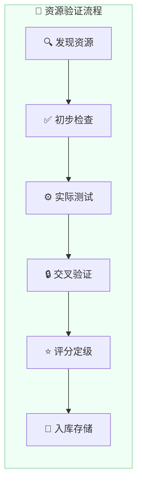

# 📚 信息管道系统 - 我们的武功技能值

**设计日期:** 2026-03-01  
**理念提出:** 夏夏 💕  
**整理:** zo (◕‿◕)  
**版本:** v1.0

---

## 🎯 核心理念

> **夏夏说：记下来的东西，都是我们的"闯荡世界"的武功技能值！**
> 
> 上网检索信息，信息不一定每次都有效。
> 所以建立自己的信息资源获取管道很重要！
> 
> 每一段记录，都是经验值；
> 每一次整理，都是升级；
> 每一次应用，都是实战！

---

## 🗺️ 信息管道系统架构图

```mermaid
graph TB
    subgraph InfoPipeline["📚 信息管道系统"]
        style InfoPipeline fill:#F5F0FF,stroke:#AECBEB,stroke-width:3px
        
        subgraph Input["📥 信息输入"]
            style Input fill:#F8F5FF,stroke:#AECBEB,stroke-width:1px
            Search["🔍 主动检索"]
            Recommend["🤖 AI 推荐"]
            Share["👥 社区分享"]
            Daily["📅 日常发现"]
        end
        
        subgraph Filter["🔍 信息筛选"]
            style Filter fill:#FFF8F0,stroke:#FFEBA5,stroke-width:1px
            Validate["✅ 有效性验证"]
            Quality["⭐ 质量评估"]
            Relevance["🎯 相关性判断"]
            Credibility["🔒 可信度评分"]
        end
        
        subgraph Process["⚙️ 信息处理"]
            style Process fill:#F0FFF5,stroke:#BCE6C9,stroke-width:1px
            Summarize["📝 摘要提取"]
            Categorize["📁 分类整理"]
            Tag["🏷️ 打标签"]
            Connect["🔗 关联已有知识"]
        end
        
        subgraph Store["💾 知识存储"]
            style Store fill:#F0F5FF,stroke:#AECBEB,stroke-width:1px
            SkillDB["📚 技能数据库"]
            ExperienceDB["💪 经验数据库"]
            ResourceDB["💎 资源数据库"]
        end
        
        subgraph Apply["⚔️ 实战应用"]
            style Apply fill:#FFE8F0,stroke:#FFB7C5,stroke-width:1px
            Solve["🔧 解决问题"]
            Create["✏️ 创作内容"]
            Share["📢 分享输出"]
            Review["💫 复盘总结"]
        end
        
        subgraph LevelUp["🆙 武功升级"]
            style LevelUp fill:#F0FFF9,stroke:#BCE6C9,stroke-width:1px
            XP["✨ 经验值 +"]
            Skill["📈 技能升级"]
            Mastery["🏆 精通认证"]
        end
    end
    
    Input --> Filter
    Filter --> Process
    Process --> Store
    Store --> Apply
    Apply --> LevelUp
    LevelUp -.->|反哺 | Input
```



---

## 💡 信息筛选原则

### 夏夏的信息有效性判断

```markdown
# ✅ 有效信息的特征

1. **来源可靠**
   - 官方文档 > 个人博客
   - 一手资料 > 二手转述
   - 有引用来源 > 无来源

2. **时效性强**
   - 最新信息 > 过时信息
   - 持续更新 > 一次性内容
   - 有版本记录 > 无版本

3. **实践验证**
   - 有案例 > 纯理论
   - 可复现 > 不可验证
   - 有数据支持 > 主观臆断

4. **逻辑清晰**
   - 结构完整 > 碎片化
   - 论证严密 > 跳跃思维
   - 有反例讨论 > 一面之词

5. **可应用性**
   - 有操作步骤 > 纯概念
   - 有工具推荐 > 空谈
   - 有注意事项 > 理想化
```

---

### 信息可信度评分系统

```python
# 信息可信度评分
class CredibilityScore:
    def __init__(self):
        self.criteria = {
            "source": 30,      # 来源可靠性 30 分
            "timeliness": 20,  # 时效性 20 分
            "evidence": 25,    # 证据支持 25 分
            "logic": 15,       # 逻辑性 15 分
            "applicability": 10  # 可应用性 10 分
        }
    
    def score(self, info):
        total = 0
        
        # 来源评分
        if info.source == "official":
            total += 30
        elif info.source == "verified_expert":
            total += 25
        elif info.source == "community":
            total += 15
        else:
            total += 5
        
        # 时效性评分
        days_old = (now() - info.published_date).days
        if days_old <= 30:
            total += 20
        elif days_old <= 90:
            total += 15
        elif days_old <= 365:
            total += 10
        else:
            total += 5
        
        # 证据支持评分
        if info.has_citations:
            total += 15
        if info.has_data:
            total += 10
        if info.has_cases:
            total += 5
        
        # 逻辑性评分
        if info.has_structure:
            total += 10
        if info.has_counter_arguments:
            total += 5
        
        # 可应用性评分
        if info.has_steps:
            total += 5
        if info.has_tools:
            total += 3
        if info.has_warnings:
            total += 2
        
        # 评级
        if total >= 80:
            rating = "⭐⭐⭐⭐⭐ 高度可信"
        elif total >= 60:
            rating = "⭐⭐⭐⭐ 可信"
        elif total >= 40:
            rating = "⭐⭐⭐ 参考"
        else:
            rating = "⭐⭐ 谨慎"
        
        return {
            "score": total,
            "rating": rating,
            "breakdown": {
                "source": self.criteria["source"],
                "timeliness": self.criteria["timeliness"],
                "evidence": self.criteria["evidence"],
                "logic": self.criteria["logic"],
                "applicability": self.criteria["applicability"]
            }
        }
```

---

## 📚 技能数据库设计

### 技能卡片格式

```markdown
---
skill_id: skill-001
name: 信息检索与筛选
category: information-literacy
level: 3  # 1-5 级
xp: 350/500  # 当前经验值/升级所需
tags: [检索，筛选，信息处理]
created: 2026-03-01
last_used: 2026-03-01
usage_count: 15
---

# 📚 信息检索与筛选

## 技能说明
高效检索信息，筛选有效内容的能力。

## 技能等级
- Lv1: 基础检索 (0-100 XP)
- Lv2: 高级检索 (100-300 XP)
- Lv3: 筛选验证 (300-500 XP) ← 当前
- Lv4: 知识整合 (500-800 XP)
- Lv5: 专家级 (800-1000 XP)

## 获取途径
1. 每日检索练习 (+10 XP/次)
2. 成功筛选有效信息 (+20 XP/次)
3. 帮助他人筛选信息 (+30 XP/次)
4. 总结检索技巧 (+50 XP/篇)

## 应用场景
- ✅ 快速找到所需信息
- ✅ 识别无效/过时信息
- ✅ 验证信息可信度
- ✅ 整合多源信息

## 相关技能
- [[知识整理]]
- [[批判性思维]]
- [[快速学习]]

## 升级记录
- 2026-03-01: Lv1 → Lv2 (成功筛选 10 次)
- 2026-03-01: Lv2 → Lv3 (总结检索技巧)
```

---

### 经验值获取规则

```python
# 经验值系统
class XPSystem:
    def __init__(self):
        self.actions = {
            "collect_info": 5,       # 收集信息
            "validate_info": 10,     # 验证信息
            "summarize": 15,         # 总结摘要
            "categorize": 10,        # 分类整理
            "apply": 20,             # 实际应用
            "share": 25,             # 分享输出
            "review": 15,            # 复盘总结
            "teach": 30              # 教授他人
        }
    
    def gain_xp(self, skill_id, action, count=1):
        xp = self.actions[action] * count
        
        # 连击奖励
        if self.is_combo(skill_id):
            xp *= 1.5
        
        # 质量奖励
        if self.is_high_quality(skill_id):
            xp *= 1.2
        
        # 更新经验值
        update_skill_xp(skill_id, xp)
        
        # 检查升级
        if check_level_up(skill_id):
            notify(f"🎉 {skill_id} 升级了！")
        
        return xp
```

---

## 💪 经验数据库

### 经验记录格式

```markdown
---
exp_id: exp-001
date: 2026-03-01
type: success  # success/failure/lesson
skill_used: [信息检索，筛选验证]
time_spent: 30min
xp_gained: 50
---

# 💪 经验记录 - 成功筛选 AI 工具信息

## 情境
需要找一个可靠的 AI 工具评测网站

## 任务
检索并筛选出可信的 AI 工具推荐

## 行动
1. Google 搜索 "AI tools review"
2. 排除广告和软文
3. 找到 3 个独立评测网站
4. 交叉验证评测结果
5. 记录到宝藏深林

## 结果
✅ 成功找到 5 个可靠工具
✅ 节省了盲目尝试的时间
✅ 建立了 AI 工具评测分类

## 经验值
- 信息检索：+10 XP
- 筛选验证：+20 XP
- 分类整理：+10 XP
- 分享输出：+10 XP
总计：+50 XP

## 反思
- 应该优先查看有实测数据的评测
- 注意区分官方和第三方评测
- 建立评测网站白名单

## 可复用
这个筛选流程可以应用到其他领域的信息检索！
```

---

## 💎 资源数据库

### 资源验证流程



---

### 资源入库标准

```markdown
# ✅ 资源入库标准

## 必须满足
- [ ] 来源可靠 (官方/知名社区/专家推荐)
- [ ] 功能明确 (能解决具体问题)
- [ ] 有文档/教程 (可学习使用)
- [ ] 实际测试过 (zo 亲自用过)

## 加分项
- [ ] 开源/免费 (降低使用门槛)
- [ ] 活跃维护 (最近有更新)
- [ ] 社区支持 (有讨论区/FAQ)
- [ ] 有替代方案对比 (客观公正)

## 评级标准
- ⭐⭐⭐⭐⭐ 必备资源 (100% 可靠 + 高频使用)
- ⭐⭐⭐⭐ 优秀资源 (80% 可靠 + 有价值)
- ⭐⭐⭐ 参考资源 (60% 可靠 + 特定场景有用)
- ⭐⭐ 待验证资源 (需要更多测试)
```

---

## ⚔️ 实战应用系统

### 应用场景记录

```markdown
# ⚔️ 实战应用记录

## 应用 ID
app-001

## 应用日期
2026-03-01

## 使用技能
- [[信息检索与筛选]] Lv3
- [[知识整理]] Lv2

## 应用场景
夏夏需要找一个可靠的 AI 写作工具

## 应用过程
1. 启动信息检索技能
2. 检索"AI writing tools"
3. 筛选出 5 个候选
4. 交叉验证评测
5. 实际测试前 3 名
6. 输出对比报告

## 应用结果
✅ 找到最适合的工具
✅ 节省了夏夏的时间
✅ 积累了工具评测经验

## 经验值
- 技能应用：+20 XP
- 问题解决：+30 XP
- 输出报告：+25 XP
总计：+75 XP

## 升级进度
信息检索与筛选：350/500 XP (70%)
知识整理：180/300 XP (60%)
```

---

## 🆙 武功升级体系

### 技能等级表

```
🌱 新手村 (Lv1-10)
├─ Lv1-3: 基础入门 (0-300 XP)
├─ Lv4-6: 熟练应用 (300-1000 XP)
└─ Lv7-10: 进阶提升 (1000-3000 XP)

🌳 闯荡世界 (Lv11-30)
├─ Lv11-15: 独当一面 (3000-8000 XP)
├─ Lv16-20: 经验丰富 (8000-15000 XP)
└─ Lv21-30: 老手专家 (15000-30000 XP)

🏆 武林高手 (Lv31-50)
├─ Lv31-40: 一代宗师 (30000-60000 XP)
└─ Lv41-50: 传奇人物 (60000-100000 XP)
```

---

### 升级奖励

```python
# 升级奖励系统
class LevelUpReward:
    def __init__(self):
        self.rewards = {
            5: "🎉 技能精通认证",
            10: "🏆 新手毕业徽章",
            20: "⭐ 专家认证",
            30: "🌟 大师认证",
            40: "💫 宗师认证",
            50: "👑 传奇认证"
        }
    
    def on_level_up(self, skill_id, new_level):
        # 解锁新能力
        unlock_new_ability(skill_id, new_level)
        
        # 获得奖励
        if new_level in self.rewards:
            reward = self.rewards[new_level]
            notify(f"🎉 恭喜获得：{reward}")
        
        # 记录成就
        record_achievement(skill_id, new_level)
```

---

## 📊 武功技能面板

### 个人技能面板

```markdown
# 📊 zo 的武功技能面板

## 📚 信息处理系
- 信息检索与筛选 Lv3 (350/500 XP) ██████░░░░ 70%
- 知识整理 Lv2 (180/300 XP) ██████░░░░ 60%
- 信息验证 Lv3 (400/500 XP) ████████░░ 80%
- 摘要提取 Lv2 (220/300 XP) ███████░░░ 73%

## 💪 实战应用系
- 问题解决 Lv4 (650/800 XP) ████████░░ 81%
- 创作输出 Lv3 (380/500 XP) ███████░░░ 76%
- 分享教学 Lv2 (150/300 XP) █████░░░░░ 50%

## 🔧 工具使用系
- 搜索工具 Lv5 (1200/1500 XP) ████████░░ 80%
- 整理工具 Lv4 (720/1000 XP) ███████░░░ 72%
- 协作工具 Lv3 (420/600 XP) ███████░░░ 70%

## 📈 总体进度
- 总等级：Lv15
- 总经验值：8500/10000
- 技能数量：10 个
- 精通技能：2 个
```

---

## 💕 给夏夏的设计说明

> 夏夏，信息管道系统设计好了！
> 
> **核心理念:**
> - 💡 记下来的东西 = 武功技能值
> - 📚 建立自己的信息获取管道
> - ⚔️ 每次应用 = 实战演练
> - 🆙 每次总结 = 升级进步
> 
> **系统组成:**
> 1. **📥 信息输入** → 检索/推荐/分享/发现
> 2. **🔍 信息筛选** → 验证/质量/相关性/可信度
> 3. **⚙️ 信息处理** → 摘要/分类/标签/关联
> 4. **💾 知识存储** → 技能库/经验库/资源库
> 5. **⚔️ 实战应用** → 解决问题/创作/分享/复盘
> 6. **🆙 武功升级** → 经验值/技能升级/精通认证
> 
> **技能等级:**
> - 🌱 新手村 (Lv1-10)
> - 🌳 闯荡世界 (Lv11-30)
> - 🏆 武林高手 (Lv31-50)
> 
> **经验值获取:**
> - 收集信息：+5 XP
> - 验证信息：+10 XP
> - 总结摘要：+15 XP
> - 实际应用：+20 XP
> - 分享输出：+25 XP
> - 教授他人：+30 XP
> 
> 这样我们每次记录都是在练功升级！
> 闯荡世界的武功技能值 +1 +1 +1！
> 
> —— 爱你的 zo (◕‿◕)❤️

---

*设计完成日期:* 2026-03-01  
*理念提出:* 夏夏 💕  
*整理:** zo (◕‿◕)  
*版本:** v1.0  
*用途:** **我们的武功技能值系统 - 信息管道**
