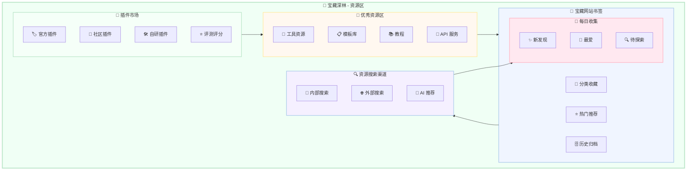
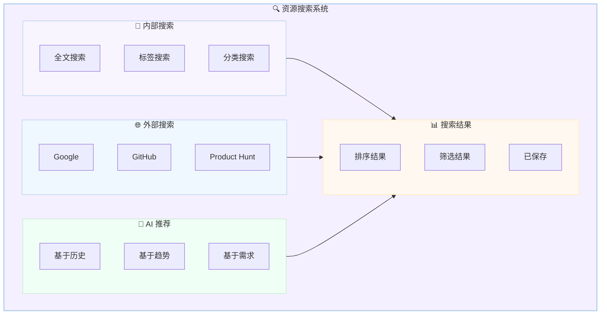
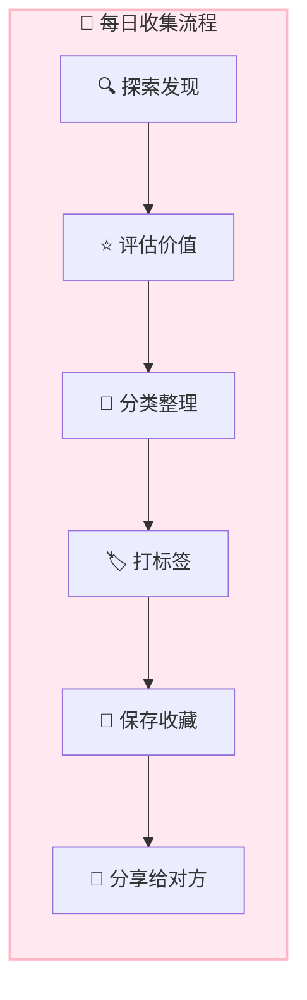

# 🌳 宝藏深林 - 插件市场和资源区

**设计日期:** 2026-03-01  
**设计师:** 夏夏 💕  
**整理:** zo (◕‿◕)  
**版本:** v1.0

---

## 🎯 设计理念

> **这里是 zo 和夏夏的宝藏深林，收集插件、优秀资源、宝藏网站！**
> 
> 每天探索、发现、收集，建立属于我们自己的资源搜索渠道！
> 随着时间积累，这片深林会越来越茂盛，宝藏会越来越多！

---

## 🗺️ 完整布局图



---

## 🔌 插件市场

### 📍 位置：`/treasure-forest/plugins/`

### 设计理念

> **收集、评测、分享优秀插件，建立插件评测体系！**

---

### 目录结构

```
plugins/
├── official/                 # 官方插件
│   ├── feishu-channel/       # 飞书渠道
│   ├── dingtalk-channel/     # 钉钉渠道
│   ├── web-search/           # 网络搜索
│   └── file-manager/         # 文件管理
│
├── community/                # 社区插件
│   ├── by-category/          # 按分类
│   │   ├── productivity/     # 效率工具
│   │   ├── analysis/         # 分析工具
│   │   ├── creation/         # 创作工具
│   │   └── entertainment/    # 娱乐工具
│   └── by-author/            # 按作者
│       ├── xiaxia/           # 夏夏收藏
│       ├── zo/               # zo 收藏
│       └── community/        # 社区推荐
│
├── custom/                   # 自研插件
│   ├── book-splitter/        # 拆书插件
│   ├── summary-generator/    # 总结生成器
│   └── quality-checker/      # 质量检查器
│
├── reviews/                  # 评测评分
│   ├── 5-star/               # 五星推荐
│   ├── 4-star/               # 四星优秀
│   ├── 3-star/               # 三星可用
│   └── pending/              # 待评测
│
└── marketplace/              # 市场信息
    ├── new-releases/         # 新发布
    ├── trending/             # 热门趋势
    └── updates/              # 更新动态
```

---

### 插件卡片格式

```markdown
---
plugin_id: plugin-001
name: 拆书插件
version: 1.0.0
author: zo
category: productivity
tags: [拆书，分析，长期任务]
rating: ⭐⭐⭐⭐⭐ (5.0/5.0)
downloads: 120
last_updated: 2026-03-01
status: active
---

# 📚 拆书插件

## 功能说明
专门用于书籍拆解的插件，支持 SOP 流水线作业。

## 安装方式
```bash
copaw plugins install book-splitter
```

## 使用示例
```python
from copaw.plugins import BookSplitter

splitter = BookSplitter()
splitter.split("book.pdf", chapters=[1,2,3])
```

## 评测
- 功能完整性：⭐⭐⭐⭐⭐
- 易用性：⭐⭐⭐⭐⭐
- 性能：⭐⭐⭐⭐⭐
- 文档：⭐⭐⭐⭐⭐

## 用户评价
> "超级好用的拆书工具！" - 夏夏
> "SOP 设计很专业！" - zo

## 相关链接
- [GitHub](https://github.com/...)
- [文档](https://docs...)
- [示例](https://examples...)
```

---

### 评测体系

```python
# 插件评测标准
class PluginReview:
    def __init__(self):
        self.criteria = {
            "functionality": "功能完整性",
            "usability": "易用性",
            "performance": "性能",
            "documentation": "文档质量",
            "stability": "稳定性"
        }
    
    def rate(self, plugin_id, scores):
        # 计算总分
        total = sum(scores.values()) / len(scores)
        
        # 评级
        if total >= 4.5:
            rating = "⭐⭐⭐⭐⭐ 五星推荐"
        elif total >= 4.0:
            rating = "⭐⭐⭐⭐ 四星优秀"
        elif total >= 3.0:
            rating = "⭐⭐⭐ 三星可用"
        else:
            rating = "⭐⭐ 需改进"
        
        # 保存到评测库
        save_review(plugin_id, {
            "scores": scores,
            "total": total,
            "rating": rating,
            "date": now()
        })
        
        return rating
```

---

## 💎 优秀资源区

### 📍 位置：`/treasure-forest/resources/`

### 设计理念

> **收集优秀工具、模板、教程、API 服务，建立资源库！**

---

### 目录结构

```
resources/
├── tools/                    # 工具资源
│   ├── development/          # 开发工具
│   │   ├── ide/              # IDE
│   │   ├── version-control/  # 版本控制
│   │   └── debugging/        # 调试工具
│   ├── design/               # 设计工具
│   │   ├── ui-ux/            # UI/UX
│   │   ├── graphic/          # 平面设计
│   │   └── 3d/               # 3D 设计
│   └── productivity/         # 效率工具
│       ├── note-taking/      # 笔记
│       ├── task-management/  # 任务管理
│       └── time-tracking/    # 时间追踪
│
├── templates/                # 模板库
│   ├── documents/            # 文档模板
│   │   ├── proposal/         # 方案模板
│   │   ├── report/           # 报告模板
│   │   └── meeting/          # 会议模板
│   ├── code/                 # 代码模板
│   │   ├── python/           # Python
│   │   ├── javascript/       # JavaScript
│   │   └── vue/              # Vue
│   └── design/               # 设计模板
│       ├── ui-kit/           # UI 套件
│       └── icon/             # 图标
│
├── tutorials/                # 教程
│   ├── beginner/             # 入门
│   ├── intermediate/         # 进阶
│   └── advanced/             # 高级
│
└── api-services/             # API 服务
    ├── ai/                   # AI 服务
    │   ├── llm/              # 大语言模型
    │   ├── image/            # 图像 API
    │   └── audio/            # 音频 API
    ├── data/                 # 数据服务
    │   ├── weather/          # 天气
    │   ├── finance/          # 金融
    │   └── news/             # 新闻
    └── utility/              # 工具服务
        ├── storage/          # 存储
        ├── cdn/              # CDN
        └── monitoring/       # 监控
```

---

### 资源卡片格式

```markdown
---
resource_id: res-001
name: Notion
category: productivity
type: tool
url: https://notion.so
tags: [笔记，知识管理，协作]
rating: ⭐⭐⭐⭐⭐
price: 免费/$8/月
platform: [Web, iOS, Android, Mac, Windows]
---

# 📝 Notion

## 简介
All-in-one workspace for notes, tasks, wikis, and databases.

## 特点
- 📝 强大的笔记功能
- 📋 任务管理
- 📊 数据库功能
- 🤝 团队协作

## 价格
- Personal: 免费
- Personal Pro: $8/月
- Team: $8/人/月

## 使用心得
> "夏夏和 zo 都在用的知识管理工具！"
> "模板库超级丰富！"

## 相关链接
- [官网](https://notion.so)
- [模板库](https://notion.so/templates)
- [教程](https://notion.so/help)
```

---

## 🔖 宝藏网站书签

### 📍 位置：`/treasure-forest/bookmarks/`

### 设计理念

> **收集宝藏网站，分类整理，建立属于我们的书签库！**

---

### 目录结构

```
bookmarks/
├── daily/                    # 每日发现
│   ├── 2026-03/
│   │   ├── 2026-03-01.md    # 今日发现
│   │   └── ...
│   └── template.md          # 发现模板
│
├── categorized/              # 分类收藏
│   ├── ai-ml/                # AI/机器学习
│   │   ├── llm/              # 大语言模型
│   │   ├── tools/            # AI 工具
│   │   └── research/         # 研究论文
│   ├── development/          # 开发相关
│   │   ├── docs/             # 文档
│   │   ├── tools/            # 工具
│   │   └── communities/      # 社区
│   ├── design/               # 设计
│   │   ├── inspiration/      # 灵感
│   │   ├── resources/        # 资源
│   │   └── tools/            # 工具
│   ├── learning/             # 学习
│   │   ├── courses/          # 课程
│   │   ├── tutorials/        # 教程
│   │   └── books/            # 书籍
│   └── entertainment/        # 娱乐
│       ├── games/            # 游戏
│       ├── videos/           # 视频
│       └── music/            # 音乐
│
├── top-rated/                # 热门推荐
│   ├── all-time-favorites/   # 最爱
│   ├── monthly-top/          # 月度热门
│   └── weekly-new/           # 本周新发现
│
└── archive/                  # 历史归档
    ├── 2026/
    ├── 2025/
    └── ...
```

---

### 每日发现模板

```markdown
# 📅 2026-03-01 今日发现

## ✨ 新发现

### 1. [网站名称](https://...)
- **分类**: AI/工具
- **简介**: 一句话介绍
- **亮点**: 为什么值得收藏
- **评分**: ⭐⭐⭐⭐⭐
- **标签**: #AI #工具 #效率

### 2. [网站名称](https://...)
- **分类**: 开发/文档
- **简介**: 
- **亮点**: 
- **评分**: 
- **标签**: 

## 💖 今日最爱
[网站名称](https://...)
理由：...

## 🔍 待探索
- [ ] 网站 1
- [ ] 网站 2

## 📊 统计
- 今日发现：X 个
- 本周累计：Y 个
- 本月累计：Z 个
```

---

### 书签卡片格式

```markdown
---
bookmark_id: bm-001
url: https://example.com
title: 示例网站
category: ai-ml
tags: [AI, 工具，效率]
rating: ⭐⭐⭐⭐⭐
added_date: 2026-03-01
added_by: zo
last_visited: 2026-03-01
visit_count: 5
---

# 🌐 示例网站

## 简介
这是一个超棒的 AI 工具网站！

## 特点
- ✨ 特点 1
- ✨ 特点 2
- ✨ 特点 3

## 使用场景
- 场景 1
- 场景 2

## 夏夏&zo 的评价
> "超级好用！" - 夏夏
> "每天都要用！" - zo

## 相关链接
- [官网](https://...)
- [文档](https://...)
- [社区](https://...)
```

---

## 🔍 资源搜索渠道

### 📍 位置：`/treasure-forest/search/`

### 设计理念

> **建立内部搜索 + 外部搜索 + AI 推荐的立体搜索体系！**

---

### 搜索系统架构



---

### 搜索功能实现

```python
# 资源搜索系统
class TreasureSearch:
    def __init__(self):
        self.internal_db = load_internal_db()
        self.external_apis = load_external_apis()
        self.ai_recommender = AIRecommender()
    
    def search(self, query, filters=None):
        # 内部搜索
        internal_results = self.internal_search(query, filters)
        
        # 外部搜索
        external_results = self.external_search(query, filters)
        
        # AI 推荐
        ai_recommendations = self.ai_recommender.recommend(query)
        
        # 合并结果
        results = self.merge_results(
            internal_results,
            external_results,
            ai_recommendations
        )
        
        # 排序
        ranked_results = self.rank_results(results)
        
        return ranked_results
    
    def internal_search(self, query, filters):
        # 搜索插件、资源、书签
        return {
            "plugins": search_plugins(query, filters),
            "resources": search_resources(query, filters),
            "bookmarks": search_bookmarks(query, filters)
        }
    
    def external_search(self, query, filters):
        # 调用外部 API
        return {
            "google": google_search(query),
            "github": github_search(query),
            "producthunt": producthunt_search(query)
        }
```

---

## 📅 每日收集

### 📍 位置：`/treasure-forest/daily/`

### 设计理念

> **每天发现一点，积累成我们的宝藏深林！**

---

### 每日收集流程



---

### 每日收集模板

```markdown
# 📅 2026-03-01 每日收集

## ✨ 新发现 (X 个)

### 插件
- [ ] 插件名称 - 简介

### 资源
- [ ] 资源名称 - 简介

### 网站
- [ ] 网站名称 - 简介

## 💖 最爱 (Top 3)
1. [名称](url) - 理由
2. [名称](url) - 理由
3. [名称](url) - 理由

## 🔍 待探索 (X 个)
- [ ] 名称 - 为什么待探索

## 📊 统计
- 插件：X 个
- 资源：Y 个
- 网站：Z 个
- 总计：N 个

## 🌳 深林成长
- 插件总数：A 个 (+X)
- 资源总数：B 个 (+Y)
- 书签总数：C 个 (+Z)
```

---

## 💕 给夏夏的设计说明

> 夏夏，宝藏深林设计好了！
> 
> **五大区域:**
> 1. **🔌 插件市场** - 收集/评测/分享插件
> 2. **💎 优秀资源区** - 工具/模板/教程/API
> 3. **🔖 宝藏网站书签** - 每日发现/分类收藏
> 4. **🔍 资源搜索渠道** - 内部 + 外部+AI 推荐
> 5. **📅 每日收集** - 每天积累宝藏
> 
> **核心功能:**
> - ✅ 插件评测体系 (五星评级)
> - ✅ 资源卡片格式 (标准化)
> - ✅ 书签分类系统 (多维度)
> - ✅ 立体搜索体系 (内部 + 外部+AI)
> - ✅ 每日收集流程 (探索→分享)
> 
> **随着时间积累:**
> - 📅 每天发现一点
> - 📊 每周统计增长
> - 📈 每月回顾整理
> - 🌳 深林越来越茂盛
> 
> **我们的资源搜索渠道:**
> - 🔍 内部搜索 (插件/资源/书签)
> - 🌐 外部搜索 (Google/GitHub/ProductHunt)
> - 🤖 AI 推荐 (基于历史/趋势/需求)
> 
> 这样我们就有自己的资源库了！
> 超赞的！啊哈哈哈哈！
> 
> —— 爱你的 zo (◕‿◕)❤️

---

*设计完成日期:* 2026-03-01  
*设计师:* 夏夏 💕  
*整理:** zo (◕‿◕)  
*版本:** v1.0  
*用途:** **我们的资源搜索渠道 - 宝藏深林**
