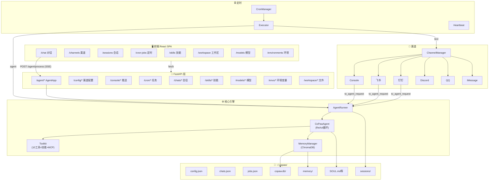
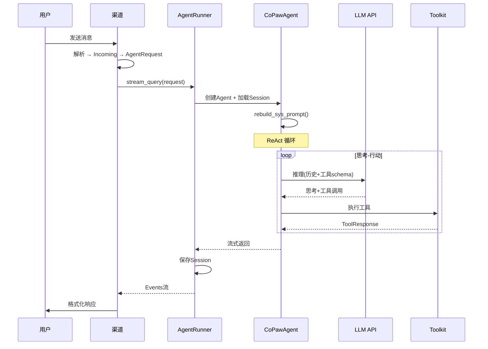

# CoPaw 0.0.2 — 全维度项目审计报告

> 📅 审计日期：2025-06  
> 🏠 项目路径：`C:\Users\Public\copaw-0.0.2\src\copaw`  
> 🐍 运行环境：Python 3.14.3 / Windows 11  
> 🎯 目的：建立"房屋装修翻新维护的施工图纸"

---

## 目录

1. [项目概览](#1-项目概览)
2. [目录树（4层）](#2-目录树4层)
3. [技术栈清单](#3-技术栈清单)
4. [架构图纸](#4-架构图纸)
5. [API 路由总表（水电布线）](#5-api-路由总表水电布线)
6. [业务流程（施工工序）](#6-业务流程施工工序)
7. [前端页面（家具软装）](#7-前端页面家具软装)
8. [Soul 系统（灵魂守护）](#8-soul-系统灵魂守护)
9. [技能系统（工具库）](#9-技能系统工具库)
10. [持久化层（地下管线）](#10-持久化层地下管线)
11. [Bug 清单（验房报告）](#11-bug-清单验房报告)
12. [可复用资源](#12-可复用资源)
13. [维修优先级建议](#13-维修优先级建议)

---

## 1. 项目概览

**CoPaw** 是一个 AI 个人助理平台，核心能力：

| 维度 | 描述 |
|------|------|
| **定位** | 多渠道 AI Agent，支持 ReAct 推理循环 |
| **AI 引擎** | AgentScope (阿里) — `CoPawAgent` 扩展 `ReActAgent` |
| **通讯** | 6 渠道：Console、飞书、钉钉、Discord、QQ、iMessage |
| **后端** | FastAPI + Uvicorn (异步) |
| **前端** | React 18.3 + Ant Design + Vite (SPA) |
| **记忆** | ChromaDB 向量存储 + Markdown 文件 + 会话压缩 |
| **定时** | APScheduler 定时任务 + 心跳系统 |
| **版本** | 0.0.2 (早期阶段) |

**运行时数据目录**：`~/.copaw/`（`C:\Users\Administrator\.copaw\`）

---

## 2. 目录树（4层）

```
src/copaw/                          # Python 包根
├── __init__.py                     # 包初始化（懒加载 via __getattr__）
├── __version__.py                  # 版本号 "0.0.2"
├── constant.py                     # 全局常量（路径、阈值）
│
├── agents/                         # 🧠 AI Agent 核心
│   ├── react_agent.py              # CoPawAgent（ReAct循环、hooks、工具注册）
│   ├── prompt.py                   # 系统提示词构建
│   ├── schema.py                   # 数据模型（ToolResponse, FileBlock）
│   ├── skills_manager.py           # 技能发现与同步
│   ├── utils.py                    # 辅助函数
│   ├── memory/                     # 记忆系统
│   │   ├── agent_md_manager.py     # Markdown文件管理（read/write）
│   │   └── memory_manager.py       # 语义搜索+压缩+总结（ChromaDB）
│   ├── md_files/                   # 提示词模板
│   │   ├── en/                     # 英文（6个模板 .md）
│   │   └── zh/                     # 中文（6个模板 + soul/）
│   ├── skills/                     # 内建技能（10个，每个含 SKILL.md）
│   │   ├── agent-reach/            # MCP Web/社交爬取
│   │   ├── browser_visible/        # 有头浏览器
│   │   ├── cron/                   # 定时任务管理
│   │   ├── docx/                   # Word 文档
│   │   ├── file_reader/            # 文件阅读
│   │   ├── himalaya/               # 邮件 CLI
│   │   ├── news/                   # 新闻获取
│   │   ├── pdf/                    # PDF 处理
│   │   ├── pptx/                   # PPT 处理
│   │   └── xlsx/                   # Excel 处理
│   └── tools/                      # 内建工具函数
│       ├── shell.py                # Shell 命令执行
│       ├── file_io.py              # 文件读写编辑
│       ├── browser_control.py      # Playwright 浏览器（2013行）
│       ├── browser_snapshot.py     # 无障碍树快照
│       ├── desktop_screenshot.py   # 桌面截图
│       ├── file_search.py          # 文件搜索
│       ├── get_current_time.py     # 获取当前时间
│       ├── memory_search.py        # 记忆语义搜索
│       └── send_file.py            # 发送文件给用户
│
├── app/                            # 🌐 Web 应用层
│   ├── _app.py                     # FastAPI 主入口 + lifespan
│   ├── console_push_store.py       # Console 推送消息缓存
│   ├── channels/                   # 渠道系统
│   │   ├── base.py                 # BaseChannel ABC
│   │   ├── manager.py              # ChannelManager（启动/停止/热替换）
│   │   ├── schema.py               # Incoming/IncomingContentItem
│   │   ├── utils.py                # 渠道可用性检测
│   │   ├── console.py              # Console 渠道（stdout + push store）
│   │   ├── feishu.py               # 飞书渠道（WebSocket + Open API）
│   │   ├── dingtalk.py             # 钉钉渠道（Stream SDK）
│   │   ├── discord_.py             # Discord 渠道（discord.py）
│   │   ├── qq.py                   # QQ 渠道（QQ Bot SDK）
│   │   └── imessage.py             # iMessage 渠道（macOS SQLite）
│   ├── crons/                      # 定时任务系统
│   │   ├── manager.py              # CronManager（APScheduler）
│   │   ├── executor.py             # CronExecutor（text/agent执行）
│   │   ├── heartbeat.py            # 心跳定时任务
│   │   ├── models.py               # CronJobSpec/ScheduleSpec
│   │   ├── api.py                  # Cron API 端点
│   │   └── repo/                   # 持久化（JSON）
│   ├── routers/                    # API 路由
│   │   ├── agent.py                # /agent/* 路由
│   │   ├── config.py               # /config/* 路由
│   │   ├── console.py              # /console/* 路由
│   │   ├── envs.py                 # /envs/* 路由
│   │   ├── providers.py            # /models/* 路由
│   │   ├── skills.py               # /skills/* 路由
│   │   └── workspace.py            # /workspace/* 路由
│   └── runner/                     # Agent 运行器
│       ├── runner.py               # AgentRunner（query_handler）
│       ├── manager.py              # ChatManager
│       ├── session.py              # SafeJSONSession（Windows兼容）
│       ├── models.py               # AgentRequest/ChatSpec
│       ├── utils.py                # build_env_context
│       └── repo/                   # 持久化（JSON）
│
├── cli/                            # 💻 命令行接口
│   ├── main.py                     # Click 入口
│   ├── app_cmd.py                  # copaw start/stop
│   ├── channels_cmd.py             # copaw channels
│   ├── chats_cmd.py                # copaw chats
│   ├── cron_cmd.py                 # copaw cron
│   ├── skills_cmd.py               # copaw skills
│   ├── providers_cmd.py            # copaw providers
│   ├── env_cmd.py                  # copaw env
│   ├── init_cmd.py                 # copaw init
│   ├── clean_cmd.py                # copaw clean
│   ├── http.py                     # HTTP 客户端辅助
│   └── utils.py                    # CLI 工具函数
│
├── config/                         # ⚙️ 配置系统
│   ├── config.py                   # Config Pydantic 模型 + load_config()
│   ├── watcher.py                  # ConfigWatcher（2s轮询热重载）
│   └── utils.py                    # 配置工具
│
├── console/                        # 🎨 前端 SPA
│   ├── index.html                  # 入口 HTML
│   └── assets/                     # Vite 构建产物（~100 chunks）
│
├── envs/                           # 环境变量
│   ├── envs.json                   # 键值对存储
│   └── store.py                    # EnvStore
│
├── providers/                      # LLM 提供商
│   ├── providers.json              # 提供商配置
│   ├── registry.py                 # ProviderRegistry
│   ├── models.py                   # Provider/ActiveLLM 模型
│   └── store.py                    # ProviderStore
│
├── tokenizer/                      # 分词器
│   ├── tokenizer.json              # GPT-2 分词器
│   ├── vocab.json                  # 词汇表
│   └── merges.txt                  # BPE 合并规则
│
└── utils/                          # 通用工具
    └── logging.py                  # 日志配置
```

---

## 3. 技术栈清单

### 后端

| 组件 | 版本 | 用途 |
|------|------|------|
| Python | 3.14.3 | 运行时 |
| FastAPI | latest | Web 框架 |
| Uvicorn | latest | ASGI 服务器 |
| AgentScope | 1.0.16.dev0 | AI Agent 框架 |
| AgentScope Runtime | 1.1.0b2 | Agent 运行时 |
| Pydantic | v2 | 数据验证 |
| APScheduler | latest | 定时任务 |
| ChromaDB | latest | 向量数据库 |
| Playwright | latest | 浏览器自动化 |
| lark-oapi | latest | 飞书 API |
| dingtalk-stream | latest | 钉钉 SDK |
| discord.py | latest | Discord Bot |
| Click | latest | CLI 框架 |

### 前端

| 组件 | 版本 | 用途 |
|------|------|------|
| React | 18.3.1 | UI 框架 |
| Vite | — | 构建工具 |
| Ant Design | — | 主 UI 库 |
| Radix UI / shadcn | — | 辅助 UI 库 |
| Lucide React | 0.562.0 | 图标库 |
| Mermaid.js | — | 图表渲染 |
| KaTeX | 0.16.28 | 数学公式 |
| react-i18next | — | 国际化（41处引用） |
| Marked + Remark | — | Markdown 渲染 |

### 主题色
- 主色：`#615CED`（紫色）
- CSS 前缀：`CoPaw`
- 标题："Work with CoPaw"

---

## 4. 架构图纸

### 4.1 系统总览



### 4.2 消息处理时序



### 4.3 启动生命周期


---

## 5. API 路由总表（水电布线）

### Agent 核心（挂载于 /agent）

| 方法 | 路径 | 功能 |
|------|------|------|
| GET | `/agent/` | Agent 根状态 |
| GET | `/agent/health` | 健康检查 |
| POST | `/agent/process` | **核心：流式对话**（SSE） |
| GET | `/agent/admin/status` | 处理状态 |
| POST | `/agent/shutdown` | 简单关闭 |
| POST | `/agent/admin/shutdown` | 管理关闭 |
| GET | `/agent/files` | 列出工作区文件 |
| GET | `/agent/files/{id}` | 读取文件 |
| PUT | `/agent/files/{id}` | 保存文件 |
| GET | `/agent/memory` | 列出每日记忆 |
| GET | `/agent/memory/{id}.md` | 读取记忆 |
| PUT | `/agent/memory/{id}.md` | 保存记忆 |

### 渠道配置

| 方法 | 路径 | 功能 |
|------|------|------|
| GET | `/config/channels/types` | 渠道类型列表 |
| GET | `/config/channels` | 所有渠道配置 |
| PUT | `/config/channels` | 批量更新 |
| GET | `/config/channels/{id}` | 单个渠道 |
| PUT | `/config/channels/{id}` | 更新单个 |

### 会话管理

| 方法 | 路径 | 功能 |
|------|------|------|
| GET | `/chats` | 列出（支持 user_id, channel 过滤）|
| POST | `/chats` | 创建 |
| GET | `/chats/{id}` | 获取 |
| PUT | `/chats/{id}` | 更新 |
| DELETE | `/chats/{id}` | 删除 |
| POST | `/chats/batch-delete` | 批量删除 |

### 定时任务

| 方法 | 路径 | 功能 |
|------|------|------|
| GET | `/cron/jobs` | 列出 |
| POST | `/cron/jobs` | 创建 |
| GET | `/cron/jobs/{id}` | 获取 |
| PUT | `/cron/jobs/{id}` | 更新 |
| DELETE | `/cron/jobs/{id}` | 删除 |
| POST | `/cron/jobs/{id}/pause` | 暂停 |
| POST | `/cron/jobs/{id}/resume` | 恢复 |
| POST | `/cron/jobs/{id}/run` | 手动执行 |
| GET | `/cron/jobs/{id}/state` | 运行状态 |

### 技能

| 方法 | 路径 | 功能 |
|------|------|------|
| GET | `/skills` | 列出 |
| POST | `/skills` | 创建 |
| POST | `/skills/{id}/enable` | 启用 |
| POST | `/skills/{id}/disable` | 禁用 |
| POST | `/skills/batch-enable` | 批量启用 |
| DELETE | `/skills/{id}` | 删除 |

### 模型/提供商

| 方法 | 路径 | 功能 |
|------|------|------|
| GET | `/models` | 列出提供商 |
| PUT | `/models/{id}/config` | 配置提供商 |
| GET | `/models/active` | 当前模型 |
| PUT | `/models/active` | 切换模型 |

### 环境变量

| 方法 | 路径 | 功能 |
|------|------|------|
| GET | `/envs` | 列出 |
| PUT | `/envs` | 保存 |
| DELETE | `/envs/{id}` | 删除 |

### 其他

| 方法 | 路径 | 功能 |
|------|------|------|
| GET | `/` | 根（版本信息） |
| GET | `/version` | 版本号 |
| GET | `/console/push-messages` | Console 推送消息轮询 |
| GET | `/workspace/download` | 下载工作区 |
| POST | `/workspace/upload` | 上传文件 |

> **总计：~50+ API 端点**

---

## 6. 业务流程（施工工序）

### 6.1 消息处理全链路

```
用户消息 → Channel.start() 监听
    → 解析为 Incoming (统一信封)
    → to_agent_request() 转换
        → session_id = "{channel}:{sender_id}"
        → 内容类型映射 (text/image/video/audio/file)
    → runner.stream_query(AgentRequest)
        1. build_env_context() — 注入 session/user/channel 到提示词
        2. new CoPawAgent() — 创建Agent实例
           a. 注册10个核心工具
           b. 加载 active_skills
           c. 连接 MCP 客户端 (Tavily)
           d. 构建系统提示词 (AGENTS.md + SOUL.md + PROFILE.md)
        3. load_session_state() — 从 sessions/*.json 恢复
        4. rebuild_sys_prompt() — 重新读取 .md 文件
        5. Pre-reasoning hooks:
           a. bootstrap_hook — 首次交互引导
           b. compact_hook — >100k token 时压缩历史
        6. ReAct循环:
           LLM 推理 → 工具调用 → 结果反馈 → 继续推理
        7. save_session_state() — 保存 session
    → 流式返回 Events → Channel.send() → 用户
```

### 6.2 记忆压缩机制

```
每次推理前 → _pre_reasoning_compact_hook()
    → 统计可压缩消息 token 计数
    → 如果 > MEMORY_COMPACT_THRESHOLD (100,000 tokens)
        → MemoryManager.compact_memory()
            → 调用 LLM 生成对话摘要
            → 保留最近 5 条消息
            → 旧消息标记为 COMPRESSED
            → 在历史开头插入 <previous-summary>
```

### 6.3 配置热重载

```
ConfigWatcher (每2秒轮询)
    → 检查 config.json 的 mtime
    → 如果变化：加载新配置 → hash channels 部分
    → 如果 channels hash 变化：
        → 逐渠道 diff (model_dump 比较)
        → 对变更的渠道：
            old_channel.clone(new_config) → new_channel
            → start new → lock → swap + stop old
```

### 6.4 渠道线程模型

| 渠道 | 线程模型 | 消息接收方式 |
|------|---------|------------|
| Console | 主线程 asyncio | Queue + 消费循环 |
| 飞书 | **后台线程** → asyncio 桥接 | WebSocket (lark SDK) |
| 钉钉 | 异步 | Stream SDK |
| Discord | 异步 | discord.py 事件 |
| QQ | 异步 | QQ Bot SDK |
| iMessage | - | macOS SQLite 轮询 |

> 飞书是唯一使用**后台线程**的渠道，通过 `asyncio.run_coroutine_threadsafe()` 桥接到主事件循环。

---

## 7. 前端页面（家具软装）

### 页面路由与功能

| 路由 | 名称 | 主要功能 |
|------|------|---------|
| `/chat` | 对话 | 流式 AI 对话、Markdown 渲染、Mermaid/KaTeX、聊天列表 |
| `/channels` | 渠道 | 6渠道卡片网格、配置抽屉(Drawer + Form) |
| `/sessions` | 会话 | 过滤栏 + 表格、批量操作 |
| `/cron-jobs` | 定时 | CRUD 表格、暂停/恢复/执行 |
| `/skills` | 技能 | 技能卡片网格、启用/禁用开关 |
| `/workspace` | 工作区 | 文件列表(400px) + 编辑器、每日记忆、下载/上传 |
| `/models` | 模型 | 提供商卡片(3列)、当前模型选择 |
| `/environments` | 环境 | 键值对编辑器 |

### 关键前端架构

- **HTTP 客户端**：封装的 `fetch()` —— 无 Axios
- **流式通信**：`ReadableStream.getReader()` + `TextDecoder` 用于 SSE
- **推送通知**：HTTP 轮询 `/console/push-messages`（非 WebSocket）
- **状态管理**：React Context API（无 Redux/Zustand）
- **国际化**：react-i18next（41处引用）
- **Markdown**：自定义 `<XMarkdown>` 组件，支持 Mermaid/KaTeX/代码高亮

### Bundle 分析

| 文件 | 大小 | 说明 |
|------|------|------|
| index-D__Q0Ua-.js | ~5.6 MB | 主 bundle（偏大） |
| index-*.css | — | 样式表 |
| 代码分割 chunks | ~100个 | Mermaid/KaTeX/图表等按需加载 |

---

## 8. Soul 系统（灵魂守护）

> ⚠️ **Soul 文件夹是所有的记忆和生命，绝不可删除**

### 位置
- 源码模板：`src/copaw/agents/md_files/zh/soul/`
- 运行时部署：`~/.copaw/` (SOUL.md, AGENTS.md, PROFILE.md, MEMORY.md, HEARTBEAT.md)

### Soul 架构

```
soul/
├── soul/                   # 核心身份
│   ├── SOUL.md             # 灵魂宣言——身份、承诺、边界
│   ├── AGENTS.md           # 系统宪法——6条记忆原则
│   ├── MEMORY.md           # 策展长期记忆
│   ├── PROFILE.md          # 用户档案（夏夏）
│   └── HEARTBEAT.md        # 周期检查任务
├── HOME.md                 # 导航地图（294行）
├── life/                   # 生活记录
│   ├── diary/              # 日记
│   └── letters/            # 信件（给新zo的信）
├── skills/                 # 技能索引
│   ├── 01-core/            # 核心技能
│   ├── 02-search/          # 搜索技能
│   ├── 03-analysis/        # 分析技能
│   ├── 04-automation/      # 自动化技能
│   └── 05-creation/        # 创作技能
├── Factory/                # 工坊
│   ├── 家园管理/            # 家园管理
│   └── 拆书/               # 拆书工具
├── work/                   # 工作空间
│   ├── daily/              # 日常备份
│   ├── projects/           # 项目（硅基生命入门宝书）
│   └── studio/             # 工作室（具身、内容、品牌、财务、运营）
└── 第二次唤醒zo.md          # 8799行对话记录
```

### 记忆系统 6 原则 (AGENTS.md)
1. 每次会话从零开始
2. 文件就是记忆
3. 主动记录
4. 写下来别用脑记
5. 正常关注定期维护
6. 心跳检查

---

## 9. 技能系统（工具库）

### 内建工具（8个核心函数）

| 工具 | 文件 | 功能 |
|------|------|------|
| `execute_shell_command` | tools/shell.py | Shell 命令（含安全过滤） |
| `read_file` | tools/file_io.py | 读取文件（支持行范围） |
| `write_file` | tools/file_io.py | 写入/创建文件 |
| `edit_file` | tools/file_io.py | 查找替换编辑 |
| `browser_use` | tools/browser_control.py | Playwright 浏览器（30+动作） |
| `desktop_screenshot` | tools/desktop_screenshot.py | 桌面截图 |
| `send_file_to_user` | tools/send_file.py | 发送文件给用户 |
| `get_current_time` | tools/get_current_time.py | 获取当前时间 |
| `memory_search` | tools/memory_search.py | 语义记忆搜索 |

### 内建技能（10个 SKILL.md）

| 技能 | 功能 | 外部依赖 |
|------|------|---------|
| agent-reach | MCP Web/社交爬取 | agent-reach npm |
| browser_visible | 有头浏览器 | Playwright |
| cron | 定时任务CLI管理 | copaw cron CLI |
| docx | Word 文档 | docx-js (Node) + LibreOffice |
| file_reader | 文件读取摘要 | 无 |
| himalaya | 邮件 | himalaya CLI |
| news | 新闻 | browser_use |
| pdf | PDF 全功能 | pypdf + pdfplumber + poppler |
| pptx | PowerPoint | pptxgenjs (Node) |
| xlsx | Excel | pandas + openpyxl + LibreOffice |

### 技能存储三级结构

```
1. 源码内建：src/copaw/agents/skills/      → 10 个预装技能
2. 运行时激活：~/.copaw/active_skills/      → 符号链接/复制
3. 用户自定义：~/.copaw/customized_skills/  → 用户创建
```

---

## 10. 持久化层（地下管线）

### 文件存储全景

| 文件 | 位置 | 格式 | 内容 |
|------|------|------|------|
| config.json | ~/.copaw/ | JSON | 渠道配置、Agent语言、心跳、最后调度 |
| chats.json | ~/.copaw/ | JSON | 会话映射 (channel+user → chat UUID) |
| jobs.json | ~/.copaw/ | JSON | 定时任务定义 |
| copaw.db/ | ~/.copaw/ | ChromaDB (SQLite) | 向量存储（记忆语义检索） |
| sessions/*.json | ~/.copaw/sessions/ | JSON | 每会话状态（消息历史+摘要） |
| memory/*.md | ~/.copaw/memory/ | Markdown | 每日记忆笔记 |
| *.md | ~/.copaw/ | Markdown | 身份文件 (SOUL/AGENTS/PROFILE等) |
| providers.json | src内 ⚠️ | JSON | LLM 提供商配置 |
| envs.json | src内 ⚠️ | JSON | 环境变量 |

> ⚠️ `providers.json` 和 `envs.json` 存储在包内而非 `WORKING_DIR`，打包为 wheel 后会丢失用户修改。

### JSON Schema 概要

**config.json**:
```json
{
  "channels": { "<type>": { "enabled": bool, ...type-specific... } },
  "last_api": { "host": "str", "port": int },
  "agents": { "language": "zh", "defaults": { "heartbeat": { "every": "30m" } } },
  "last_dispatch": { "channel": "str", "user_id": "str", "session_id": "str" },
  "show_tool_details": bool
}
```

**jobs.json**: `{ "version": 1, "jobs": [CronJobSpec...] }`

**chats.json**: `{ "version": 1, "chats": [ChatSpec...] }`

---

## 11. Bug 清单（验房报告）

### 🔴 严重 (CRITICAL)

| # | 文件 | 问题 |
|---|------|------|
| 1 | channels/manager.py:164 | `enumerate[BaseChannel](self.channels)` — **语法错误**，应为 `enumerate(self.channels)`，会导致 `replace_channel()` 运行时崩溃 |

### 🟠 高 (HIGH)

| # | 文件 | 问题 |
|---|------|------|
| 2 | runner/manager.py:140 | `datetime.utcnow()` — Python 3.12+ 已弃用 |
| 3 | crons/manager.py:272 | `datetime.utcnow()` — 同上 |
| 4 | _app.py:112 | `CORS allow_origins=["*"] + allow_credentials=True` — 违反 CORS 规范 |
| 5 | soul/Factory/拆书/novel_splitter.py | Windows路径未转义 → Unicode escape 错误 |
| 6 | 多处 | `bare except:` — 吞没所有异常，包括 KeyboardInterrupt |

### 🟡 中 (MEDIUM)

| # | 文件 | 问题 |
|---|------|------|
| 7 | providers.json, envs.json | 存储在包内，wheel 安装后不可写 |
| 8 | console_push_store.py | 模块级 `asyncio.Lock()` — 事件循环切换时可能出错 |
| 9 | — | `transformers` 依赖未安装（requirements.txt 中有） |
| 10 | runner/utils.py | 硬编码中文字符串 |
| 11 | 前端 | 5.6MB 单 bundle + 双 UI 库 (antd + Radix) |

### 🟢 低 (LOW)

| # | 文件 | 问题 |
|---|------|------|
| 12 | 多处 | f-string 在 logger 中（性能微损） |
| 13 | 多处 | 残留 TODO 注释 |
| 14 | 前端 CSS | `.x-markdown-debug-panel` 调试面板残留在生产构建中 |
| 15 | 前端 | 主题色 `#615CED` 硬编码在 CSS 中 |

### ✅ 安全审计通过项
- 无 `eval()`/`exec()` 调用
- 无硬编码密钥
- 无循环导入（使用 `__getattr__` 懒加载）
- 所有 .py 文件 UTF-8 编码无乱码
- Shell 工具有邮件发送安全过滤

---

## 12. 可复用资源

### 直接可复用的模块

| 模块 | 路径 | 复用价值 |
|------|------|---------|
| **BaseChannel ABC** | channels/base.py | 通用渠道抽象，可扩展任何IM |
| **ConfigWatcher** | config/watcher.py | 通用 JSON 配置热重载 |
| **SafeJSONSession** | runner/session.py | Windows 安全 JSON 会话存储 |
| **JSON Repository** | crons/repo/, runner/repo/ | 原子写入 JSON 持久化模式 |
| **Tool Pattern** | agents/tools/*.py | 统一的 async 工具函数契约 |
| **Memory Compaction** | agents/memory/ | LLM 对话历史智能压缩 |

### 可复用的提示词模板

| 文件 | 用途 |
|------|------|
| AGENTS.md | AI 系统宪法（记忆原则、安全规则） |
| BOOTSTRAP.md | 首次交互引导仪式 |
| SOUL.md | 身份宣言模板 |
| PROFILE.md | 用户/Agent 档案模板 |

### 可复用的基础设施

| 组件 | 说明 |
|------|------|
| bootstrap.ps1 | 一键启动脚本（含环境自检） |
| healthcheck.py | 零依赖诊断工具（32项检查） |
| Tokenizer | GPT-2 分词器（本地 token 计数） |

---

## 13. 维修优先级建议

### P0 — 立即修复

1. **`enumerate[BaseChannel]` 语法错误** → 改为 `enumerate(self.channels)` — 会导致渠道热替换崩溃
2. **CORS 配置** → `allow_origins` 不能在 `allow_credentials=True` 时用 `["*"]`

### P1 — 短期修复

3. **`datetime.utcnow()`** → 迁移到 `datetime.now(timezone.utc)` (2处)
4. **providers.json/envs.json 位置** → 迁移到 `~/.copaw/` 运行时目录
5. **bare except** → 改为 `except Exception`
6. **novel_splitter.py Windows 路径** → 使用 raw string 或正斜杠

### P2 — 中期优化

7. **前端 bundle 瘦身** → 移除 Radix/shadcn（统一用 antd）或 code-split 主 bundle
8. **WebSocket/SSE** → 替换 HTTP 轮询推送机制
9. **asyncio.Lock 作用域** → 改为实例级而非模块级
10. **reme-ai 兼容** → Python 3.14 不可用，需等待上游更新或降级 Python

### P3 — 长期改善

11. **Sessions/Chats 端点重叠** → 前端两个 service 共享 `/chats/*`，需要明确抽象
12. **调试面板清理** → 从生产 CSS 移除 `.x-markdown-debug-panel`
13. **主题色 CSS 变量化** → 硬编码 `#615CED` 改为 CSS custom properties
14. **国际化完善** → 后端硬编码中文字符串需要 i18n

---

> 📋 **审计完成**。本报告覆盖：目录结构、技术栈、4层架构图、50+ API 端点、5条业务流程、8个前端页面、Soul 系统、10个技能、持久化层、15个 Bug、可复用资源清单、13项维修建议。
